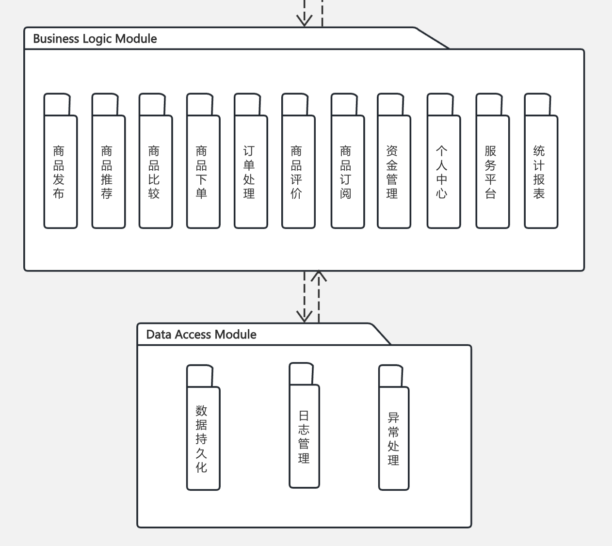
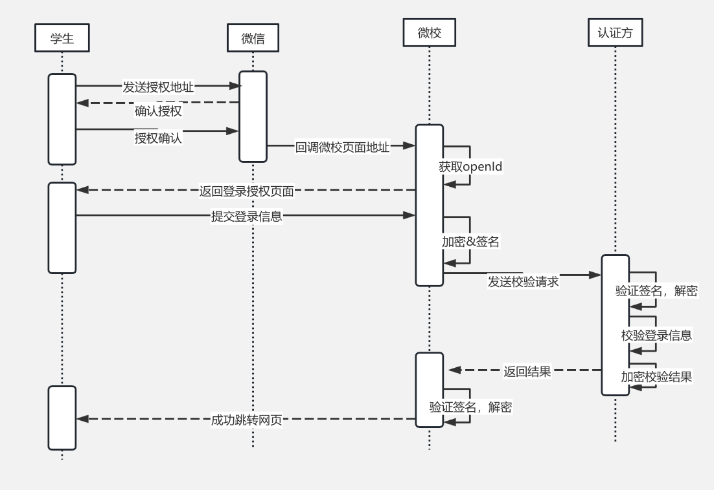
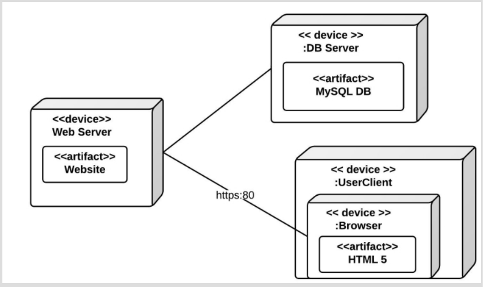
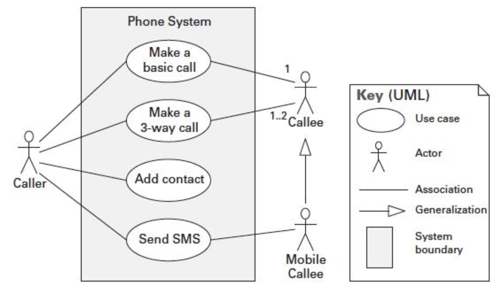
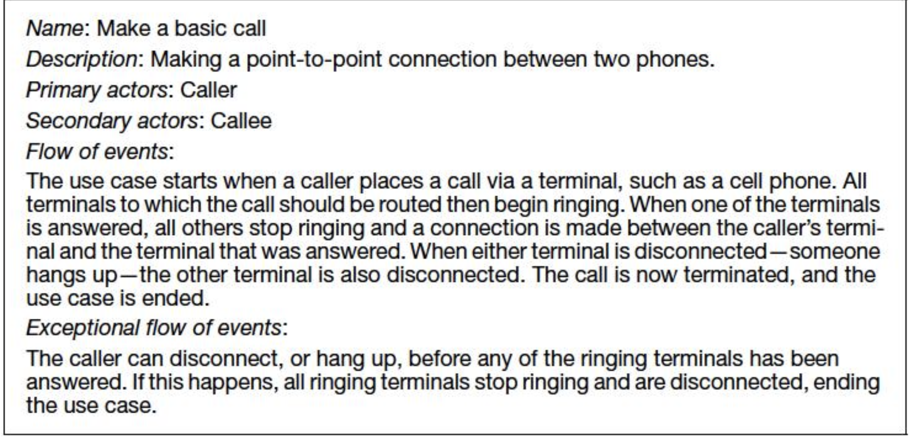

# Documenting Software Architecture

**Importance**: any architecture will be useless if people can not understand it, or misunderstand, or apply it incorrectly

**Used and Audience**: need to be transparent and accessible, concrete

### 10.3 文档的用途

- **教育**：向新团队成员、外部分析师或后续架构师介绍系统。
- **沟通**：在利益相关者（特别是架构师与开发者）间传递信息。
- **分析与构建**：
  - 指导开发者实现模块及其接口。
  - 记录未解决问题。
  - 支持架构评估。

### Notation

- **Informal Notation**：使用通用工具绘制，语义用自然语言描述，无法形式化分析。
- **Semiformal Notation**：如 UML，标准化图形元素，允许基本分析。
- **Formal Notation**：如架构描述语言（ADL），具有精确语义，支持自动化分析。
- **Choose of Notation**：
  - 权衡：正式符号分析能力强但创建复杂；非正式符号易创建但保证少。
  - 根据**the important issue you need to capture and reason about**选择符号（如 UML 类图不适合调度分析）。

## View

Documenting an architecture is a matter of documenting the relevant views and then adding documentation that applies to more than one view; 也就是架构文档化就是在记录每一个视图的详细信息，以及视图之间的关系； 

视图将架构分解为可管理的表示形式。以下为主要视图类型：

### Module Views（页面57-59）

- **元素**：模块（软件实现单元，提供一致职责）。
- **元素之间的关系**：
  - **Is part of**：模块与整体的分解关系。
  - **Depends on**：模块间的依赖关系。
  - **Is a**：模块的泛化/特化关系，例如继承。
- **约束**：不同模块视图可能限制模块间可见性。
- **用途**：
  - 代码构建蓝图。
  - 变更影响分析。
  - 增量开发规划。
  - 需求追溯和功能沟通。
- **重要性**：几乎所有架构文档都需要至少一个模块视图。

#### C&C views(Components and Connector)（页面60-63）

- **元素**：
  - **Component**：运行时的主要处理单元和数据存储，拥有端口。
  - **Connector**：组件间交互路径，拥有角色（接口）。
- **关系**：
  - **Attachments**：组件端口与连接器角色关联，形成图结构。
  - **Interface delegation**：端口与内部子架构关联。
- **约束**：
  - 组件只能连接到连接器，连接器只能连接到组件。
  - Attachments/Interface Delegation can only be made between compatible ports
  - Connector can not appear isolation
- **用途**：
  - 展示系统运行方式。
  - 指导运行时元素的行为和结构。
  - 分析性能和可用性等质量属性。
- **符号**：
  - UML 组件适合表示 C&C 组件，但连接器需额外标注（如使用标签或刻板印象）。

#### Allocation View（页面64-65）

- **元素**：
  - **软件元素**：具有环境需求的属性。
  - **环境元素**：提供软件所需的属性。
- **关系**：
    - **Allocated to**，软件元素映射到环境元素。
- **用途**：
  - 分析性能、可用性、安全性和并发访问。
  - 支持分布式开发和系统安装规划。

#### Quality View（页面66-68）

- **特点**：为特定利益相关者或关注点定制，extracting relevant pieces of structual view and package them together。
- **示例**：
  - **安全视图**：展示安全组件、通信、数据存储及协议。
  - **通信视图**：展示组件间通道、网络质量参数，分析性能和死锁。
  - **错误处理视图**：描述错误检测和解决机制。
  - **可靠性视图**：展示复制和切换机制。
  - **性能视图**：展示网络流量模型和操作延迟。

#### Choosing the view（页面69-72）

at least one module view and one CC view, for large system, at least one allocation view

- **步骤1**：构建利益相关者/视图表，列出利益相关者及其对每个视图的信息需求（none、overview、moderate detail或high detail）。
- **步骤2**：合并边缘视图（如仅需overview的视图）以减少数量，常见合并包括：
  - C&C 视图合并,因为都是描述运行时不同components和connectors的关系。
  - 部署视图与 SOA 或通信进程视图合并。
  - Decomposition视图(one of module view)与工作分配、实现,层视图合并。
- **步骤3**：优先级排序和分阶段文档化：
  - 优先发布分解视图(easy to start)，支持早期规划。
  - 提供 80% 的信息即可满足大部分需求, 和stakeholders沟通，看看是不是某些信息就足够了。
  - 采用广？度优先方法，逐步补充细节。(don’t have to complete one view before starting another)

### Template for documenting a view（页面74-77）

每个视图的文档应包含：

1. **Primary Presentation**：以图形或表格展示元素和关系，附带符号说明。
2. **Element Catalog**：at least elements in the primary presentation, if elements or relation are omitted in the primary presentation, then they should be introduced and explained in the element catalog
   - **元素及其属性**：命名并list their properties。
   - **关系及其属性**：描述视图中的关系类型。
   - **元素接口**：记录接口定义。
   - **元素行为**：描述行为(not obvious in primary presentation)。
3. **Context Diagram**：展示视图的系统或部分与外部环境的交互, Entities in environment may be human, other system or physical objects like sensors。
4. **Variability Guide**：描述架构中的变化点。
5. **Rationale**：解释设计决策及其合理性。(justify chosen pattern by describing the problem it solves)

### Documenting Information Beyond Views（页面78-82）

- **控制信息**：记录发行组织、版本号、发布日期、变更历史和变更请求流程。
- **Document Roadmap**：
  - 说明文档目的和内容概要。
  - 描述文档组织结构。
  - **View Overview**: 概述视图类型、模式、建模技术
  - 利益相关者使用方式。
- **System Overview**：简述系统功能、用户和背景约束。
- **Mapping between view**：记录视图间元素关联（如模块视图到 C&C 视图的“实现”关系）。
- **Rationale**：记录跨视图的架构决策，如选择的基础模式或组织约束。
- **Directory**：提供术语索引、词汇表和缩写列表。

### Documenting Behavior（页面83-92）

Complement each view by describing how elements in that view interacting with others

**Enable Reasoning About**:
    - potential to Deadlock
    - Memory Consumption
    - Ability to complete a task in a desired amount of time

- **符号类型**：
  - **Trace-oriented Language**：sequence activities or interactions between between elements to specific stimulus
    - **用例**：如“Make a basic call”用例，描述点对点电话连接的流程和异常情况。
    - **序列图**、**通信图**、**活动图**等：展示特定场景下的交互序列。

  - **Comprehensive Language**：如状态机，描述元素的完整行为，适合分析所有可能路径。
    > it is possible to infer all possible paths from initial state to final state

### 快速变化的架构文档化（页面93）

- **挑战**：运行时或高频发布架构变化快于文档周期。
- **方法**：
  - 记录所有版本通用的不变约束或指南。
  - 在可变性指南中记录允许的架构变化方式（如添加或替换组件）。

### 敏捷开发中的文档化（页面94）

- **方法**：
  - 采用标准模板捕获设计决策，仅为有明确利益相关者的视图编写文档。
  - 使用白板草图或照片作为初步呈现。
  - 仅记录对下游工作有帮助的信息，允许部分模板为空。
  - 避免创建单独的详细设计文档，仅提供足够信息支持编码。