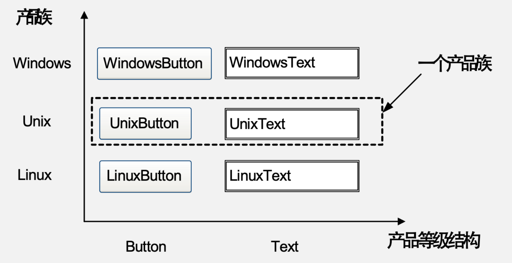

# 简单工厂模式

有多个类可以使用，他们拥有相同的基类并且内部成员都有不同；此时想要不知道他们的名字和具体差异，而只需要一个参数和一个接口，使用该接口就能得到对应的类实例；

**State**：专门定义一个类，来根据传入的参数创建其他类的实例(被创建的类一般都有共同的基类)

**结构**：
- 工厂Factory：用于创建对象
- Product：抽象产品角色，即基类
- ConcreteProduct： 具体产品角色

## Analyse

将对象的创建和业务分离可以降低耦合性，并且一般Factory的工厂方法是一个静态方法，调用简单，并且可以将传入参数放入配置文件中，使得更改生成Product时不用修改源代码

- **优点**；
    1. 分割责任，客户端免除了创建产品的责任
    2. 客户端不需要知道具体类名，减少了对复杂类名记忆的需求
    3. 引入Config可以不修改源码的情况下改变对象类型
- **缺点**：
    1. 工厂类中集中了所有产品的创建逻辑，如果工厂类有Bug所有客户端都要出问题
    2. 增加了类的数量，提升了系统的复杂度
    3. 扩展和维护困难：要添加新Product需要修改工厂类源码；产品类型较多时工厂类逻辑复杂,违反了OCP
    4. 简单工厂为静态工厂，无法形成继承链
- **适用环境**：
    1. Product类型较少
    2. 客户端不关心创建过程

# 工厂方法模式

**State**： 注重解决简单工厂模式的违反OCP的问题，首先设定一个抽象工厂类，他有很多个具体的工厂子类，每个工厂子类负责一种具体Product的创建，此时工厂方法不在Static，并且在有新的Produc时，只需要为他编写新的专门的工厂类即可，符合OCP；

> 为了提高系统的可扩展性和灵活性，在定义工厂和产品时都必须使用抽象层，也就是所有具体的工厂类和Product类都必须继承自一个抽象基类

## Analyse

- **优点**：
    1. 扩展性好，符合OCP
    2. 客户端不需关心具体创建细节
- **缺点**：
    1. 在添加新Produc时不仅需要编写新Product类，还需要对应的新的工厂类，增加了类的个数，系统的复杂度和可理解性
    2. 工厂类和Product类都需要定义抽象层，提高了理解难度，以及需要使用反射等技术，更加复杂

# 抽象工厂模式

> 在工厂方法模式中，一个具体工厂只提供一种Product，但是有时候我们需要一个工厂提供多种不同Product； 
> **产品等级结构**： 一种Product(抽象基类和具体Product子类)构成了一个产品等级结构  
> **产品族**：在抽象工厂模式中，一个产品族指一个工厂创建的位于不同产品等级结构中的一组产品 

当一个工厂中需要生产出不同产品等级结构deProduct时，需要使用抽象工厂模式；他是所有工厂模式中最抽象/最具一般性的一种形态；和工厂方法模式最大的区别是工厂方法模式针对一个产品等级结构，而抽象工厂模式针对多种产品等级结构，因此相比于工厂方法模式更加简单高效。同样包含抽象工厂/产品，具体工厂/产品；

**State**：一个抽象工厂有很多个具体的子类工厂，每个工厂对应一个产品族，每个产品族有多种产品，抽象工厂中需要包含每种产品的创建方法；具体可以看这张图：

> **一个抽象Product对应一个产品等级结构，一个具体工厂对应一个产品族**

## Analyse

- **优点**
    1. 隔离了具体类的生成，其实也就是更换具体工厂类型十分方便
    2. 当一个产品族中的对象需要一起工作时，客户端只需要一个工厂就可以了
    3. 符合OCP
- **缺点**
    1. 增加新的产品等级结构十分复杂，要对抽象工厂和所有具体工厂类进行修改(这可以看成OCP的一种倾斜)
- **适用环境**：
    1. 系统不依赖Product如何被创建
    2. 有多个产品族，一个产品族中的产品将在一起使用
- **退化**：当只有一个产品等级结构时，此时每个抽线工厂都只生产一种产品，此时抽象工厂模式退化成工厂方法模式
