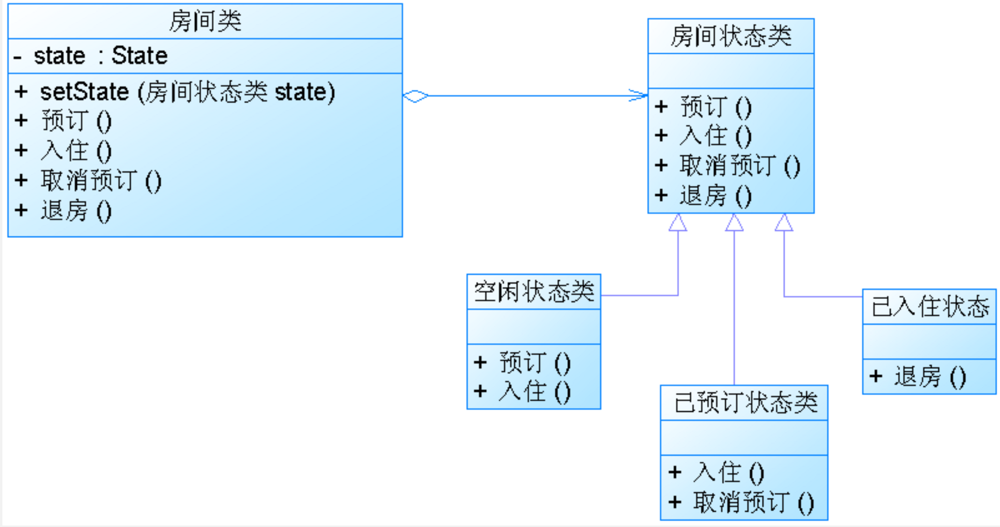

# 状态模式

运行一个对象在状态(也就是在成员属性)变化时动态的改变他的行为，看起来就像是修改了他的类,其组成如下：
- Context
- State
- ConcreteState

具体工作方式如下：

环境类就是拥有状态的角色，可以在环境类中调用不同的状态的行为，或者切换状态；将不同状态对应的不同行为封装在专门的状态类对象中，使得环境类对象在其内部改变状态时也可以改变自己的行为；

### Analyse

- **优点**：
    1. 封装了转换规则
    2. 可以方便的新增新的状态和状态中的新的行为
    3. 允许状态转换逻辑和状态和成一体，而不是一个巨大的ifelse
    4. 多个对象可以共享一个状态对象
- **缺点**：
    1. 增加系统中类的数量,增加系统复杂度
    2. 对OCP支持不太好，因为如果新增一个状态，就要修改某些状态中的状态转换逻辑函数

1. 简单状态模式：无法切换状态，状态之间相对独立，在环境类中手动指定具体状态，并针对抽象状态编程，符合OCP
2. 可切换状态的状态模式；一般在状态类中，需要引用环境类的SetState来切换状态，不符合OCP

# 命令模式

完全解耦请求的发送者和接受者，二者完全没有引用关系，发送者只需要知道如何发送请求；

**State**： 完全分离请求者和接受者，引入抽象命令接口，并且发送者针对抽象命令接口编程，包含一下部分：
- Command
- ConcreteCommand
- Invoker
- Receiver
- client
具体流程为，首先接受者内部有一系列行为，并有一系列具体命令，具体命令类中包含了Receiver对象，不同的命令调用接受者不同的行为；而发送者只需要包含具体的Command然后调用Command的execute方法即可；例如，在client中，先创建一系列接受者对象，创建具体的想要执行的命令，将命令要作用的对象赋给命令，随后将命令赋发送者，发送者调用execute即可执行命令；

### Analyse

- **优点**：
    1. 降低系统耦合度
    2. 新命令可以很容易的加入到系统中
    3. 可以很方便的设定命令队列和组合命令(即宏命令，其中包含一个命令对象，这个命令对象是宏命令/普通命令，发送一个宏命令会执行多个具体命令)
    4. 可以方便的实现命令的Undo和Redo
- **缺点**：
    1. 可能使得有过多的具体命令类，增加系统的复杂度