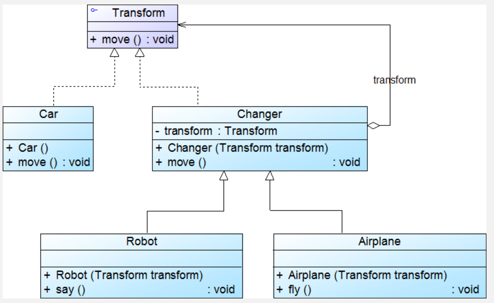

# 外观模式

非常的简单，就是为了降低客户端和复杂子系统之间的耦合；通过设置一个外观类，来将子系统的复杂功能封装成简单的接口；组成如下：
- Subsystem
- Facade
- client

外观类作为子系统和客户之间的中间，提供简单接口，客户无需知道子系统的复杂细节，可以使用外观类直接操作子系统

优点是可以简化接口，降低耦合，提高可维护性；但是可能使得外观类过于庞大

```java
// 子系统类
public class DVDPlayer {
    public void turnOn() { System.out.println("DVD Player is ON"); }
    public void play() { System.out.println("DVD Player is playing"); }
    public void turnOff() { System.out.println("DVD Player is OFF"); }
}

public class Projector {
    public void turnOn() { System.out.println("Projector is ON"); }
    public void setInput(String input) { System.out.println("Projector input set to " + input); }
    public void turnOff() { System.out.println("Projector is OFF"); }
}

public class SoundSystem {
    public void turnOn() { System.out.println("Sound System is ON"); }
    public void setVolume(int level) { System.out.println("Sound System volume set to " + level); }
    public void turnOff() { System.out.println("Sound System is OFF"); }
}

// 外观类
public class HomeTheaterFacade {
    private DVDPlayer dvdPlayer;
    private Projector projector;
    private SoundSystem soundSystem;

    public HomeTheaterFacade(DVDPlayer dvdPlayer, Projector projector, SoundSystem soundSystem) {
        this.dvdPlayer = dvdPlayer;
        this.projector = projector;
        this.soundSystem = soundSystem;
    }

    public void watchMovie() {
        System.out.println("Setting up home theater for movie...");
        dvdPlayer.turnOn();
        projector.turnOn();
        projector.setInput("DVD");
        soundSystem.turnOn();
        soundSystem.setVolume(10);
        dvdPlayer.play();
    }

    public void endMovie() {
        System.out.println("Shutting down home theater...");
        dvdPlayer.turnOff();
        projector.turnOff();
        soundSystem.turnOff();
    }
}

// 客户端代码
public class Client {
    public static void main(String[] args) {
        DVDPlayer dvdPlayer = new DVDPlayer();
        Projector projector = new Projector();
        SoundSystem soundSystem = new SoundSystem();

        HomeTheaterFacade homeTheater = new HomeTheaterFacade(dvdPlayer, projector, soundSystem);
        homeTheater.watchMovie();
        // 输出:
        // Setting up home theater for movie...
        // DVD Player is ON
        // Projector is ON
        // Projector input set to DVD
        // Sound System is ON
        // Sound System volume set to 10
        // DVD Player is playing

        homeTheater.endMovie();
        // 输出:
        // Shutting down home theater...
        // DVD Player is OFF
        // Projector is OFF
        // Sound System is OFF
    }
}
```

# 享元模式

通过使用共享对象来降低内存的使用，将对象状态分为内在状态和外在状态，通过共享内在状态来实现目标；包含以下部分：
- 享元接口
- 具体享元接口
- 享元工厂
- cient

首先，享元接口定义了享元的行为，具体享元包含了状态以及行为的具体实现；享元工厂维护了一个列表，其中是具体的享元，每当需要调用特定状态的享元时，就使用工厂，工厂会检测这种状态的享元是否已经存在，如果存在就直接返回调用，如果没有就创建一个新的然后返回调用，这样就实现了享元模式的目的；

优点显然就是减少内存占用，提高性能，但是有增加代码复杂性的缺点；

```java
import java.util.HashMap;
import java.util.Map;

// 享元接口
public interface CharacterFlyweight {
    void render(int x, int y); // 外在状态由客户端传入
}

// 具体享元类
public class Character implements CharacterFlyweight {
    private char symbol; // 内在状态：字符
    private String font; // 内在状态：字体

    public Character(char symbol, String font) {
        this.symbol = symbol;
        this.font = font;
    }

    @Override
    public void render(int x, int y) {
        System.out.println("Rendering " + symbol + " in font " + font + " at position (" + x + ", " + y + ")");
    }
}

// 享元工厂
public class CharacterFactory {
    private Map<String, CharacterFlyweight> flyweights = new HashMap<>();

    public CharacterFlyweight getCharacter(char symbol, String font) {
        String key = symbol + "-" + font;
        if (!flyweights.containsKey(key)) {
            flyweights.put(key, new Character(symbol, font));
        }
        return flyweights.get(key);
    }
}

// 客户端代码
public class Client {
    public static void main(String[] args) {
        CharacterFactory factory = new CharacterFactory();

        // 渲染字符，共享相同的内在状态
        CharacterFlyweight charA = factory.getCharacter('A', "Arial");
        charA.render(10, 20); // 输出: Rendering A in font Arial at position (10, 20)

        CharacterFlyweight charA2 = factory.getCharacter('A', "Arial");
        charA2.render(30, 40); // 输出: Rendering A in font Arial at position (30, 40)

        CharacterFlyweight charB = factory.getCharacter('B', "Times");
        charB.render(50, 60); // 输出: Rendering B in font Times at position (50, 60)

        // 验证共享：charA 和 charA2 是同一个对象
        System.out.println("charA == charA2: " + (charA == charA2)); // 输出: true
    }
}
```


# 代理模式

通过构建代理对象作为客户访问真实对象的代理/中介，这样可以在访问真实对象时添加一些逻辑，例如权限检查，安全性检查等，包含
- 抽象主题
- 真实主题
- 代理
- client

抽象主题定义了真实对象的行为，真实主题实现了这些行为；而代理持有真实主题并且同样实现了这些行为；因此client直接使用代理，来访问真实主题，代理中在调用真实主题的行为时增加一些额外逻辑来实现代理模式的目的

优点当然有添加了访问控制，对客户和真实对象解耦，但是提高了性能开销和复杂度

```java
// 抽象主题
public interface Image {
    void display();
}

// 真实主题
public class RealImage implements Image {
    private String filename;

    public RealImage(String filename) {
        this.filename = filename;
        loadFromDisk();
    }

    private void loadFromDisk() {
        System.out.println("Loading image: " + filename);
    }

    @Override
    public void display() {
        System.out.println("Displaying image: " + filename);
    }
}

// 代理
public class ProxyImage implements Image {
    private RealImage realImage;
    private String filename;

    public ProxyImage(String filename) {
        this.filename = filename;
    }

    @Override
    public void display() {
        if (realImage == null) {
            realImage = new RealImage(filename); // 延迟加载
        }
        realImage.display();
    }
}

// 客户端代码
public class Client {
    public static void main(String[] args) {
        Image image = new ProxyImage("photo.jpg");
        image.display();
        // 输出:
        // Loading image: photo.jpg
        // Displaying image: photo.jpg

        image.display(); // 第二次调用不重新加载
        // 输出: Displaying image: photo.jpg
    }
}

```

# 桥接模式

将抽象部分和实现部分解耦，包含以下部分：
- 抽象类
- 扩展抽象类
- 接口类
- 具体接口类
- client
解耦的具体方法就是把继承变成组合，符合CRP；

其中抽象类持有接口类的引用，接口类定义有哪些方法，不同的具体接口类给出不同的方法实现；客户通过抽象类来调用接口，使得抽象类的实现和接口的实现解耦，互不影响；

他的优点就是解耦了抽象和实现，提高了系统的可扩展性；但是却使得系统更加复杂

具体实例见代码：
```java
// 实现接口
public interface DrawAPI {
    void drawShape(String shape);
}

// 具体实现类
public class VectorDrawAPI implements DrawAPI {
    @Override
    public void drawShape(String shape) {
        System.out.println("Drawing " + shape + " using Vector API");
    }
}

public class RasterDrawAPI implements DrawAPI {
    @Override
    public void drawShape(String shape) {
        System.out.println("Drawing " + shape + " using Raster API");
    }
}

// 抽象类
public abstract class Shape {
    protected DrawAPI drawAPI;
    
    protected Shape(DrawAPI drawAPI) {
        this.drawAPI = drawAPI;
    }
    
    public abstract void draw();
}

// 扩展抽象类
public class Circle extends Shape {
    public Circle(DrawAPI drawAPI) {
        super(drawAPI);
    }
    
    @Override
    public void draw() {
        drawAPI.drawShape("Circle");
    }
}

public class Rectangle extends Shape {
    public Rectangle(DrawAPI drawAPI) {
        super(drawAPI);
    }
    
    @Override
    public void draw() {
        drawAPI.drawShape("Rectangle");
    }
}

// 客户端代码
public class Client {
    public static void main(String[] args) {
        DrawAPI vectorAPI = new VectorDrawAPI();
        DrawAPI rasterAPI = new RasterDrawAPI();
        
        Shape circle = new Circle(vectorAPI);
        Shape rectangle = new Rectangle(rasterAPI);
        
        circle.draw();    // 输出: Drawing Circle using Vector API
        rectangle.draw(); // 输出: Drawing Rectangle using Raster API
    }
}
```

相当于，接口就是具体实现任务的方法，例如画画可以用铅笔或彩笔，而抽象类则定义了要完成什么任务，例如画圆或者画方框；

# 装饰模式

目的就是在不修改源码的情况下动态的为组件修改其功能或者增加功能；结构和上面的桥接模式基本一样，也是包含
- 组件
- 具体组件
- 装饰器
- 具体装饰器
- clien

注意其中组件和装饰器需要实现完全一样的接口，client使用装饰器，装饰器装饰的就是组件，而可以为一个组件更换不同的装饰器，来使得组件有更多的功能，这些功能可以依赖组件本来的功能，也可以完全是新功能，例如变形金钢是辆车，但是也可以变成robot或plane，此时可以用robot和plane装饰car，并在其中添加新的功能；注意，只要组件和装饰器中的接口相同就行了，具体装饰器可以有更多的接口；如下：



优点是可以动态扩展，其实这个模式的主要目的就是满足OCP，缺点就是复杂性增加；

示例代码如下：

```java
// 组件接口
public interface Coffee {
    String getDescription();
    double getCost();
}

// 具体组件
public class SimpleCoffee implements Coffee {
    @Override
    public String getDescription() {
        return "Simple Coffee";
    }
    
    @Override
    public double getCost() {
        return 5.0;
    }
}

// 装饰器抽象类
public abstract class CoffeeDecorator implements Coffee {
    protected Coffee coffee;
    
    public CoffeeDecorator(Coffee coffee) {
        this.coffee = coffee;
    }
    
    @Override
    public String getDescription() {
        return coffee.getDescription();
    }
    
    @Override
    public double getCost() {
        return coffee.getCost();
    }
}

// 具体装饰器
public class MilkDecorator extends CoffeeDecorator {
    public MilkDecorator(Coffee coffee) {
        super(coffee);
    }
    
    @Override
    public String getDescription() {
        return coffee.getDescription() + ", Milk";
    }
    
    @Override
    public double getCost() {
        return coffee.getCost() + 1.5;
    }
}

public class SyrupDecorator extends CoffeeDecorator {
    public SyrupDecorator(Coffee coffee) {
        super(coffee);
    }
    
    @Override
    public String getDescription() {
        return coffee.getDescription() + ", Syrup";
    }
    
    @Override
    public double getCost() {
        return coffee.getCost() + 2.0;
    }
}

// 客户端代码
public class Client {
    public static void main(String[] args) {
        Coffee coffee = new SimpleCoffee();
        System.out.println(coffee.getDescription() + " $" + coffee.getCost());
        // 输出: Simple Coffee $5.0
        
        coffee = new MilkDecorator(coffee);
        System.out.println(coffee.getDescription() + " $" + coffee.getCost());
        // 输出: Simple Coffee, Milk $6.5
        
        coffee = new SyrupDecorator(coffee);
        System.out.println(coffee.getDescription() + " $" + coffee.getCost());
        // 输出: Simple Coffee, Milk, Syrup $8.5
    }
}
```

# 适配器模式

将一个接口转化为客户希望的接口，使得接口不兼容的类可以一起工作，包含如下角色：
- Target
- Adapter
- Adaptee
- client

当client调用Target类中的一个接口时，如果他也能支持Adaptee中的一些功能，就可以使用适配器模式，让Adapter继承自Target，以及包含对Adaptee的引用，这样就能改变Target的接口；在编程时针对Target编程，但是运行时传入Adapter对象即可实现目的

### Analyse 

- **优点**：将Target和Adaptee解耦；增加了类的透明性和复用，可以通过Config方便的切换适配器，符合OCP，可以在Adapter中置换Adaptee中的一些方法，使得这种模式更加灵活；
- **缺点**：java中只能继承一个类，Target一定得是抽象类，使得使用有一定局限性

可扩展为双向适配器，即适配器包含Target和Adaptee的引用，那么这就是一个双向适配器，Adaptee和Target可以通过他调用对方的方法

# 组合模式

client希望一致的处理容器对象和叶子对象；因此组合对象通过一个抽象Component，作为抽象基类，来定义所有容器对象和叶子对象需要实现的接口；容器对象中还包含了Component类型的数组；此时client针对这个抽象Component编程，以统一的方式使用所有的容器对象和叶子对象; **实际就是将单个对象和集合对象统一为一种类型, 使得可以用统一的一套接口操作两种对象**

### Analyse 

- **优点**：可以形成复杂的树形结构，cient可以方便的使用这些组件；更容易在树形结构中加入新的组件，符合OCP
- **缺点**：系统更加抽象，很难对结构中的新组件的类型做限制