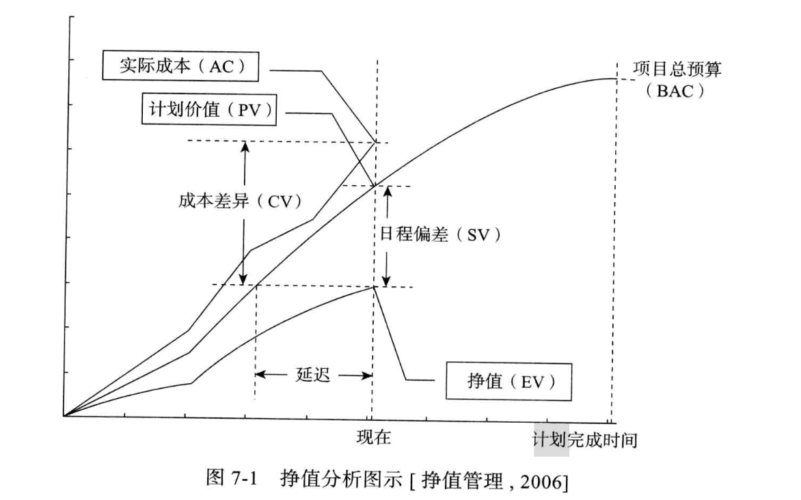

# 估算

估算的目的是给计划提供依据;而规模度量和估算存在矛盾，即规模度量不利于早期的估算，而有助于早期估算的度量往往很难产生精确结果,由此产生了PROBE

利用对已有事物相对性大小的认知，建立相对大小矩阵；即，对于每一类代码，例如运算或者IO，都可以分为五个大小级别，分别为VS，S，M，L，VL，不同的级别对应不同的行数；对于一个程序，可以将程序的各个部分估算其模糊大小，即上面五个等级，然后通过该矩阵将其映射到详细大小；解决了精确度量和早期估算的矛盾

估算的流程是定义需求，产生概要设计，定义产品元素以及规模，较快完成；具体流程可以如下：
- 清晰了解功能，以及产生这些功能需要的模块
- 将这些程序以及模块和之前写的代码做对比来估算每个部分
- 最后，综合这些估算并给出总估算规模

随后进行规模估算和资源估算，计划日程

### 整合多个估算结果

如果将估算的模块划分细致一点，那么估算的总误差小于每个模块的误差和，例如每个模块都是50%误差，那么总的误差一定小于50%；因此在估算时应当尽可能划分详细一点

最后，估算的目的并不是为了产生一个结果，重要的是过程，也就是通过估算让所有相关人员对产品达成一致，并建立信心；

# 计划

**开发策略和计划**：开发策略是在产品组件需求基础之上，明确每个产品组件的获得方式和顺序，在团队内建立起大家都理解的开发策略；需要考虑WBS，组件获取方式和顺序

**日程计划和任务计划**：和估算的流程一样，首先是估算规模，随后估算资源，这时候可以列出任务清单，包含有哪些任务任务，每个任务的规模是怎样的；以及资源清单，每天都有多少资源可以使用，随后用这两个估算产物规划日程，生成日程计划，即每个任务在什么时候完成；

# 跟踪

### 项目跟踪的意义

项目跟踪需要参照物，即项目计划；并且需要管理针对偏差而采取的纠偏措施；项目跟踪因此的意义为：了解项目进度，以便在项目进度和计划出现严重偏差时及时采取纠偏措施

### 挣值管理方法EVM

用来衡量项目进度，用三个和进度计划，成本预算和实际成本相关的三个变量进行项目绩效测量，优势是在前期就可以想项目小组警示进度问题；这三个值分别为：
- EV：挣值，也就是已经实现的价值
- PV：计划价值，需要实现的价值
- AC：实际消耗的成本

当某任务100%完成时，就获得该任务价值，即其EV=PV

有三种实现方式：
1. 简单实现：为所有工作设置PV，以及用一定规则为正在进行和完成的工作设置EV；
2. 中级实现：在简单的基础上，加入日程偏差的计算，即SV=EV-PV
3. 高级实现：在中级实现基础上还要考虑实际成本

基于高级实现，可以绘制图示，例如：

其中，PV曲线代表BAC，即计划的项目总预算；有如下变量：
- CV = EV - AC；正常EV应当大于等于AC，图中这种情况表明，现在实现的价值远少于计划，并且还花费了更多的成本
- CPI = EV/AC, 成本差异指数
- SV = EV - PV， 进度偏差，小于0，如图中情况，表示进度落后
- SPI = EV/PV，日程偏差指kk
- **EAC = BAC/CPI**,预计完成成本，就是预计成本，乘以当前使用成本和实现价值的比值

在实际应用中，如果只是观察EVM曲线图，那么可能得出错误结果；因为在进行中的项目的EV值可能为0；所以在图中可能EV要一直比PV少一点，从而使得作出错误决策；因此可以采用周报的形式，统计一周的EV变化等；如果项目进度落后，可以采取的措施有：
1. 消减功能，使得EV增加
2. 加班，提升EV获取速度

**EVM局限**：
- 一般不能应用于软件项目的质量管理
- 需要定量化的管理机制，使得在探索性项目和敏捷团队中有局限性
- 完全依赖对项目的准确估算，但是在初期很难准确估算

### 里程碑评审

**里程碑**：某个时间点，用来标记某项工作的完成或者阶段的结束

**审查内容**：项目的时间，质量等承诺；进度；当前状态；可能面临的问题

### 其他计划的跟踪

1. 日程计划跟踪:跟踪项目计划中所用到的参数的变化；包含工作产品，工作量，资源等；并依据实际参数及时纠偏过程
2. 承诺计划跟踪: 即记录跟踪项目干系人的承诺，例如客户对时间的承诺，供应商就所提供产品质量的承诺
3. 风险计划跟踪：跟踪风险的来源和属性
4. 数据收集计划跟踪: 数据收集即在项目过程中收集必要的资料，例如过程数据和中间产物；要跟踪这个收集
5. 沟通计划跟踪: 跟踪开始设定的和干系人沟通计划

### 纠偏措施的管理

在执行了上述跟踪后，如果发现了数据的偏差，那么就要实施纠偏措施，包括三个步骤：
1. 分析偏差原因
2. 随后定义纠偏措施
3. 跟踪管理纠偏措施，对纠偏措施的实施进行跟踪