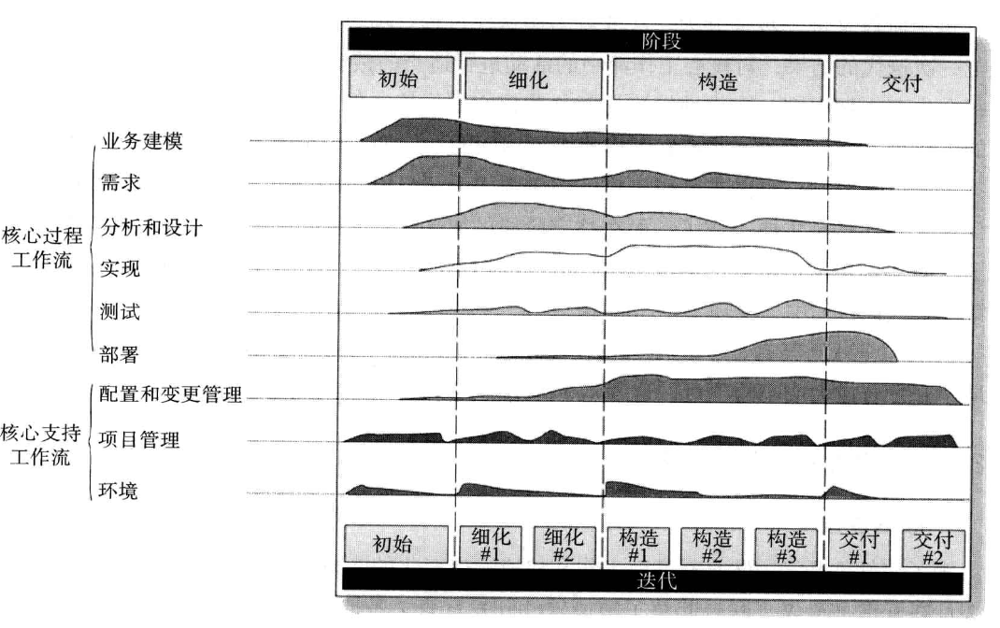

# 历史和经典软件过程

**软件开发本质困难**：不可见行，复杂性，可变性，一致性

## 历史

1. 50年代：和硬件开发基本没有区别

2. 60年代：code-fix，开发语言出现，软件可移植性被人们意识到，软件需求大幅增长，大量非专业人员涌入，导致软件开发过程和质量进一步下降，出现意大利面条式的代码，自由的黑客文化，和牛仔式编程(以上两个部分可以总结为软硬件一体化时代)

3. 70年代：形式化方法和自顶向下的结构化软件设计方法被提出，软件质量评估方法被提出，使得可以估计结构中质量较差，较容易出问题的模块；进而瀑布式模型被提出，但是被误解为一种严格的顺序化过程因此不被推崇;形式化在扩展性和可用性方面不足

4. 80年代：增加人员培训从而减少测试阶段的返工；发布CMM，包含能力成熟度评估和改进的更高效的框架，其实就是对瀑布模型的改进(以上阶段可以总结为软件成为独立产品，此时个人电脑出现，普通人成为软件用户，需求多变，规模扩大)

5. 90年代至今，网络化和服务化

## 经典软件过程和实践

### PSP

针对开发者个人，提高软件工程师的估算，计划和质量管理能力；弥补了CMM的不足，并和TSP，CMM共同组成一个体系更好的指导软件过程管理;他的作用如下：
- 个体软件过程的原则
- 工程师作出准确计划的方法
- 为改善产品质量需要做出的步骤
- 度量个体软件过程改善的基准
- 流程的改变对工程师能力的影响

### TSP

CMM-PSP-TSP的最后一环，使得可以从三个层次改善软件过程，通过定义，度量和改善团队开发过程，来指导团队在一定时间内开发出高质量的软件产品；包括：
- 完整定义的团队作业过程
- 已经定义的团队成员角色
- 结构化的启动和跟踪过程
- 一个团队和工程师的支持工具

### CMM

软件过程改进的指导性模型，实际上就是用来评估的，可以看出自己那里有问题；在实际使用中用于软件过程改进，过程评估和能力评价，将组织能力分为五个等级

### CMMI

过程改进模型,CMM Integration，主要用于解决使用多个成熟模型带来的问题，CMMI产品团队的初始任务是整合模型；将三个初始模型整合成一个统一的架构，供需要进行软件过程改善的团队使用

### RUP

Rational统一过程，总结了6个最佳实践，也就是经验，包括：
- 迭代式开发：为满足需求变更而产生，每次迭代以产出一个可以运行的产品为结束
- 管理需求：描述如何提取，组织和文档化需求
- 使用基于构件的体系结构：构件就是有清晰工程的模块/子系统，RUP提供了使用构件定义体系结构的系统化方法
- 可视化建模：使用UML等图像建模语言，为软件建立可视化的模型
- 验证软件质量：将软件质量评估贯穿在整个开发过程中
- 控制软件变更：描述了如何控制，跟踪和监控修改

生命周期如下：将整个生命周期分为四个阶段：每个阶段都有明确目标，并定义了评估目标是否达到的指标

### Agile and XP

为了使得团队可以高效工作并且响应变化，创立了敏捷宣言：
- 个体和交互胜过过程和工具
- 可以工作的软件胜过面面俱到的文档
- 客户合作胜过合同谈判
- 响应变化胜过遵循计划

XP是最有名的敏捷过程，在需求模糊且变化较大的项目中很有用；具体XP可以看前面

### SCRUM

看前面就好了

### SPICE

软件过程改进和能力鉴定标准，同样也是用于评估的，并且包含一个过程模型，是软件过程评估得以进行的基础

### CLEANROOM

开发和验证一系列软件增量并最终获取结果，用集成测试代替了单元测试，系统集成不断进行，功能不断增加
