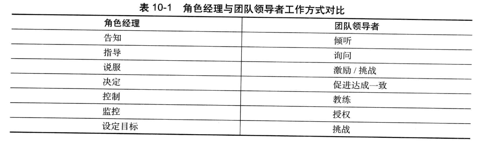

# 团队动力学

## 自主团队

自主团队对每一个成员有着严格的要求，其必须有很高的自我管理能力；并且整个团队相互扶持帮助，遵守规范，互相信任，这称为胶冻状团队；但是，在团队形成初期，成员有不同的目标，缺乏职责安排，效率低下；经过一段时间协同合作后可能会变好，而TSP可以指导团队尽快变好，缩短团队形成时间；

软件工程要求开发者全身心投入并且主观上追求卓越；并要求管理者激励并维持激励；知识工作者的管理需要领导者而不是经理；

## 自主团队的外部环境

项目小组需要在两方面获得管理层的支持：
1. 在项目启动阶段获得管理层支持
2. 在项目执行阶段获得管理层支持

要在启动阶段获得支持，就需要：
1. 体现出已经尽最大可能满足管理层的需求
2. 在计划中体现定期要向管理层汇报的内容
3. 向管理层证明他们的计划是合理的
4. 在计划中体现为了追求高质量而开展的工作
5. 持续向管理层展现优异的项目表现

要在执行阶段获得支持，就要：
1. 项目小组应当严格遵循定义好的开发过程开展项目开发工作。
2. 项目小组应当维护和更新项目成员的个人计划和团队计划。
3. 项目小组应当对产品质量进行管理。
4. 项目小组应当跟踪项目进展，并定期向管理层报告。
5. 项目小组应当持续地向管理层展现优异的项目表现

## 团队领导者和经理的区别

经理和领导者一般需要共存，协同工作，领导者确定方向，激励成员努力工作；各个角色经理安排具体工作内容来实现团队目标；

## 承诺文化的建立和团队激励

三种激励方式：

- 威逼: 上级要求下级必须完成某些工作

- 利诱: 用一定好处来吸引下属努力工作

- 鼓励承诺: 利用成员希望得到别人尊重的心理，来建立承诺文化，鼓励他们合理承诺并完成承诺，来得到别人尊重

**马斯洛需求层次理论**：从低到高分为：生理需求，安全感，爱和归属管，获得尊重，自我实现

可以发现威逼利诱属于下两层，而鼓励承诺属于最高两层，有更好的激励效果；并且因为每个人对待承诺的态度不一样，因此最好以团队形式建立承诺；团队共同建立/履行承诺；并且要在项目过程中提供反馈等来维持承诺

## TSP角色

### 项目组长

**工作内容和目标**：激励团队成员努力工作，主持会议，分配任务工作，汇报项目状态，来建设和维持高效率的团队

**需要技能**：领导者，有能力识别问题关键并作出客观决策，尊重团队成员并不介意偶尔充当恶人

### 计划经理

**工作内容和目标**： 开发项目和个人计划，并平衡计划，跟踪项目进度并参与项目总结；

**需要技能**：做事有条理，有逻辑，对过程数据非常感兴趣，充分认识计划的重要性

### 开发经理

**工作内容和目标**：制定开发策略，例如概要设计，带领成员开展各种估算，例如产品规模估算，时间估算等；开发需求规格说明，高层设计，设计规格说明，开发软件产品，开展集成测试和系统测试，开发用户支持文档等；并参与项目总结；总之就是开发优秀的软件产品，发挥每个成员的技能；

**需要技能**：具备足够的素养可以成为软件设计师，熟悉设计工具，愿意倾听别人的意见和想法；喜欢创造事物

### 质量经理

**工作内容和目标**：指导和带领整个团队开发可行的质量计划，并度量和跟踪质量计划的执行；并执行评审工作，形成评审报告等；详细包括向项目组长警示质量问题，开发质量计划，在软件产品提交之前进行评审；充当评审的组织者和协调者

**需要技能**： 关注产品的质量，理解过程的质量最终决定了产品的质量，知道在哪些关键节点开展评审来提升质量；有评审方面的经验，熟悉各种评审工具，知道不同的软件产品应该怎样去评审；有协调组织有效评审的能力

### 过程经理

**工作内容和目标**：准确记录，报告，跟踪过程数据，确保所有团队会议都有会议记录；带领团队定义和记录开发过程并支持过程改进；在项目进展过程中，记录过程数据和过程改进提案；基于这些记录，在总结时寻找过程改进方法，并在下一次实施；建立开发标准，例如代码规范，度量标准；其实就是管理文档，并且记录分析过程并进行改进的角色

**需要技能**： 对过程定义，过程度量以及过程改进非常有兴趣

### 支持经理

**工作内容和目标**：就是建立，管理和维护开发需要的工具和基础设施，例如环境，配置管理等；具体为带领团队识别开发过程中需要的工具和设施，主持配置管理系统，控制版本变更，维护产品的一致性和完整性；维护软件项目的词汇表，例如各个模块的解释等；建立跟踪系统来跟踪项目过程中遇到的问题和风险；支持开发过程中复用策略的使用；

**需要技能**：对开发过程中的工具有了解，例如版本控制工具