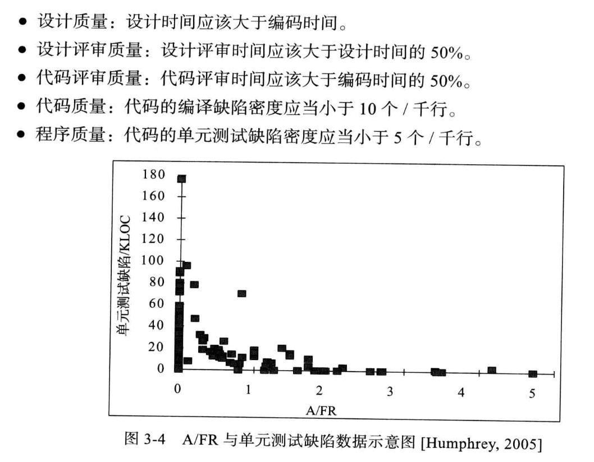
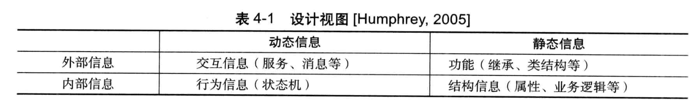
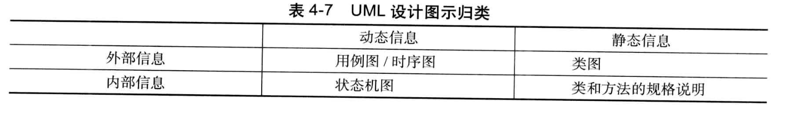
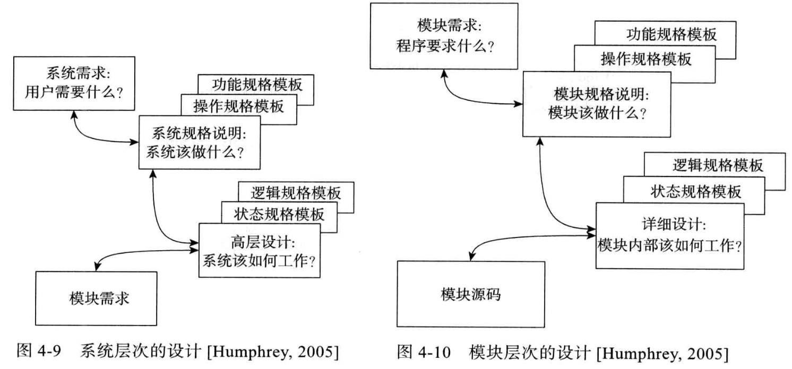

# 质量管理

## 质量策略

PSP中采用了面向用户的质量观，将质量定义为满足用户需求的程度；需要满足如下要求：
- 软件必须能够工作
- 必须有较好的执行速度
- ...

上面的列表可以扩展，但是无论如何第一条都是软件产品必须工作；而要满足这个最基本的期望，就应该没有缺陷；因此产品的质量目标就可以归结为确保基本没有缺陷；PSP中就用缺陷管理来代替质量管理

因此，质量策略就有如下亮点：
- 用缺陷管理来代替质量管理
- 高质量产品要求组成软件的各个组件高质量，基本没有缺陷
- 各个组件的高质量是通过高质量评审来实现的

而测试消除缺陷流程如下：
1. 发现bug
2. 理解工作方式
3. 调试，找出出错位置和原因
4. 确认修改方案并修改
5. 回归测试

而评审消除缺陷则更加简单：
1. 遵循评审者逻辑来理解程序
2. 发现缺陷的同时也知道了位置和原因
3. 消除缺陷

> 评审消除缺陷的成本要远远小于测试消除缺陷

为了保证评审过程的质量，定义了如下度量过程质量的指标：

### Yield

分为Phase Yield和Process Yield, 主要用Phase，表示每个阶段消除缺陷的效率，计算方式为某阶段消除的缺陷个数/(新发现的缺陷个数+前一阶段遗留的缺陷个数)

### A/FR

用来指导开发者合理安排评审和测试时间，计算方式为

$$
    A/FR = 质检成本 / 失效成本
$$

越大质量越高，质检成本也就是为了找出软件缺陷消耗的成本，而失效成本是发现了缺陷，分析缺陷并解决的成本；可以看出，要尽量预防缺陷，而不是等缺陷发生了再去修正；这里可以简单将质检成本设为评审时间，失效成本为编译和测试时间；期望值为2，也就是花费编译和测试两倍时间进行评审时，在测试阶段发现的缺陷较少

### PQI

用来描述过程质量，计算方式为五个过程质量指标的乘积；

### 评审速度

不能无限制的花更多时间进行评审，要设定一定的评审速度；一般200LOC/h，对于文档4page/h是合理的评审速度

### DRL

缺陷消除效率比，衡量不同缺陷消除手段消除缺陷的效率；一般用一个单元测试阶段消除缺陷的速度作为baseline，即a个缺陷/小时；此时其他消除缺陷手段的速度和该速度的比值就是DRL；

# 设计和质量

低劣的设计是导致软件开发中出现返工，招致用户不满的主要原因；更详细的设计往往可以减少软件系统的规模，降低软件系统的复杂度；进而可以提升软件质量；

# 设计过程

PSP给出了设计的具体步骤和设计的最终形式，也就是设计文档中包含什么，使得设计师不用考虑使用什么样的设计工具，以及如何编写设计文档；而是专注于设计这项真正需要关注的任务；设计文档中包含：
- 目标程序在整个系统中的位置
- 目标程序的使用方式
- 目标程序和其他组件和模块的关系
- 目标程序外部可见的变量和方法
- 目标程序内部运作机制
- 目标程序内部静态逻辑

可以总结为如下表格

PSP提供了四个模版，可以分别提取上述的动态/静态，内部/外部信息

## OST 操作规格模版

用来描述系统用户和系统的交互过程，来反应系统如何和外界交互；注意此时用户可以是人，也可以是和系统交互的其他模块；这个模版以用户和系统的一系列操作序列构成；

## FST 功能规格模版

描述系统对外的接口；通过FST来定义程序的功能；包括类和继承信息，外部可见的属性和方法，以及内部可见的属性(方便他人了解设计意图，便于评审)

## SST 状态规格模版

可以精确定义程序的所有状态，状态之间的转换以及状态转换时发生的动作；可以通过SST构件状态机，从而发现设计中的问题；

## LST 逻辑规格模版

精确描述系统的内部静态逻辑，包括关键方法的静态逻辑，方法的调用，外部引用，数据的类型和定义，一般使用伪代码表示

# 如何将设计模版和UML相结合(设计模版和UML的关系)

有些UML图中包含了上述模版中需要的信息，也有些信息UML图中完全没有；因此他们可以互补，具体如何使用在实践中根据需要选择；目前有如下对应关系

# 设计层次

一个系统的设计包含很多层次，例如最开始是需求定义，导出需求规格说明文档；随后根据这个进行高层设计，包含了所有子系统的规格说明；每个子系统规格说明包含每个子系统高层设计，该高层设计又包含该系统组件的规格说明；组件又包含模块，以此类推；而上述四种方法可以在各个层次应用，可以在不同的层次记录设计结果；例如：

