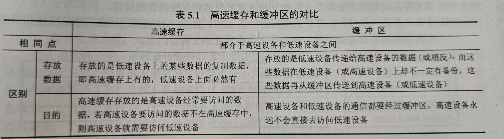

# IO管理

**注意**：
1. 当键盘中断服务例程运行结束后，输入数据的存放位置是内核缓冲区；因为中断服务例程实际上是由驱动程序响应的；可以这么理解，当设备发送中断请求后，产生中断，由驱动程序来处理中断，即运行一定的中断服务例程，将数据传送到内核缓冲区中；随后唤醒用户进程；当用户进程被调度时，没执行完的系统调用(实际上是设备独立性软件)将内核缓冲区数据读入到用户缓冲区，随后系统调用返回进入用户态；
2. 缓冲区是临界资源，因此要考虑进程访问缓冲的同步问题
3. 驱动程序先将抽象命令转化为具体命令后才能检验IO合法性

**IO设备**：最复杂的设备，可以将数据输入计算机也可以接受输出

**分类**：
1. 按照信息交换单位分为：
    - 快设备：传输速率高，可寻址
    - 字符设备：传输速率低，不可寻址
2. 按传输速率可以分为低速/中速/高速
3. 按使用方式分为：
    - 人机交互设备
    - 存储设备
    - 网络通信设备
4. 按共享属性分类：
    - 独占设备：同一时刻只能一个进程占用
    - 共享设备：**同一时间段**允许多个进程访问
    - 虚拟设备：通过SPOOLing等软件技术将独占设备改造成共享设备

### IO接口/设备控制器

CPU和设备之间的接口，用于接受CPU命令并控制IO设备；由三部分组成：
1. 设备控制器和CPU接口：连接数据线，包含数据/状态/控制寄存器；
2. 设备控制器和设备的接口：一个设备控制器可以连接多个IO设备；每个接口可以传输数据/状态/控制信息
3. IO逻辑：实现对设备的控制，相当于设备控制器的内部，通过地址线和控制线和CPU连接；可以根据和CPU接口寄存器中的值，以及地址(同时负责地址译码)，命令等信息控制设备

### IO端口

设备控制器中可以被CPU直接访问的寄存器；
1. 数据：存储要输入/输出的数据
2. 状态：存储设备状态或执行结果
3. 控制：CPU写入用来传输命令

**端口的编址**：
1. 独立编址：IO端口的地址空间和内存地址空间独立，范围可以重叠，需要用特殊的命令才能访问IO设备；
    - 优点：地址空间更小，位数更少，地址线更少，译码更简单，并且访问速度更快
    - 缺点：需要用额外专门的命令，更加复杂
2. 统一编址：内存映射IO，将一部分内存地址分配给IO端口；用统一的访存指令就可以访问
    - 优点：更方便，有更大的地址空间
    - 缺点：内存容量被占用，译码更复杂，降低访问速度

# IO控制方式

控制方式指设备和主机之间的数据传送方式；关键是降低CPU对IO控制的intervene

## 程序直接控制

CPU采用轮询方式，此时进程发出IO请求后，不会被阻塞，CPU发送IO命令后不断询问设备IO是否已经完成，完成后则继续运行，相当于一直在原地自旋；容易实现但是CPU利用率大幅降低

## 中断驱动方式

进程发出IO请求后，CPU将命令等信息传输给设备控制器，随后阻塞该进程，上下文切换后继续工作；当设备完成IO后，通过控制线向CPU发出中断请求，CPU处理中断，将数据读入寄存器中，随后唤醒被阻塞的进程；这样可以实现IO和CPU的并行；

**注意**：具体的流程为：进程请求IO，调用sys_call,转入内核态，CPU发送命令，随后阻塞进程；在数据准备好后，CPU进入内核态执行中断服务例程，随后唤醒进程；因此有：
1. 预处理/后处理程序都是在内核态
2. 预处理时进程处于运行态，后处理时处于阻塞态

**缺点**：
1. 设备和内存的数据交换必须经过CPU寄存器
2. 每次IO都要中断，如果要传输一个快那就要经常中断，效率很低

## DMA

有DMA控制器，其中有如下寄存器：
1. 命令状态寄存器CR
2. 内存地址寄存器MAR：存储数据在内存中的地址
3. 数据寄存器DR
4. 数据计数器

在设备和内存之间建立直接的通路，从而以快为单位进行数据传输，并且只在传输开始/结束时才需要CPU的干预；具体流程为：进程发起DMA请求，CPU将参数写入DMA控制器后将IO控制权交给DMA控制器；DMA完成数据传输后发出中断，CPU进行后处理;

## 通道通信方式

**通道**是特殊的处理机，CPU只需要向通道发送一条IO指令，指明通道在内存中的位置和IO设备，通道即可进行数据传输；和DMA的区别是：
1. 通道不需要CPU控制数据大小，存储位置
2. 通道可以对应多个设备

## IO软件层次结构

IO软件下面是硬件，上面是用户，因此要有层次结构，每层都利用下层提供的服务

1. 用户层：实现用户接口
2. 设备独立性软件：实现用户和设备驱动器的统一接口，他的主要功能有
    - 将物理设备映射为逻辑设备，用户用逻辑设备了调用IO命令，负责逻辑设备到物理设备的转换
    - 为不同的设备提供统一的接口，使得用户可以用同一套接口访问所有设备(所有设备的公有操作)
    - 对设备进行保护
    - 缓冲管理
    - 差错控制
3. 设备驱动程序：每类设备对应一个驱动，将系统发出的命令转化为具体设备可以理解的命令；随后发送给设备控制器；并实现设备命令到系统命令的转换
4. 中断处理程序：处理中断，进行上下文切换; 

## 应用程序的IO接口

**阻塞IO和非阻塞IO**：
1. 阻塞IO：在执行IO时阻塞进程，操作简单，适合并发量小的情况
2. 非阻塞IO：在发出IO请求后执行其他部分并不断询问IO是否完成；可以提高并发度，但是轮询会占用CPU时间

# 设备独立性软件

包括执行素有设备公有操作的软件；

1. **设备独立性**：指用户使用逻辑设备名申请使用设备，使得用户编程时使用的设备和实际使用的物理设备无关

## 磁盘高速缓冲和缓冲区

使用磁盘高速缓冲技术来提高IO速度，但是并不会用专门的硬件实现缓冲，而是将内存的一部分作为缓冲区；有两种方式：在内存的单独空间作为缓冲区；未利用的内存空间作为缓冲区

**缓冲区的主要目的**：
1. 提高并行性
2. 缓和设备和CPU速度不匹配的矛盾

### 单缓冲

缓冲区一般有三个工作：
1. 将数据输入缓冲区，时间为T
2. 将数据传送到工作区，时间为M
3. CPU对数据处理的时间为C，C和T可以并行

单独的缓冲区，工作流程为TMC，如果T大于C，那么在CPU处理完数据后需要等到一段时间，等新数据填满缓冲区后才可以开始处理下一个数据;如果C大于T，那么缓冲区需要等待CPU处理数据;处理一块数据时间为Max(T,C)+M

### 双缓冲

设置两个缓冲区，CPU处理1，2输入数据，然后CPU处理2，1输入数据，此时T和MC可以并行；处理一块数据的实现为Max(M+C,T);如果两个和设备之间只有一个缓冲区，那么无法同时发送；必须要设置两个缓冲区才能同时发送数据

### 循环缓冲

多个缓冲区，连成一个循环队列，原理和上面双缓冲一样

### 缓冲池

不仅包含数据结构还包含接口用于操作自身；缓冲区按照使用状况可以分为：
1. 空缓冲队列
2. 输入队列：其中的缓冲区装满输入数据
3. 输出队列

工作缓冲区分为四种：
1. hin收容输入：负责输入的进程从空缓冲队列中拿一个空缓冲区，作为hin，将数据输入其中并加入输入队列
2. hout收容输出：输出进程存储输出数据
3. sin提取输入：计算进程需要输入数据时从输入队列获取缓冲区，作为sin，提取数据并将缓冲区加入空缓冲队列
4. sout提取输出：计算进程需要输出数据

**高速缓冲和缓冲区的对比**：

# 设备分配和回收

根据用户的IO请求为其分配设备

## 设备分配的数据结构

每个通道对应多个设备控制器，每个设备控制器对应多个设备；因此有如下设备结构：
1. 设备控制表DCT：包含类型，状态和**设备控制器表**指针
2. 设备控制器表COCT：包含状态和**通道控制表**
3. 通道控制表CHCT：包含状态和他的**连接的所有设备控制器的表以及设备控制器地址**
4. 系统设备表SDT：系统中只有一张，每个设备一个表项，包含设备类和他的DCT

## 设备分配

### 考虑因素

1. 设备的固有属性：即独占，共享还是虚拟
2. 设备分配算法：FCFS，优先级
3. 安全性：
    - 安全分配：当进程请求设备后阻塞进程，降低并发度，但是进程阻塞是不会持有任何资源
    - 不安全分配：进程请求设备后可以继续运行，可以一次持有并操作多个设备，可能造成死锁

### 步骤

1. 进程发送IO请求，根据物理设备名查找SDT，并得到DCT，如果该设备忙，就阻塞进程
2. 根据DCT找到COCT，如果设备控制器忙，就阻塞进程
3. 根据COCT找到DHCT，如果通道忙，就阻塞进程
4. 将设备，控制器，通道全部分配给进程后，才能开始数据传输

如果使用逻辑设备名，则一个逻辑设备名对应多个物理设备，依次考虑这些设备，将不忙的设备作为目标物理设备即可

### 逻辑设备名到物理设备名的转换

系统中维护逻辑设备表LUT，表项为逻辑设备名到物理设备名的映射；当用逻辑设备名请求设备时，系统会为他分配一个物理设备，并在表中建立一项；下次再用同样的逻辑名申请时就直接使用这个物理设备；有两种方式：
1. 只有一张，不同用户不能使用相同逻辑名，适用于单用户
2. 每个用户一张

## SPOOLing技术(假脱机技术)

可以平衡高速的CPU和低速的IO设备，并且将独占设备改造为共享设备，由如下部分组成(井管理程序，预输入程序，缓输出程序)：
1. 磁盘中：
    - 输入井：输入进程先将数据存储到磁盘上的输入井中
    - 输出井：也是同样，设备现将数据存储到输出井中
2. 内存中：输入/输出缓冲区
3. 输入/输出进程
4. 井管理程序：用于控制井中数据和缓冲区数据的交换

他的工作原理如下：CPU在收到IO请求后，直接将数据存放到磁盘的井中；等设备空闲后，可以直接从井上读取数据；以输出举例：
1. 首先进程获得CPU，发送输出请求，将数据放到输出井上后阻塞
2. 设备空闲后，输出井上的数据，直接通过内存中的输出缓冲区输出到设备上

当有多个进程同时申请一个设备时，将他们的数据放到井上排队并都阻塞，在用户视角即为可以同时使用一个设备；

**特点**：
1. 提高IO速度: 如果没有技术，那么CPU在向设备输出数据时，必须在打印机打印完后才能做更多工作；但是有该技术，CPU只要将数据传送到磁盘(更加高速的IO设备)上后就不用管了；
2. 将独占设备改造为共享设备
3. 实现了虚拟设备功能

## 设备驱动程序接口

驱动程序：接受上层应用的抽象IO请求，将其转换为具体命令后发送给设备；

应该具有如下**功能**：
1. 接受上层的命令和参数
2. 检查用户IO的合法性
3. 发出IO命令
4. 及时响应由设备控制器发来的中断请求

## IO操作举例

**用户缓冲和内核缓冲**：当进程发起IO请求后，开辟一快用户缓冲空间，内核缓冲空间大家共用，目的是：最终数据要通过系统调用来获得，而系统调用运行在内核态，因此数据最先到内核缓冲中，再由系统调用复制到用户缓冲中；例如现在调用了scanf函数，整个过程如下：
1. 创建并检查用户缓冲区
2. 将参数传入
3. 执行trap进入内核态，执行相应服务例程，阻塞进程，返回用户态并调度其他进程执行

当键盘输入数据后：
1. 字符输入到IO端口中
2. 键盘IO发出中断请求
3. CPU响应中断，并由驱动程序将端口中的数据传输到内核缓冲中；
4. 进程被唤醒
5. 等进程被调度后，由设备无关层程序将内核态数据复制到用户态中；
6. 进程从系统调用中返回，此时数据已经存储到变量中

# 磁盘和固态硬盘

## 磁盘

**磁盘**是涂有磁性物质的物理盘片；每个扇区固定存储大小，并且按照固定圆心角划分，因此最里道存储密度最大；**磁盘的存储能力受限于最内道的最大记录密度**；磁盘安装在磁盘驱动器(硬件)，多个磁盘堆叠成磁盘组共同旋转；每个磁盘上都有一个磁头，所有磁头必须共进退；每个磁盘上的同一扇区形成一个柱面，扇区地址由柱面，磁盘，扇区号表示

**注意**：
1. 扇区地址就按照柱面，磁盘，扇区号表示，例如，第一个快存储到0号柱面，0号磁盘，0号扇区，第二个就是1号扇区，当0号磁盘的0号磁道满了以后，就存储到0号柱面，1号磁盘，0号扇区，就像进位一样

磁盘类型如下：
1. 按照磁头是否固定分为
    - 固定头磁盘
    - 活动头磁盘
2. 按照盘片是否固定分为
    - 固定盘磁盘
    - 可换盘磁盘

## 磁盘的管理

1. 磁盘初始化：在制作时进行**初级格式化**，即将空白磁盘分成扇区,并初始化逻辑快号到物理磁盘的映射
2. 分区：接下来要对磁盘进行分区，并对分区进行**逻辑/高级格式化**，即将文件系统数据结构存储到各个分区中；
3. 引导块：计算机启动时要运行的初始化程序，很小一部分存储在ROM中，完整功能存放在磁盘的启动快中(只有有启动快的磁盘才被称为启动/系统磁盘)；其实这个启动快就是MBR，MBR是第一个扇区，存放引导代码，分区表等信息；当计算机启动时步骤如下：
    - 执行ROM中的引导程序，将MBR中的引导程序读入内存并执行
    - 找到磁盘的引导分区(存储操作系统的分区)，读取该区的第一个扇区(引导扇区)
    - 加载各种系统服务，例如操作系统和驱动程序
4. 坏快：有两种处理方式：
    - 定时扫描磁盘，找出所有坏快并不再使用
    - 维护坏快列表，并保留快作为备用，采用备用快来逻辑的替换坏快

**注意**：
1. 磁盘扇区的划分位于初级格式化步骤中，文件系统根目录的建立位于高级格式化步骤中，因此必须要先分区，确定不同的分区对应不同的文件系统后，才能建立文件系统的根目录，高级/逻辑格式化相当于就是在初始化文件系统

## 磁盘调度算法

### 存取时间

由寻道，旋转延迟和数据传输时间决定；寻道时间占大头，因此调度算法就是通过尽量减少寻道时间来提高磁盘IO速度；(其他两个时间很大程度取决于磁盘的转速)

### FCFS

先来先服务，公平，适用于并发度小并且访问位置比较集中的情况；

### SSTF最短寻道时间优先

每次调度的是离磁头最近的磁道,使得每次寻道时间最短，但是不能保证平均寻道时间最小，可能导致饿死；

### SCAN算法

电梯算法，磁头只能向一个方向移动到边后才能向另一个方向移动；对最近扫描过的区域不公平，在访问局部性方面不如上面的两个算法，并且会偏向于最里/外侧的磁道；

### C-SCAN算法

相比于SCAN，他在移动到最外侧后，会直接移动到最里侧，然后从里开始再次到外；解决了SCAN算法偏向最里/外侧磁道的问题；

### LOOK调度和C-LOOK调度

是对上面两种SCAN算法的改进，即不移动到最外侧/最内侧，而是移动到最外/内的请求；一般无特别说明，SCAN默认为LOOK调度

### 减少延迟时间

有两种方式：
1. 因为在读取一个扇区后还要一定的时间处理，所以如果逻辑扇区在物理上也连续，那么消耗时间很多；因此交替编号，例如0213这样，使得逻辑上连续的扇区在物理上不连续，可以减少旋转延迟
2. 每个磁盘都是对齐的，如果要读取多个磁盘上相同的扇区，就不行；所以对不同磁盘错位命名；使得磁头划过0号盘0号扇区后，刚好到达1号盘0号扇区

## 固态硬盘

SSD，由多个闪存芯片和闪存翻译器构成；闪存芯片代替机械驱动器，闪存翻译层负责翻译来自CPU的命令；其中存储空间以页为基本单位，多个页构成一个快；以页为单位进行读写，以快为单位进行擦除；只有在页所属的快被擦除后才能写这个页；要写一个页，必须将这个快上的其他页都复制到新块才行

**磨损均衡**：快的擦除次数有限，因此要将经常要擦除，也就是写的数据均衡到各个快上，有如下方式：
1. 动态磨损均衡：写入时将块复制到新的闪存快上
2. 静态磨损均衡：SSD自动检测并进行数据分配，让老的快负责读，新的快负责写

**特点**：由半导体构成，没有旋转的部件，因此随机访问速度比机械磁盘快很多