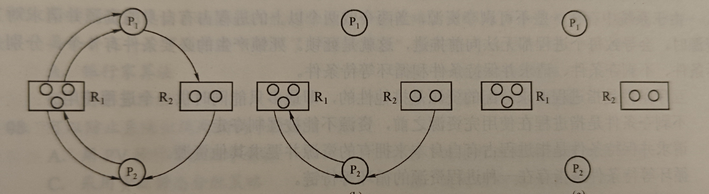

# 进程

**进程**是为了保证程序的封闭性，从而更好的描述和控制程序的并发执行；进程实体由如下部分组成：
1. **PCB**：描述进程的基本情况和运行状态
2. **程序段**：
3. **数据段**：

那么进程的定义为：进程实体的运行过程，系统进行资源分配和调度的一个独立单位

### PCB

进程存在的唯一标志，系统通过PCB来对进程进行控制，只有通过进程的PCB才能感知到进程的存在；PCB主要包括如下信息：
1. **进程描述信息**: PID,UID
2. **进程控制和管理信息**: 进程状态，代码地址，CPU占用时间等
3. **资源分配清单**: 代码段指针，堆栈段指针等
4. **处理机相关信息**: 寄存器值等

有如下两种方式组织PCB：
1. **链接**：将同一状态的PCB链接成一个队列
2. **索引**：将同一状态的PCB连接成一个索引表

## 进程的状态和切换

进程有如下状态：
1. 运行：在CPU上运行，单核CPU同一时刻最多有一个进程处于运行态
2. 就绪：获得了除了CPU之外的所有资源的进程，只要被调度选中后就可以开始运行的进程，占大多数
3. 阻塞：等待某个时间/某个资源的进程，例如调用sys_call，或等待硬盘IO的进程；
4. 创建态：正在创建中的进程，需要为进程分配内存，如果内存不够，那么就保持创建态并一直等待
5. 终止态：进程正在从系统中消失

状态转换：
1. 就绪 - 运行：就绪的进程被调度获得CPU资源
2. 运行 - 就绪：运行的进程时间片用完后让出CPU
3. 运行 - 阻塞：正在运行的资源请求某一资源或等待时间，进程只能从运行态变换到阻塞态
4. 阻塞 - 就绪：拿到了等待的东西

注意，进程被创建后为就绪态，并被插入到就绪队列中

## 进程控制

对进程实施有效管理，进程控制使用的程序段为原语，具有原子性，包括如下：
1. **创建**：父进程创建子进程，子进程拥有父进程的所有资源，过程为：为新进程分配唯一的PID，申请空白PCB，分配运行资源，初始化PCB，将新进程插入就绪队列中
2. **终止**：正常运行结束，出错或外界干预可以造成进程终止；终止过程如下：根据PID检索出PCB，读取该进程状态，将子孙进程全部终止(有些系统可以不终止)，将资源归还给父进程或OS，将PCB删除
3. **阻塞和唤醒**：当进程无法得到需要的资源时，就主动调用阻塞原语来使自己变为阻塞态；当资源被释放或事件完成时，由释放资源/完成事件的进程调用唤醒原语来将等待该事件的进程唤醒；

## 进程间的通信

PV为低级通信，这里先说四种高级通信方法：
1. **共享存储**：共享一段内存，两个进程都可以以互斥方式，使用系统调用来读写这段内存从而实现通信
2. **消息传递**：通过系统调用，以格式化的消息为单位进行数据交换，隐藏了通信实现的细节，简化了通信程序的设计，应用很广泛；有如下两种：
    - 直接通信：直接发送给接受进程，放在接受进程的消息缓冲队列中
    - 间接通信：发送给某个中间实体**信箱**，广泛用于计算机网络中
3. **管道**：特殊的共享文件，使得两个进程通过生产者-消费者的方式进行通信，必须要互斥，同步(写进程写后阻塞等待读进程读，同样读进程读后阻塞等待写进程写),确定对方存在；管道一般被限制大小，并且单向，可以被子进程继承，分为两种管道：
    - 匿名管道：存储在内核中，一般是父进程创建管道后子进程继承，用于父子之间通信，只能两个进程通信
    - 命名管道：存储在硬盘中，一个文件，可以多个进程进行通信
4. **信号**：用于通知进程发生了某个事件的机制，Linux共定义了三十种新号，在PCB中，有几种信号，就至少用几位来记录待处理信号，还有一个同样位数的序列用来记录被屏蔽的信号；有两种发送方式：
    - 内核给进程发送
    - 进程使用kill函数给别的进程发送<br>
    当从内核态转为用户态时，会检查进程是否有未被处理的信号，有如下处理方式：
    - 执行操作系统定义的默认的信号处理程序
    - 自定义的处理程序

# 线程

引入线程是为了减少在并发执行时付出的时空开销，因为同一进程的线程之间切换基本没有成本，可以提高并发性能；是程序执行的最小单元，同一进程的线程共享内存空间，但是每个都有不同的堆栈，只能访问自己的堆栈；引入线程后，进程作为除CPU外的系统资源的分配单元，线程则作为CPU资源的分配单元；每个线程都有专属的标识符和TCB

### 状态和转换

线程之间存在制约关系，也拥有运行，阻塞，就绪三种状态

### 线程的组织和控制

线程也有TCB，包含了如下信息：
1. 标识符
2. 寄存器的值
3. 运行状态
4. 优先级
5. 存储区，用于保存CPU现场
6. 堆栈指针

线程终止时，一般不会立马释放自己的资源，而是当其他线程执行了分离函数后才释放资源；终止了但是没有释放资源的线程仍然可以被调用继续执行

## 实现方式

由两种实现方式：用户级线程ULT，内核级线程KLT
1. **ULT**: 用户在用户态自己创建线程，通过调用线程库创建，此时操作系统看不到线程，因此资源分配和调度仍然以进程为单位；优点如下：线程切换不需要转到内核更快，可以定制自己的线程调度算法，实现和操作系统平台无关；但是缺点有：如果一个线程被阻塞了，那么这个进程就被阻塞了，不能发挥多CPU的优势，一个进程中同时刻只有一个线程能执行
2. **KLT**: 为每个线程设立TCB，让内核能感受到线程的存在，此时CPU调度单位为线程，提高了并发性，但是线程切换的成本变高
3. **组合方式**：可以建立多个内核级线程，并且允许用户自己建立用户级线程；

**多线程模型**：在同时支持ULT和KLT的系统中，用户级线程和内核级线程的连接方式不同，有如下三种：
1. 多对一：多个用户级线程映射到一个内核级线程，如果将每个进程的所有线程都映射到一个内核级线程，那么和只使用ULT基本没有区别；
2. 一对一：一个用户级线程映射到一个内核级线程，和只使用KLT也没有什么区别
3. 多对对：多个用户级线程映射到多个内核级线程，克服了上面的缺点，同时还提高了并发性，很好用；

# CPU调度

调度即从就绪队列中按照一定算法选择一个进程并将CPU分配给他，调度的层次如下：

1. 高级调度/作业调度：从外存上选择一个/多个作业，为他们分配内存，建立相应进程，将他们掉入内存
2. 中级调度/内存调度: 提高内存利用率，有些进程不能运行，因此将他们挂起/移到外存中，当可以运行时由中级调度来将他们掉入内存
3. 低级调度/进程调度：从就绪队列中选择一个给他分配CPU

**注意**：
1. 尽量让IO时间占比较高，或IO时间更长的进程先运行
2. FCFS比较有利于长作业，也可以说比较有利于CPU密集型作业，因为这种作业要长时间占用CPU，而IO密集型作业用一下CPU就IO就耀重新排队，在FCFS中耗时较长
3. 基本上除了在中断/原子操作的时候不能调度，其他时候都能调度


## 调度的实现

### 调度器

由如下部分组成：
1. 排队器：将就绪进程排程一个队列放入到就绪队列中
2. **分派器**：将选中的进程从就绪队列中拉出，给他分配CPU
3. **上下文切换器**：处理上下文切换

### 调度的时机，切换和过程

首先出现请求调度的事件，然后调度执行，最后切换到选择的进程；引起调度的因素如下：

1. **创建新进程**：决定运行父还是子
2. **进程终止**：进行调度，新选择一个进程
3. **运行进程被阻塞**
4. **IO设备准备就绪**：发出IO中断，将原来被阻塞的进程放到就绪队列中，并决定是否要运行她<br>
在某些系统中，优先级可以引发调度，或时间片用完时，也会引发调度

切换一般在调度完以后立即执行，但有几种情况除外：
1. 在处理中断时
2. 在原子操作时,关中断，因此调度和切换都无法进行

### 进程调度的方式

两种调度方式如下：
1. **非抢占氏调度**：当某进程在运行时，就让他一直运行，直到有触发调度的时间出现
2. **抢占氏调度**：若出现了更重要的进程，那么可以依据某种原则暂停正在运行的进程；主要有**优先权，短进程优先，时间片**等方式

## 调度算法评价指标

1. CPU利用率：利用时间比总时间
2. 系统吞吐量：单位时间内完成的作业数量，优先短作业可以大幅提升系统吞吐量
3. 周转时间：作业提交到作业完成的时间；还有
    - 平均周转时间
    - 加权周转时间：$\frac{作业周转时间}{作业实际运行时间}$
    - 平均带权周转时间
4. 等待时间：进程处于等待的时间，即周转时间减去运行时间
5. 响应时间：作业从提交到第一次被运行的时间


## 调度算法

1. **FCFS**算法：先来先服务，选择队列最开始的进程，新进程加入队列末尾；直到运行完成/阻塞时进行调度；实现简单，但是效率低，对短作业不利，周转时间较长
2. **SFJ**算法：短作业优先算法，每次都选择最短的作业来运行，可以显著降低周转时间，缺点是对长作业很不公平，如果一直有短作业，那么可能导致长作业饥饿，为考虑作业的紧迫程度，且运行时间是用户指定的，用户为了使得自己进程优先被选中可以设低运行时间，导致算法效果下降；SFJ可以是**抢占氏**的(默认非抢占)，当一个进程到达就绪队列时，如果他的运行时间比当前运行进程的剩余时间还要短就立马替换为这个进程运行
3. **高响应比优先调度**算法：综合了FCFS和SJF，为每个进程维护一个响应比： $1 + \frac{等待时间}{要求服务时间}$ ，每次都选择响应比最高的进程来运行；根据响应比的计算公式可以知道，当等待时间一定时，越短的进程越优先，符合短进程优先，降低整体周转时间；随着时间推移，长进程的响应比也会提高，防止长进程饥饿；
4. **优先级调度算法**：根据优先级高低选择进程进行调度，分为
    - 非抢占氏：运行完才选择下一个最高优先级的进程
    - 抢占氏：如果有更高优先级的进程进入队列，那么直接选择他，停止运行进程<br>
    优先级分为静态和动态，优先级的设置可以参考如下规则：
    - 系统进程 大于 用户进程
    - 交互性进程 大于 非交互式进程
    - IO进程 大于 计算型进程
5. **时间片轮转RR**算法：适用于分时系统，很公平，抢占氏，维护一个FIFO队列作为就绪队列，并设定时间片大小，每个进程完成/被阻塞/时间片耗尽时进行调度；(注意，时钟中断不是一定在时间片结束时发生，而是定时发生；因此时钟中断处理程序需要处理和时间有关的信息，例如决定是否要运行调度程序，记录进程使用的CPU时间，以及在当前时间片内剩余的时间)
6. **多级队列调度**算法：适用于多CPU，设置多个队列，每个队列可以对应不同性质/类型的进程，并应用不同的调度算法；
7. **多级反馈队列**算法：融合了多级队列和RR，FIFO，设置多个队列，每个队列有不同的优先级，每个队列的时间片大小不同，优先级越高时间片越短；每个队列都采用FCFS算法(RR算法准确来说)，如果一个进程在时间片内未完成，则进入下一级队列；按队列优先级调度，只有当高级队列空时，才会调度低级队列；
8. **基于公平原则**的调度算法：有两种：
    - 保证调度算法：跟踪每个进程获得的CPU时间，计算应该获得的CPU时间，即创建以来的时间除以进程个数，计算二者的比值，选取最低的进程运行，直到她的比值不是最低后进行调度
    - 公平分享调度算法：上面的算法对进程公平但是对用户不公平，因此该算法保证对用户公平，考虑每个用户的进程个数来构建一个特殊的调度序列，使得每个用户获得一样的时间；例如用户1有ABC三个进程，2有D一个进程，那么序列为ADBDCD...

## 多处理器调度

- **非对称多处理器AMP**：采用主从式操作系统，内核在主机上，从机上只运行用户进程，调度完全由主机负责；主机性能容易成为系统瓶颈
- **对称多处理器SMP**：每个核都是相同的，调度程序可以将任何一个进程分给任何一个CPU

**处理器亲和性**：为了使缓存一直有效，尽量使一个进程一直运行在一个CPU上

**负载均衡**：将负载平均分配到所有CPU上

可以看出这两者矛盾，如果要负载均衡就要移动进程，可能破坏亲和性；有如下调度方案：

1. **公共就绪队列**：仅设置一个队列，很好的实现了负载均衡，但是不亲和；为了保持亲和有两种方法
    - 软亲和：设置调度算法使得将一个进程始终分配给一个CPU
    - 硬亲和：由用户调用sys_call来使得进程一直运行在一个CPU上
2. **私有就绪队列**：每个CPU都有一个就绪队列，很好的实现了亲和但是没有负载均衡，为了实现均衡有两种方法：
    - 推迁移：一个系统程序周期性检查负载情况，从超载的队列中推一些到空闲队列
    - 拉迁移：同样

# 同步和互斥

**注意**：
1. 操作系统中，PV属于低级进程通信原语(主要因为V可以唤醒别的进程，所以有通信的成分在里面)
2. 生产者-消费者问题解决的是**多个进程之间的同步和互斥问题**，而不是共享一个数据对象的问题，因为他的关键不在于共享数据结构，本质上还是为了能让进程能有一定的运行顺序；

**临界资源**：必须互斥访问的资源为临界资源，代码中访问临界资源的代码段为临界区

**同步**：直接制约关系，指并发执行的进程有时必须要按照固定的执行顺序来访问某个临界区，才能使进程产生正确的结果

**互斥**：临界资源同一时间只有一个进程能访问，一个进程进入临界区时其他进程必须等待；同步和互斥遵循以下准则：

1. 空闲时其他进程可以进入临界区
2. 临界资源忙时其他资源必须等待
3. 一个请求临界资源的进程等待的时间是有限的
4. (可选)一个进程不能进入临界区时应该释放CPU资源

## 实现临界区互斥的基本方法

### 软件实现

1. **单标志法**：设置一个turn变量，用来表示是否有进程在临界区内；在进入前循环检查turn，退出后改变turn，但是此时两个进程必须轮流进入临界区，一个进程没法连续两次进入临界区；
2. **双标志先检查法**：设置一个大小为进程数量的flag数组，第i位表示进程i是否想要进入临界区；在进入前检查其他位是否为false,如果是就设置自己的位为true，如果全部是false才能进入临界区；但是无法互斥，若在检查后设置前切到别的进程，会使得多个进程同时进入临界区
3. **双标志后检查法**：同上，但是这里先设置自己的位为true再检查其他位是不是false；如果在设置后检查前切到别的进程，那么可能导致多个位为true，形成死锁
4. **Peterson**：(只允许两个进程)结合了第三种和第一种算法，同时维护flag数组和turn变量，flag表示想要进入，turn表示可以进入，先设置flag，后设置turn为另一个进程；如果另一个进程flag不为true或turn不是另一个进程，那么可以进入临界区；很好的满足了前三个准则；在访问临界区结束后将flag改为false即可

### 硬件实现

使用硬件提供的原子操作来实现互斥，有如下方法：

1. **关中断**：在访问临界区之前关中断，访问后再打开，会显著降低系统的并发性，并且在多CPU上不好用，并且给了程序恶意占用CPU的机会
2. **TestandSet**：一个原子操作，将某个变量设为新值并返回他的旧值；用一个bool值变量表示资源是否被占用，在访问临界区之前循环调用TS(true)并检查返回值是否为false，离开临界区后调用TS(false)即可；在临界资源被占用时进程只能自旋等待
3. **Swap**：一个原子操作，可以交换两个变量的值；和TS的使用方法基本一直，在进入临界区之前，设置一个变量为true，不断检查他的值，如果不为false，就调用swap交换他和锁的值，直到为false，此时说明临界区空闲，即可进入临界区；退出时将锁重新设置为false即可

注意，上面的方法都无法满足进程在得不到临界资源时释放CPU，并且可能导致饥饿问题；

## 互斥锁

mutex lock,提供两个原子的接口，分别为acquire和release,很简单，不多说；需要注意的是互斥锁也是自旋锁，在只有一个CPU的情况下表现较差，因此互斥锁适用于多处理器系统

## 信号量

包含一个值，和两个原子接口P和V；有两种信号量：

1. **整数型信号量**：不包含阻塞队列，其中P操作为如果val小于等于0就自旋，否则使得val减1；V操作为使val加一；可以实现最基本的同步和互斥
2. **记录型信号量**：此时每个信号量包含了一个链表表示等待该信号量的进程；此时PV操作分别如下：
    - P(wait)：val--，如果val小于0，那么将该进程加入链表中，并阻塞该进程(调用block原语)
    - V(signal): val++，如果val小于等于0，说明有进程在等待该信号量，此时从链表中选择一个进程唤醒；

有了信号量，可以轻易的实现互斥，即将信号量初始化为1即可(信号量的初值表示资源数，即可以同时进入临界区的进程数量)

### 使用信号量实现同步

如果在两个进程中有两行代码，他们的执行必须满足一定的顺序，那么可以用信号量来实现这种同步；例如x必须先于y执行，那么可以认为，x生成一个资源，y消耗一个资源；因此在x执行后V，在y执行前P，信号量初始值设置为0；

同样可以实现多对前驱关系，例如必须在x执行完以后才能执行y和z，那么设置两个信号量，然后使用上面所说的处理即可(注意，这里必须实现两个信号量，因为信号量的初值不能设置为负数，最小能设置为0，所以不能用一个信号量解决)；

## 经典问题

### 生产者-消费者问题

有大小为n的缓冲区，生产者每次生产一个产品放入其中，只能缓冲区还有空闲的时候放入；消费者每次消费一个产品，只能在缓冲区有东西的时候消费；首先设置信号量，为了使得二者互斥，设置初始值为1的信号量mutex作为缓冲区的锁；随后设置初始值为0的信号量con表示可以消费的资源数，初始值为n的信号量pro表示可供生产的空位；生产者-消费者代码分别如下：

```c
producer(){
    P(pro);
    P(mutex);
    \\ 生产并放入缓冲区
    V(mutex);
    V(con);
}

consumer(){
    P(con);
    P(mutex);
    \\ 消费产品
    V(mutex);
    V(pro);
}
```

### 读者-写者问题

1. 问题：有共享文件，同时只能有一个进程写,但是多个进程可以同时读该文件；设置一个rw锁，只有获取了该锁才能读写；并维护一个count值，表示在读的进程数，如果该值不为0，那么有进程想要读的时候不用获取rw锁，并设置mutex来互斥的访问count，具体代码如下：

```c
Writer(){
    P(rw);
    \\ Write
    V(rw);
}

Reader(){
    P(mutex);
    if(count==0)
        P(rw)
    count++;
    V(mutex);
    \\ read
    P(mutex);
    count --;
    if(count==0)
        V(rw);
    V(mutex)
}

```

这种实现有一个问题，即对写者很不友好，存在读进程时写进程会被延迟，存在写进程饿死情况；如果要求在有写进程请求资源时，后续新来的读进程全部被阻塞，那么可以这样实现：

```c
Writer(){
    P(w);
    P(rw);
    \\ Write
    V(rw);
    V(w);
}

Reader(){
    P(w)
    P(mutex);
    if(count==0)
        P(rw)
    count++;
    V(mutex);
    V(w)
    \\ read
    P(mutex);
    count --;
    if(count==0)
        V(rw);
    V(mutex)
}

```

### 哲学家进餐问题

共有n个哲学家做成一圈，每个人左右都各有一个筷子，哲学家只有在拿到两个筷子后才能进食；可以为每个筷子设置一个mutex锁，哲学家在进餐前P左右的mutex锁；但是这样很有可能造成死锁，即所有哲学家都拿着左手边的筷子，有如下解决方法(假设有5个哲学家)：
1. 至多允许四个哲学家同时抢筷子，即可以设置一个初始值为4的信号量，只有P了这个信号量才能开始抢筷子
2. 只有当左右两边的筷子都可以用时才能抢筷子，例如设置一个mutex，只有获得了该mutex才能拿筷子
3. 序号为奇数的哲学家先拿左手，偶数的哲学家先拿右手

## 管程

如果由用户自己设置信号量，可能为系统管理带来麻烦，因此系统设置**管程**来控制对临界资源的访问；对于每个临界资源，都有一个管程，包括如下内容：
1. 名称
2. 数据结构说明
3. 对结构进行操作的接口
4. 为资源设置初始值的接口<br>
每次仅允许一个进程进入管程，从而实现进程互斥；

### 条件变量condition

如果进程在管程内被阻塞，那么其他进程此时无法进入管程，因此有了condition；condition专门用来实现同步，每个condition实际上就是一个链表和两个接口wait和signal；管程为每个可能导致阻塞的原因都设置了一个condition；当某进程因为某原因被阻塞时，就调用相应condition的wait，将该进程放入阻塞队列后阻塞进程，直到其他进程使得需要的条件被满足，就调用这个condition的signal来唤醒该进程；

**condition和semaphor的不同**：条件变量没有值，仅仅实现了排队等待的功能；

# 死锁

**定义**：多个进程因竞争资源而造成的一种僵局，互相等待对方手里的资源，使得各个进程都被阻塞，若无外力干涉，那么进程都无法向前推进

**死锁和饥饿**：共同点是进程都无法顺利继续运行，主要差别为
1. 饥饿的进程可能只有一个，但是如果发生死锁，肯定是多个进程都被阻塞
2. 饥饿的进程可能处于就绪/阻塞态，但是死锁的进程一定是阻塞态

**产生死锁的原因**：
1. 对系统资源的竞争: 系统资源因为数量有限，并且多个进程对同一资源进行竞争，导致每个进程都持有一部分资源，都想要更多资源但是都得不到
2. 资源请求的顺序不当，导致都持有了对方需要的资源
3. **注意**：系统资源数量不足不是产生死锁的原因，而是产生饥饿的原因

**死锁产生的四个必要条件**：
1. **互斥条件**：资源必须被互斥访问
2. **不可剥夺条件**：一个进程持有某个资源后不能被剥夺
3. **请求并保持条件**：进程已经获取了资源，但是仍要请求更多资源，如果请求不到也不会释放自己的资源；
4. **循环等待条件**：第1个进程等待第2个进程...第n个进程等待第一个进程；死锁产生一定要满足循环等待条件，但是出现循环等待条件并不意味着出现死锁；

**死锁的处理条件**：
1. **死锁预防**：不论进程的资源请求情况，而预设一些资源分配的约束，来破坏死锁的四个必要条件
2. **死锁避免**：运用算法来在资源分配前检查这样的分配是否安全，拒绝不安全的分配，从而避免死锁；和第一种一样都是为资源分配添加限制条件，但是这个限制条件更轻，但是更难实现
3. **死锁检测和解除**：不施加限制条件，任由死锁发生，但是在死锁发生后能够检测到死锁并解除死锁

## 死锁预防

1. **破坏互斥条件**：使用无锁的数据结构，仅仅共享只读文件
2. **破坏不可剥夺条件**：允许其他进程强行剥夺进程持有的资源
3. **破坏请求并保持**：要求进程在请求资源时不能持有不可剥夺资源，有两种方法：
    - 预先静态分配：在运行前一次申请完所有资源
    - 进程获得初期需要的资源后开始运行，并逐渐释放资源，只有在释放完所有资源后才能申请新资源
4. **破坏循环等待**：顺序资源分配，为每类资源编号，只能从小到大请求资源，也就是必须持有小资源才能申请大资源；但是可能造成浪费，并且用户编程实现复杂

## 死锁避免

在每次分配时都检测分配带来的风险；**系统安全状态**指系统能按**安全序列**的顺序为所有进程分配资源，使得所有进程都能顺利完成；
注意，安全状态一定不会产生死锁，不安全状态可能产生死锁，如果死锁产生了那么一定是不安全状态

### 银行家算法

首先设定如下数据结构,假设有n个进程和m种资源：
1. Available：m维数组，表示每个资源的剩余量
2. Max: nxm矩阵，表示每个进程需要某种的最大值
3. Allocation: nxm矩阵，表示某进程已经被分配了多少某种资源
4. Need：nxm矩阵，表示某进程还需要多少某种资源，=Max - Allocation

**算法过程如下**：设request为进程i的请求向量
1. 检测request是否小于Need，若大于则认为出错，因为要求的资源超过了她要求的最大资源
2. 检测request是否小于Available，若大于则让他等待
3. 将资源分配给进程，修改Available,Allocation,Need
4. 运行安全性算法，如果不安全就撤销资源分配

**安全性算法**：
1. 初始化一个空的安全序列
1. 从进程中挑选一个不在安全序列中，并且其Need向量小于Available的进程加入序列
2. 将该进程的Allocation加给Available
3. 不断重复上述过程，直到所有进程都加入安全序列；如果没法把所有进程都加进去，表示不安全

## 死锁检测和解除

### 死锁检测

使用**资源分配图**来检测，框表示资源，框中的圈表示这种资源的数量，圈表示进程；进程和框之间存在有向边，资源指向进程的边表示已有一个资源分配给该进程；进程指向资源的边表示此刻进程申请一个资源；



**如何检测死锁**：
1. 找到一个进程，满足如下条件：她申请的每个资源，申请的量都小于等于目前剩余的量
2. 消除这个进程的所有边
3. 如果所有边都能被消除，说明该图可以被完全化简；否则就说明产生了死锁

### 死锁解除

1. **资源剥夺**：挂起某些进程并抢夺他的资源
2. **撤销进程**：强制撤销某些进程并回收他们的资源
3. **进程回退**：让某些进程回退到不会有死锁产生的时刻，需要系统维护进程的历史信息，设置还原点

**注意**：
1. 线程可以便于进程进行通信，但是无法增强安全性
2. FCFS不利于IO繁忙型作业，利于计算密集型作业
3. 算法设计：
    - 设计访问一个临界资源的同步和互斥算法时，在最内部抢mutex；不然如果在外部抢的话，如果抢到了锁，但是发现临界区没有资源而阻塞的话，就会造成死锁
4. 死锁检测并恢复具有最高的并发度，其次是银行家算法，最后才是资源预分配，因为预分配是很同步的一个方式，一旦给一个进程分配了所有他需要的资源，就尽可能让他一次执行完，这时候就算切到别的进程也大概率无法运行；