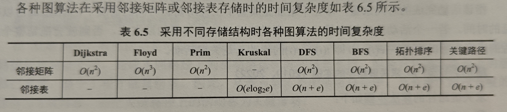

# 图

注意，一般情况下，若未做特殊说明，那么默认限定图为简单图

## 图的基本概念

#### 图的定义

图G=(V,E),其中V为顶点集合，E为边的集合。

#### 简单图和多重图

若一个图不存在重复边，并且不存在顶点到自身的边，那么图就是简单图，否则为多重图

#### 入度和出度

1. 在无向图中，顶点的度为他的边的数量，无向图的边的数量等于所有顶点度和的一半
1. 在有向图中，入度为终点为该点的边数目，出度类似。度为出度和入度之和

#### 简单路径和简单回路

路径序列中顶点不重复出现的路径为简单路径，在一个回路中，除了第一个节点和最后一个节点，其他节点不重复
出现的回路叫做简单回路

#### 子图和生成子图

子图就不说了，若有满足V(G')=V(G)的子图G'，那么称其为G的生成子图

#### 连通，连通图和连通分量

这三个概念都是针对无向图来说的，如果两个顶点之间存在路径，那么这两个顶点是连通的，
若图中任意两个顶点都是连通的，那么这个图就是连通图；无向图中的极大连通子图称为连通分量，注意，这个
连通分量既然是最大连通子图，那么他就必须包含原本存在的所有顶点和边.注意，计算强连通分量时，一个不在强连通分量
中的点自己就是一个强连通分量

#### 强连通图，强连通分量

这两个概念是针对有向图来说的，如果两个节点v,w，有v到w的路径也有w到v的路径，那么这两个节点强连通，
由此可以定义强连通图和强连通分量的概念。另外，对于有向图也有非强连通的，和非强连通分量，定义就和无向图
一样，在这个非强连通图中，一次搜索可能无法遍历到所有的节点，例如 $A \rightarrow B \leftarrow C $

#### 生成树，生成森林

连通图有一个生成树，该生成树是包含了图中全部顶点的一个极小连通子图，如果有n个节点，那么生成树就有n-1条边。
在非连通图中，每个连通分量构成一个生成树，所以这些生成树构成一个生成森林

#### 带权路径长度

每条边都带有一个权值，路径的所有边的权值之和为带权路径长度

#### 完全图

1. 无向图来说，如果每个顶点与其他所有顶点之间都有一条边，那么这个无向图为一个完全图。

2. 有向图来说，定义类似,边的数量为n(n-1),每个节点和任意节点之间有两条反向的边

## 图的存储以及基本操作

1. 注意，用邻接矩阵存储图时，若是无向图，那么0代表没有边，若是带权有向图，那么0和正无穷都代表没有边
1. 用邻接表存储有向图时，如果要删除某个点的入边，那么需要扫描整个表，设有n个节点和e条边，那么扫描整个表的时间为O(n+e)

### 邻接矩阵法

用一个nxn的矩阵来存储所有的边，适用于稠密图，若邻接矩阵为A，那么 $A^n$ 的元素 $A^n[i][j]$ 表示从i到j的长度为n的路径的条数

### 邻接表法

用链表存储每个节点的所有邻居，可以将存储每个节点的node放到一个线性表中，适合存储稀疏图，若图为有向图，那么比较难获得
一个顶点的入度

### 十字链表

专门用于存储有向图,每条边和节点都用一个节点来存储，分为边node和节点node
1. 边node：有四个指针，其中两个分别指向头和尾的节点；还有两个分别指向以同一节点为头/以同一节点为尾的下一条边
2. 节点node：两个指针，分别指向以该节点为头尾的边链表的头部

因此可以非常方便的获得点的入度和出度

### 邻接多重表

想法和十字链表基本一致，但是专门用来存储无向图，相比于邻接表，可以更加方便的查找和删除操作；
1. 边node：边连接的两个点，以及这两个点的所有边对应的链表
2. 点node：指向该点连接的边对应的链表

# 图的遍历

1. 对一个非强连通的有向图，有可能调用一次广度优先搜索就能遍历所有节点
1. 如何判断一个图是一棵树，首先判断他是否连通，然后计算边数，如果有n个节点和n-1条边，那么就是一棵树

## 广度优先搜索

用一个队列维护已经访问过的节点，随后进行循环访问，注意，若用邻接矩阵存储图，那么时间复杂度为 $O(|V|^2)$ ，如果用邻接表
来存储图，那么时间复杂度为 $O(|V|+|E|)$

**性能分析**：
1. 空间复杂度：至少需要一个队列存储将要遍历的节点，因此空间复杂度最坏情况下为O(|V|)
2. 时间复杂度：
    - 邻接表：每个节点都需要入队一次，并且每个节点的每条边都会被遍历一遍，因此为O(|V|+|E|)
    - 邻接矩阵：同理为 $O(|V|^2)$
**应用**：
1. 单源最短路径
1. 广度优先生成树：广度优先搜索过程中可以得到一个遍历树，如果是邻接矩阵表示，那么生成树一定(在顶点编号确定的情况下,因为同一个图的邻接矩阵表示是唯一的)，如果是邻接表存储，那么生成树不唯一(因为点存储的顺序不固定)

## 深度优先搜索

深度优先使用一个递归完成，每次处理一个节点时，考虑他的邻居，如果已经访问过就跳过，否则就处理。时间复杂度和广度优先搜索一样。
空间复杂度是递归的工作栈的大小。
1. 可以用深度优先搜索判断图中是否存在回路，在对v进行时，如果有一条从u指向v的边，并且在生成树中，u是v的孩子，那么存在一个
包含v和u的环

**注意**：
1. 对于任何非强连通图必须2次或以上调用广度优先遍历算法才可以访问到所有的节点

# 图的应用

## 最小生成树

**定义**：一个连通图对应一颗生成树，这个生成树包含所有节点并且包含尽可能少的边，如果图是带权值的，那么多个生成树中权值最小的树
就是最小生成树；当图中各边权值都不相同时，最小生成树唯一；否则，最小生成可能不唯一。但是最小生成树的权值肯定一样 

**注意**: 
1. 如果图只有n-1条边，那么他的最小生成树唯一，就是图本身

### Prim算法(类似dijkstra)

从一个点开始，将该点加入一个集合A，每次找A中的点的所有边(边的一个顶点已经加入到生成树中)中：权值最小的边，将这个边连接的新节点加入A中，重复直到所有点都加入A中
1. **时间复杂度**: $O(|V|^2)$ 
2. **特点**：时间复杂度不依赖边数，因此适用于解边稠密的图

### Kruskal算法(堆+并查集)

使用并查集，将所有边排序(一般使用堆来有序的存储边),初始时将所有节点都放入一个集合中，从最小的边开始，若两个端点在两个不同的集合中，那么合并这两个集合，并将该边加入到树中，重复上述过程直到所有点都加入到树中，因此在堆中找一个最小边的时间复杂度为 $O(log_2|E|)$ ,
1. **时间复杂度**:  $O(|E|log_2|E|)$

## 最短路径

**注意**:

1. 最短路径一定是简单路径，因为出现负环，那么可以通过不断的绕环使得最短路径不断减小，趋近于负无穷，这种情况下的最短路径
实际上没有意义了，可以说最短路径此时不存在。因此最短路径要么不存在，要是存在的话就一定是简单路径
1. 求关键路径的算法可以判断图中是否有环，因为第一步是求拓扑序

### 单源最短路径

**Dijkstra算法**：维护两个数组，其中一个数组存储已经考虑过的节点final，另一个存储源点到某点之间的最短距离dist。初始时，将源点加入final,并考虑源点和所有其他节点之间的距离，并更新dist数组，随后选取dist中和源点距离最短的点加入，并更新dist；不断重复上述过程直到所有点都被加入到final中，此时dist就包含了他们与源点的最短距离。如果还想要知道整条最短路径，那么可以维护一个数组path来存储每个节点的前驱，初始时将path中都设为源点，在每次更新dist时，如果某个节点的dist为被更新，那么就将刚加入final的节点作为他的前驱。这样在算法结束后就可以不断通过前驱打印出整个最短路径。
1. **复杂度**：不论如何存储，复杂度都为 $O(|V|^2)$ ，每次遍历V选择一个最小的，并且遍历V个顶点进行更新
1. **限制**：图中不能有带负权值的边

### 多源最短路径

Floyd算法：维护一个矩阵，假设节点编号从0开始，那么初始时为矩阵 $K^{(-1)}$ ,其中 $K^{(n)}$ 表示将编号小于n的节点作为中间节点时各点之间的最短路径。具体流程为
- 首先初始化第一个矩阵，即原本的邻接矩阵
- 将节点0加入作为中间节点，考虑当前矩阵，如果x到0加0到y的距离小于x到y，那么更新，并形成矩阵K1
- 重复上述步骤，假设有n个节点，直到生成Kn为止
1. 时间复杂度：不论以什么形式存储，时间复杂度都为 $O(|V|^3)$ ，因为要生成V个矩阵，并且每次都要遍历整个矩阵
1. 限制：图中的边可以为负权值，但是不能出现总权值为负的环

## 有向无环图描述表达式

用有向无环图DAG可以很好的处理公共子表达式，由此来更高效的描述表达式

## 拓扑排序

### AOV网
即用有向无环图表示一个工程，顶点表示活动，若有v到u，则表明v必须在u之前完成。则这种有向图称为顶点表示活动的网络，即AOV网。

### 拓扑序
在一个DAG中，若存在A到B的一条路径，那么A一定在B的前面，满足这个的序列即为拓扑序。生成步骤如下：
- 从DAG中选择一个入度为0的节点
- 删除该节点以及所有的边
- 重复上述过程

### 用DFS实现拓扑序
在DFS的过程中，若u是v的祖先，那么v肯定先比u结束处理，因此可以在DFS过程中为每个节点维护一个结束时间，并将结束时间从大到小排列即可得到拓扑序。

### 注意
**拓扑序可能不唯一**,如果用邻接表存储，那么时间复杂度为 O(|V|+|E|), 如果用邻接矩阵存储，那么时间复杂度为 $O(|V|^2)$.
只有在每次要选取节点时，入度为0的节点只有一个时，拓扑序才唯一。

## 关键路径

在一个DAG中，以顶点表示事件，边表示活动，这样的图称为AOE网。AOE网只有一个入度为0的点(源点)，和一个出度为0的汇点。
那么，要完成这个AOE表示的整个工程所需要的时间，就是源点到汇点的最长的路径(因为活动可以并行)，这条路径称为关键路径，路径
上的活动称为关键活动。最短完成时间就是所有关键活动的时间和。

### 事件的最早发生时间

$V_e(src) = 0, V_e(k) = max(V_e(j)+weight(j,k))$, 其中j是k的前驱。可以按照拓扑序依次计算每个节点的最早发生时间

### 事件的最晚发生时间

$V_l(end) = V_e(end), V_l(k) = Min(V_l(j)-weight(k,j),V_l(k))$ ，其中j是k的后继，从汇点开始，按照逆拓扑序来计算所有节点的
最晚发生时间。

### 活动的最早开始时间

即活动起点节点的最早发生时间

### 活动的最晚开始时间

即活动终点节点的最晚发生时间减去活动需要的时间

### 活动完成的时间余量

活动的最晚开始时间减去最早开始时间。

### 关键活动
所有时间余量为0的活动为关键活动，这些活动组成的路径即为关键路径。注意，如果要缩减整个工程的时间，那么就要缩减关键活动
的时间；一个AOE可能有多条关键路径，此时就必须减少所有关键路径的关键活动的时间才能缩短整个工程的时间。

### 活动/事件的时间余量

**事件**的时间余量即最晚开始时间和最早开始时间的差，但是**活动**的时间余量是指在按时完成的情况下，他最晚能开始多久,等于他的后继的最晚开始时间减去他需要的时间；

## 例题

1. 若一个具有n个顶点，e条边的无向图是一个森林，那么森林中必有n-e棵树
2. 若想要将无向图的节点重新编号，使得邻接矩阵只有对角线上方有值，那么可以按照拓扑序对节点进行编号
3. 邻接矩阵的平方中ij的值表示节点i到j的路径长度为2的路径条数，很好推理