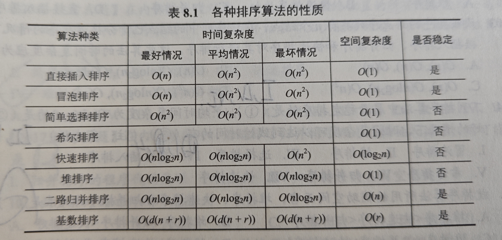

# 排序

1. 定义：输出一个关键字有序的序列，注意拓扑排序不算一个排序算法
1. 稳定性：相同的元素排序后是否交换位置
1. 内部/外部：是否要在内/外存中不断交换元素

# 插入排序

1. 简单插入排序一趟就只改一个元素，希尔排序一趟排列一组元素
1. 二分插入排序和希尔排序都只能使用顺序存储结构，因为！首先二分插入排序中使用了二分查找，所以不能；
而希尔排序，可以运行在链表上，但是因为他需要随机访问，所以如果在链表上效率会非常低，所以认为希尔排序只能运行在顺序表上

## 简单插入排序
每一趟处理列表，列表中前面都是一个有序序列，每次判断这个有序序列后面一个元素是否小于前面有序序列的最后一个元素，如果是，说明要把它往前移动，就首先将它拿出来，然后从有序序列最后开始遍历，将大于他的元素都向后移动一位，并将它放入正确位置。

#### 时间复杂度
最好是O(n),最坏是O(n^2),平均是O(n^2),因为，对于每个元素，都要向前比较和移动n次

#### 适用性
适用于顺序和链表，因为只需要顺序访问
具有稳定性

## 二分插入排序
就是简单插入排序，只不过此时如果需要向前移动元素，那么对前面的有序列表使用二分查找，来找到目标元素需要插入的位置，然后再将该位置后面的元素
都后移，并将目标元素填入目标位置，相比于简单插入排序就是减少了比较的次数，没有改变移动的次数

#### 时间复杂度
和简单插入排序基本一致，
具有稳定性

#### 适用性
只适用于顺序结构，因为里面使用了二分查找

## 希尔排序
简单插入排序的变体，设置一个d，将整个序列分成d组，例如，1，1+d,1+2d为一组，这样对每个组内的元素进行简单插入排序，并逐渐减小d，直到等于1.这是利用了简单插入排序在整个序列比较有序的情况下，并且较短的情况下性能更好。

#### 时间复杂度
数学上无法解决，因此和基本插入排序基本一致

#### 适用性
只能顺序结构，因为要随机访问，也就是要访问i+d个元素，如果是链表的性能很差，所以认为只能是顺序结构。
不具备稳定性

# 选择排序

1. 课后习题，算法题第三道，荷兰国旗
1. 若序列已经基本有序，那么不利于快速排序，因为每次选取的关键字，即第一个关键字，都会将序列分成两个极度不等长的两个序列
1. 快速排序的最大递归深度为n，最小递归深度为 $log_2n$
1. 冒泡排序的趟数，要算上最后一次不交换的趟，如果明确说明不算就不算，这里要好好审题

1. 快速排序只适合顺序存储，是因为如果要随机找一个pivot的话，那么列表无法随机访问就很麻烦，并且交换两个元素很麻烦。
1. 计算类似快速排序算法的平均时间复杂度时(例如快速选择),使用递推式：
$$
    T(n) \leq T(\frac{3n}{4}) + cn
$$ 
- 其中cn为partition处理n个元素需要的时间，不断递推，可以得到 
$$
    T(n) \leq cn(1+\frac{3}{4} + \frac{9}{16} \cdots \frac{3^k}{4^k})
$$
- 他的极限就是4cn，所以可以计算出平均时间复杂度为O(n)

## 冒泡排序
每次遍历，都将一个最大值交换到序列的最后面，并在下一趟时处理这个最大值前面的元素。注意每一趟不是只有最大元素会动，只有这个元素
比下一个元素大，他就会后移。

#### 时间复杂度
最坏为O(n^2)，平均为O(n^2

#### 性质
可以用于顺序结构和链表，具备稳定性 

## 快速排序
最屌的算法，每次选取一个pivot，一般是第一个元素，并将小于他的元素移到他左边，大的移到右边。具体实现方法可以看书上的算法，写的还是挺好的。P349

**空间复杂度**：即栈的递归深度，最坏情况下为O(n),平均情况下为 $log_2n$

#### 时间复杂度
最好为 $O(nlog_2n)$，此时每次选取的pivot都可以把序列等分，最坏为 $O(n^2)$,此时每次选择的pivot都是最小/大的元素，要递归很多次

#### 性质
只适用于顺序表，并且如果是书上的实现方法，那么不具有稳定性

# 选择排序

1. 堆排序每一趟都可以将一个元素放到最终的位置

## 简单选择排序
遍历n趟，每一趟都从后面的序列中选一个最小的元素放到最前面，不具有稳定性，因为在后面如果找到一个小元素要和前面的交换时，那么被交换的那个元素
可能会换到相同元素的后面去。具体看一下书上的算法就懂了

#### 性质
- 空间复杂度：O(1)
- 时间复杂度：O(n^2)
- 稳定性：没有
- 适用性：顺序表和链表

## 堆排序
对于一个数组，一个下标为i的元素，他的两个孩子为2i和2i+1。堆可以看成一颗完全树，最大堆的根大于孩子，最小堆的根小于孩子。堆排序有两步：
1. 首先先将无序序列构建成一个堆：从n/2个元素开始，每次查看他的两个孩子，如果两个孩子中最大的那个比他大，那么就和他交换，交换后，如果和第k个元素交换了，那么就继续考察第k个元素。从后往前这样处理，直到到达根位置。时间复杂度为O(n)
2. 排序：每次输出根元素，并将序列中最后一个元素放到根的位置，然后对根的位置应用上面的算法即可恢复堆的性质。因为在一个节点上，上面的算法的时间复杂度就是$O(log_2n)$，所以排序的总体时间就是$O(nlog_2n)$

#### 性质
1. 时间复杂度：$O(nlog_2n)$
1. 空间复杂度：O(1)
1. 稳定性：不稳定，因为在两个子节点相同时不一定会选取前面的
1. 适用性：顺序表,适合关键字较多的情况，例如从1亿个数中选取前100个数

# 归并，基数，和计数排序

## 归并排序
经典递归算法，从下往上开始，每次将两个有序序列合并为一个有序序列，逐渐合并直到只剩下最后一个有序序列。
因为一共要归并 $log_2n$ 趟，每一趟都需要O(n)，所以时间复杂度为$O(nlog_2n)$，因为每一次归并都需要辅助数组，所以空间为O(n)

#### 性质
具有稳定性，适用于顺序表和链表

## 基数排序
就是一位一位比较关键字，从最低为开始比较就是最低位优先，否则就是最高位优先。实际上这之后每次进行比较使用的排序算法只要是稳定的
就可以了，但是还是有一种专门的算法：设关键字每位有k种取值，那么就用k个队列，每次将元素放入对应的队列中，称为分配；随后将所有的队列
重新组成一个序列，称为收集。

#### 性质
1. 时间：如果关键字有d位，那么要进行d趟分配和收集，每一趟分配都需要O(n)，每一趟收集都需要O(r)(r为队列个数),所以总时间就是O(d(n+r))
1. 空间：O(r)
1. 具有稳定性
1. 适用于线形和链表

## 计数排序
这个可以直接看算法，简单来说就是只遍历一次，然后用一个数组来存储每个元素前面有的元素数量，然后直接将元素放到最终位置上。
空间换时间，算法过程是：首先遍历，如果出现了元素A，那么就在list[A]加一。随后遍历这个数组，对每一个i，都执行list[i]=list[i-1]+list[i]，这样每个list[i]就存储了i在最终排序中的索引;最后，从后往前遍历最开始的列表，通过将每个数据作为list的索引找到他应该在的位置，在位置上写入数据并将对应的list元素减1(从后往前遍历是为了让算法具有稳定性)

#### 性质
设数组中元素一共有k个取值
1. 时间：O(n)
1. 空间：O(k)
1. 稳定的，因为是从后往前将元素填到最终位置，但是有些实现也不稳定
1. 更适合顺序表,因为最后要把元素填进去的时候要随机访问，但是也可以链式存储；适合关键字都是整数并且范围不太大的情况；

# 内部排序算法的比较和应用

# 外部排序(!important)
此时待排序的数据都存放在硬盘中，并且不能一次性全部读取到内存中，所以使用归并排序，并且因为IO时间远远大于排序时间，所以可以认为
此时排序算法的总时间取决于IO的次数
1. 如果初始记录数为n，内存大小为k，那么每个归并段大小就为k，共有n/k个归并段，因为要归并段尽可能大才行。

## 外部排序方法
归并排序，假设初始有r个归并段，并且执行k路归并，那么内存中至少要能存放下k+1个快(一个归并段含有多个快)，将内存分为k个输入缓冲区和1个
输出缓冲区，每次从k个输入中选一个最小的放到输出中，如果输出满了就把输出写到文件中，输入空了就从对应的归并段中新读取一块。此时归并趟数为
$S = \lceil log_kr \rceil$, 因此，增大k，减少r可以减少读磁盘的次数。

## 多路平衡归并和败者树
如果增加归并路数k，那么在做排序时，每次选出一个元素需要做k-1次比较，每一趟归并就需要(n-1)(k-1)次比较，因此单纯增加k也不是能很好的减少排序时间。因此需要败者树。

败者树为一个完全二叉树，其中每个y叶点对应一个归并段。首选需要构造一个败者树，将归并段的第一个元素填到叶子节点上，并比较两个叶子节点，大的值为败者，将其写在父节点上，小节点为胜者，由父节点返回给上层节点继续进行比较; 接下来比较两个父节点对应的胜者，并重复上述过程，直到最后选出一个最小的记录。此时将记录输出到输出缓冲中。接下来使用败者树，每次将最小记录对应的归并段的下一个记录填到他对应的叶子节点上，并不断往上比，如果输了就留在节点上，赢了的继续往上比。这样，每次选出一个最小值之需要比较 $log_2k$ 次。此时每一趟的比较时间为 $S = (n-1)\lceil log_2k \rceil$ ,一共有 $log_kr$ 趟，因此总比较时间为 $(n-1)log_2r$ ，和k无关，因此可以放心的增大k的值

- 冠军节点一般被说为是根节点，但是其实不是，是根节点上面的冠军节点，因此冠军节点存储的是最小关键字所处的归并段号

## 置换-选择排序
该算法用于生成初始归并段，因为初始归并段必须有序并且要尽可能大，因此，最开始将内存读满，选取最小的元素为MIN，并将其填入到第一个归并段中，
随后，顺序从文件中读取下一个记录，并且从内存中选取大于MIN的最小的记录，不断重复上述过程，直到内存中选不出这样的记录，此时就形成了第一个归并段，不断重复上述过程直到产生所有归并段，每个归并段大小可能不一致，假设共有n个记录，工作区大小为m个记录，对于任意m第一个归并段的大小在m-n之间。

## 最佳归并树
首先说明一下，如果归并段大小全部相同，那么不需要使用这个，直接正常归并即可，可以构造归并树，叶节点表示初始归并段，内部节点表示归并后的归并段，归并总的读写块数为2*WSL(节点的权值为归并段大小)。

如果初始归并段大小不一样，那么可以构建一个哈夫曼树，即WSL最小的树，来生成一个最优的归并计划，此时IO次数最少。因为哈夫曼树是一颗严格k叉树，也就是节点的度要么是0，要么是k，所以有时候需要添加虚节点，即权值为0的节点;
**添加的虚节点个数**：总节点数为n，k路归并，不断添加节点直到 $(n-1)\%(k-1)=0$

## 例题

1. 平均情况下空间复杂度为n的排序算法为归并排序，最坏情况下空间复杂度为n的算法是快排和归并
2. 可以并行执行的排序算法：
    - 归并排序
    - 快速排序
    - 堆排序：因为堆的各个子树不相互影响，因此，例如在构建堆时，两个子树的构建可以并行执行
3. 败者树是一棵完全二叉树
4. 