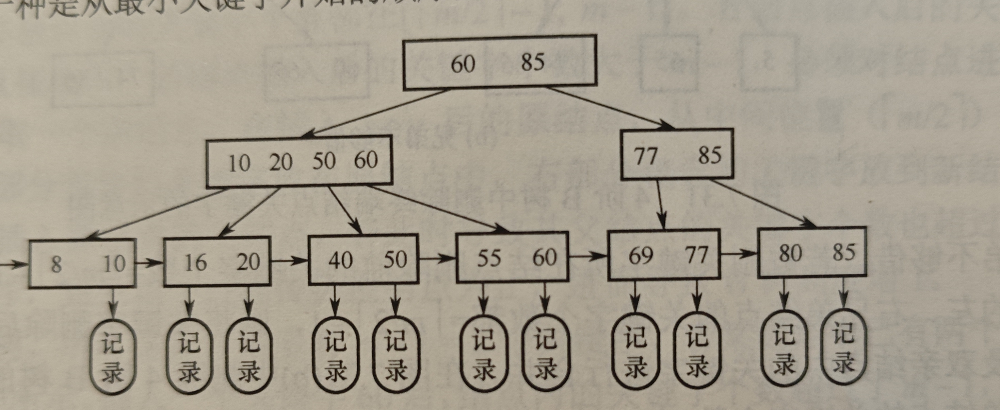
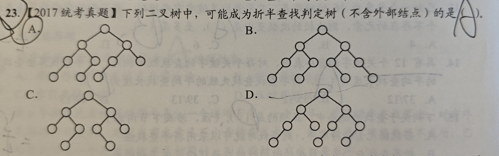

# 查找算法

### 查找的概念

1. 找到数据结构中特定的数据
1. 查找表；用于存储查找数据的数据结构
1. 静态查找表：该表只能进行查找，不能插入删除
1. 关键字：用于标识数据项
1. 平均查找长度ASL：查找长度为查找一个数据需要比较的次数，平均就是查找所有数据平均需要比较的次数

## 顺序查找和折半查找

1. 对于二分查找，如果给定了元素数量，分析查找成功/失败的平均比较次数，可以画出二分树来判断
1. 如何判断一棵树有没有可能是一颗二分查找树，就是看每一个子树的左右的节点数量。如果使用向下取整，那么左右要么相等，要么右比左多一，
如果使用向上取整，那么要么相等，要么左比右多一。由此可以判断

### 顺序
本质就是从头开始遍历，直到找到需要的数据或者没有为止

#### 一般线性表的顺序查找
可以设立一个哨兵，即将目标元素赋值给起始元素，这样从后往前进行查找时，若找不到目标元素就会返回起始元素，很方便
1. 假设有n个数据，在成功时，$ASL = \sum_{i=1}^n P_i * i = \frac{n+1}{2}$
1. 查找失败时，$ASL = n+1$

#### 关键字有序线性表的顺序查找
此时关键字有序，因此如果没有目标数据，那么查找到一半就可以发现并且及时退出，因此可以缩短查找失败时的ASL
1. 失败时的 $ASL = \frac{1+2+\cdots + n + n}{n+1} = \frac{n}{2} + \frac{n}{n+1}$, 这个的思想就是在每个元素之间
都可以加一个空，一共就有n+1个空，如果查找失败，那么一定会符合某一个空的条件，而落入每个空的概率相同，因此就是$\frac{1}{n+1}$

### 折半
每次选取中间元素，如果相同就返回，不然就比较然后在前面/后面重复上述步骤。注意只能在顺序表中应用这种查找算法，并且元素必须按关键字有序排列。
1. 成功时的ASL：设有n个节点，可以构建一棵树来表示查找过程，具体见P273,所以ASL为所有节点的高度和/n，即 
$\frac{1}{n}(1x1+2x2+4x3+\cdots hx2^{h-1}) = log_2(n+1)-1$, 因此时间复杂度为 $O(log_2n)$

### 分块
将数据结构分块，块内不要求有序，但是快之间必须有序，即第一个快的最大关键字小于第二个快的最小关键字，随后维护一个索引表，存储
每个快内最大索引和快的起始地址。其中，索引表和存储表都可以使用任意存储结构。如果在索引表和存储表中都是用顺序查找，那么总的ASL就是
在索引表中查找的ASL加上在存储表中查找的ASL，如果将存储表分成s快，每块b个，那么 $ASL = \frac{b+1}{2} + \frac{s+1}{2}$

## 树形查找

1. 树的高度有两种定义方式，一种是根节点到叶节点的最大边数，一种是最大节点数。
1. 如果将1-$2^k-1$ 个节点依次插入平衡二叉树中，那么树高度为k(最大节点数)
1. 对于一个节点，先删除再添加，不论他是叶节点还是内部节点，前后都是可能不相同
1. 红黑树如果全部节点都是黑的，那一定是一个满二叉树
1. 红黑树里面填充的那个NULL叶节点算空节点

### 二叉排序树
要么为空，要么左边节点值小于根节点小于右边节点值。在树平衡的情况下，查找平均之间为 $O(log_2n)$, 二叉树的插入非常简单，但是一般都是在
查找失败时进行插入；二叉树的删除分三种情况：
- 如果是叶节点就直接删掉
- 如果只有一个子树，就用子树根节点来代替删除节点
- 如果有两个子树，那么就找中序遍历序列中他的后继(也就是右子树的最左下节点),用**该节点来代替删除节点并且删除该节点**。
和二分查找很像，查询操作可能比二分查找差，但是可以方便的进行增添和删除，因此如果数据是动态的，就使用排序树存储数据，如果静态
就使用顺序表存储并使用二分查找更好一点

### 平衡二叉树
**定义**：左右子树的高度相差不超过一，左右子树的高度差距称为根节点的平衡因子，一个根节点要么没有子树，要么两棵子树都是平衡二叉树

在插入后，如果违反了平衡的性质，那么找到插入路径上离插入节点最近的平衡因子绝对值大于一的节点A，对以该节点为根的子树进行如下操作：
- **LL旋转**：若在左子树的左子树上插入，则右旋转
- **RR旋转**：若在右子树的右子树上插入，则左旋转
- **LR旋转**：若在左子树的右子树插入，则先将根A的左子树B的右子树的root左旋转到B的位置，再右旋转到A的位置
- **RL旋转**：若在右子树的左子树插入，同上
1. 注意，如果是单旋转，那么旋转找到的根节点的子节点，如果是双旋转，那么就旋转根节点的子节点的子节点
1. 如何判断到底是单旋转还是双旋转，首先要找到根节点，这是最重要的，然后在看新插入节点相对于根节点是左左还是左右

**删除**： 首先以二叉排序树的方式删除节点，如果删除后不满足平衡，那么找到距离删除节点最近的平衡因子不合理的节点，找到他高度最高的子树根y和y的高度最高的子树根x。按照插入的这四种情况进行旋转，即如果y是左子树并且x也是左子树就进行右旋转...

用nh表示高度为h的平衡二叉树含有的最少节点数量，那么n0=0,n1=1,n2=2,并且有nh=n(h-1)+n(h-2)+1。可以通过该式计算n个节点形成的平衡二叉树的最大高度；含有n个节点的二叉平衡树的最大高度为 $O(log_2n)$ 向下取整 ，最多就需要比较这么多次

### 红黑树
平衡二叉树太极端了，每次插入删除都要改变整棵树，所以使用红黑树，来使得树适度的平衡。红黑树有如下性质：
1. 每个叶节点都会被插入两个外部NULL节点
1. 每个节点是红色的或者黑色的
1. 根节点是黑色的
1. 虚构的外部NULL节点是黑色的
1. 不存在两个相邻的红色节点
1. 对每个节点，他到任意一个叶子节点的路径中的黑色节点数量都是一定的(这个值为该节点的黑高,不含开始节点)

由此可以得出一下性质：
1. 从根节点到叶节点的最长路径不大于最短路径的两倍(最短可能全是黑，最长可能半红半黑)
1. 有n个内部节点的红黑树高度 $h \le 2log_2(n+1)$ ,因为，黑高至少为 $\frac{h}{2}$ ，所以说节点数量至少为 $n \ge 2^{\frac{h}{2}}-1$

#### 红黑树的插入
首先，使用排序二叉树方式插入节点并将其染成红色，设该节点为z，若z是根染成黑，若z的父亲是黑色，那也不管，若z的父亲是红色，那么有如下三种情况
1. 当z的叔节点是黑色的,设z的父节点为x，叔节点为s，爷节点为y：
    1. z是左子树的右子树，那么先左旋并转为情况2，相当于交换z和x位置
    1. z是左子树的左子树，那么对x进行右旋，并且交换x和y的颜色
    1. 还有对称的两种情况，不多说，这四种情况的处理方式和AVL完全一样，只是在最后一步要交换颜色而已
1. 当z的叔节点为红色时，将z的父节点和叔节点都染为黑色，并将爷节点染为红色，并将爷节点作为新节点重复上述过程(若爷节点为根节点就将它染成黑色并结束)

#### 红黑树的删除
暂时先不看

# B树和B+树

## B树
和B+树基本一样，唯一不同就是
- 叶节点全部为NULL，表示查找失败
- 最下层内部节点为终端节点,也可以称为叶节点
- 内部节点也可以存储信息

*注意*:
- 插入的新关键字可能最终位于父节点中，因为可能插在中间。。。

### 定义
一颗m阶B树满足：
- 每个节点最多有m个子树，m-1个关键字
- 每个节点最少有 $\lceil \frac{m}{2} \rceil$ 个子树，$\lceil \frac{m}{2} \rceil -1$ 个关键字
- 根节点如果不是叶节点，那么至少有两颗子树
- 有序
- 所有终端节点都在同一层，也就是所有叶节点都在同一层，并且对于一个有n个关键字的B树，一定有n+1个叶节点

### 查找
从上到下顺序查找，首先查找目标节点(和B+树一样，节点存储在硬盘中，将节点得到内存中后再查找节点内关键字)
,因此查找速度的关键在于树的高度

### 树高
对于一颗有n个关键字的m阶B树，他的高度范围为 $ log_m(n+1) \leq h \leq log_{\lceil \frac{m}{2} \rceil}(\frac{n+1}{2})+1$
计算方式如下：
- 下限：当每个节点内关键字都填满的时候树最低，因此节点数n就小于等于所有节点的数量和(m-1)的乘积
- 上限：每个节点内关键字数量都最小，即为 $\lceil \frac{m}{2}-1 \rceil$ ，因为一定有n+1个叶子节点，因此此时二者相等，并且h取到最大值
(可以理解成，因为每个节点内关键字数量都最小，所以要满足最后能有n+1个关键字，那么树的高度就要尽可能高，此时达到最高)

### 插入
插入简单，如果超出了，就分裂成两个节点，并把最中间的关键字(此时分裂的两个节点不包括这个关键字)移到父节点中，使得他的左右两个指针指向这两个分裂的新节点，并对父节点应用同样过程即可

### 删除
删除时，
    1. 若删除的不是终端节点里的节点，那么就找到该节点的后继/前驱，该后继/前驱一定在终端节点中，将节点的值换为后继/前驱节点的值并改为删除后继/前驱节点
    1. 如果删除以后满足最小关键字限制哪就不管，否则有两种情况
- 兄弟节点够借，那么将当前节点和兄弟节点之间的关键字(父节点中)改成兄弟节点的第一个关键字(假设这时候借的是右兄弟的节点)，然后将父节点中的这个关键字填到当前节点中即可。
- 兄弟节点不够借，那么就合并当前节点，兄弟节点，以及兄弟节点和当前节点之间的父节点中的关键字，并对父节点应用同样过程。

在删除后，如果根节点只有一个子树了，也就是这时候根节点的关键字没了，那么就把新合并的节点作为根节点

## B+树的基本概念
这里的B+树和数据库那里学的B+树有一点不一样，但是他们都是专门用于数据库的

### 定义
一颗m阶B+树性质如下：
- 每个内部节点都只是起索引作用，所有信息都存储在叶节点中
- 每个内部节点的最大子树和关键字个数都是m个,至少有 $\lceil {\frac{m}{2}} \rceil$ 棵子树
- 每个叶节点内存储的每个关键字都对应一个指针，指向记录，并且还有一个多余的指针指向下一个兄弟节点
- 内部节点包含各个子节点中关键字的最大值以及指向该子节点的指针
- 有一个节点指向存储最小关键字的叶节点，使得B+树可以顺序查找

## 散列表

*注意*：
1. 使用开放定址法的散列表不能直接物理删除元素，因为会截断同义词元素的查找路径
1. 散列函数，冲突解决方法，和装填因子都会影响平均查找长度
1. 给定散列表，散列函数和冲突解决方法，如何计算查找失败的平均查找长度：注意，例如散列表中0，1，2都是满的，那么散列地址为0，查找失败
需要的查找长度为4！；并且，在查找到删除标记后，需要继续往下查找。 

### 散列函数

1. 直接定址法: 返回关键字的某个线形函数值(不会产生冲突，但是适合关键字比较连续的情况，不然会产生空间浪费)
1. 保留余数法: 返回关键字的某个模
1. 数字分析法: 取不同数位上分布比较均匀的几位作为散裂地址
1. 平方取中法: 取关键字的平方的中间几位作为地址(最终地址和关键字每一位都有关系，适用于每位取值都不够均匀的情况)

### 冲突解决方法

1. 开放定址法：就是如果发生冲突就以某种方式计算下一个地址，重复直到找到空闲地址为止
    - 线形探测：下一个地址为向后加一(堆积问题：就是大量元素在相邻的地址上堆积)
    - 平方探测：下一个地址为$[1^2,-1^2,2^2,-2^2 \cdots k^2,-k^2]$ ，并且k要满足散列表长度是一个可以表示成4k+3的素数
    - 双散列：下一个地址同样由散列函数计算，此时探查地址为 $(H(key) + i * H_2(key)) \% m $
    - **注意**：使用开放定址法时，不能物理删除元素，不然可能截断探查序列，导致**查找**异常失败
2. chaining：将所有同义词关键字存储在一个链表中，用于经常插入和删除的情况

### 散列查找以及性能分析

查找效率取决于：散列函数，处理冲突的方式和**装填因子a**；
1. 装填因子a：表中记录数/表长度，查找效率直接和a相关

# 例题

1. 判断折半查找判定树是否合法：其实就是看每次选取中间节点的规则是否一致，即在列表总数为奇数时，选择更靠前的为中间数还是更靠后的数为中间树，例如：

2. 对一个非空AVL，先删除某个节点，在插入该节点，得到得AVL和最初的不一定相同(不论操作的节点是否是叶节点)
