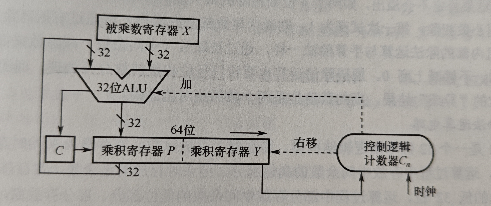
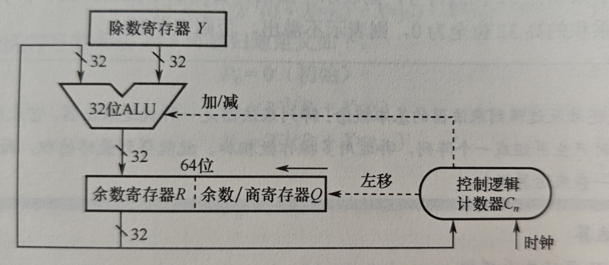

# 数制和编码

1. C语言中无符号数和有符号数比较时，将有符号数转化为无符号数来比较

## 进位计数制

一般用二进制，八进制和十六进制，注意二进制中三位对应一个八进制；不同进制之间的互相转换如下：
1. 二进制到8/16进制：对于整数部分在高位补0，小数部分在最低位补0；然后每3/4位对应一个数；
2. 转化为十进制
3. 十进制转化为任意进制，先转化为二进制再转化为其他进制；十进制小数如何转化为二进制小数：乘基取整法，每次将小数部分乘2，如果大于1，那么从低位开始取一个1，然后将小数部分拿出来继续；如果不大于1，那么取0；直到进行一次乘2后结果为1，此时最高位取1；注意，不是所有十进制都可以用二进制精确表示

## 定点数的编码表示

根据小数点是否固定由两种表示方式，定点数和浮点数；这里先讲定点数；
1. 定点小数：最高位为符号为，然后是小数点，后面的位都是有效数值
2. 定点整数

有四种表示方法：

### 原码

假设一共有n+1位，最高位表示符号位，表示范围为 $-(2^n-1) - 2^n-1$ ，0有两种表示方法，因此表示的数总共有 $2^{n+1}-1$
- **好处**: 很简单，乘除很好操作
- **问题**: 0的表示不唯一，并且加减不好操作

### 补码

假设一共有n+1位，最高位为符号位，如果是正数那么和原码一样,如果是负数：
1. 补码到真值：取反加一后即为真值的绝对值
2. 真值到补码：写出真值绝对值的n位表示，取反加一后，在添加一位符号位

表示范围为 $-2^n - 2^n-1$ ，0的表示唯一，总共表示的数个数为 $2^{n+1}$

**变形补码**：如果有0111 1111，他加一后就变成负数了，此时发生了溢出但是看不出来，因此变形补码用两位表示符号位和溢出位，00表示正，11表示负，如果有01或10，则说明发生了溢出

**注意**：
1. 用补码表示定点小数时，真值和二进制表示的转换规则和整数一摸一样；小数实际上是人为约定了小数点，在计算机中的存储表示和整数没有区别

### 反码表示

和补码的区别就是取反后不加一，0的表示不唯一，表示范围还比补码少，所以不用

### 移码表示

**只能表示整数**，假设共有n+1位，就是用 $2^n$ 加上真值得到，此时最高位符号和正常相反，即1表示正数，0表示负数，表示范围和补码相同，和补码仅仅相差一个符号位；**移码保持了数据原有的大小顺序**；

## 整数的表示

无符号数和有符号数，很简单不多说，注意有符号整数都用补码表示

## C语言的数据类型和转换

- 短整型short：16位
- int：32位，和机器字长一样
- long： 64位
- char： 8位

都按照补码形式存储；

**有符号数和无符号数的转换**：在C语言中，如果二者长度相同，那么直接转换，也就是只是变换真值的解释方式；

**不同长度整数的转换**：
1. 高位到低位直接截断
2. 低位到高位(注意，这里补0还是补符号位看的是低位数的类型，也就是说，short类型向unsigned int转换要补符号位)：
    - 如果原数是无符号数，那么高位补0
    - 如果原数是有符号数，那么高位补符号位；

# 运算方法和运算电路

**运算器**由ALU，移位器，状态寄存器和通用寄存器组成，有如下基本部件

1. **一位全加器**：最基本的加法单元，输入为两个加数和进位，输出为和以及进位
2. **串行进位加法器**：串联多个一位全加器，每一个加法器需要等上一个产生进位后才能运算，因此总运算时间很大程度取决于位数；
3. **并行进位加法器**：通过一个先行进位部分，先计算出每一位的进位，随后所有一位全加器可以同时计算出结果
4. **带标志加法器**：带有如下标志用于判断计算结果的一些特点，具体如何判断后面再说：
    - OF(overflow) ： 是否溢出
    - SF(Symbol) : 符号位
    - ZF(Zero) : 结果是否为0
    - CF(Cout) : 用于判断无符号数运算是否溢出
5. **算数逻辑单元ALU**：组合逻辑电路，输入为两个操作数，Cin进位，以及ALUop标识操作类型；可以完成加减乘除和等运算，ALUop的位数决定了ALU能完成的操作类型种类

## 定点数的移位运算

1. 逻辑移位：将操作数视为无符号整数，左移时低位补0，右移时高位补0；对于无符号数的逻辑左移，如果高位的1移出，说明发生溢出
2. 算术移位：将操作数视为有符号数
    - 左移时补0，如果移出的位不同于移出之后的符号位，那么说明溢出
    - 右移时补符号位，如果低位的1移出，则影响精度

## 定点数的加减运算

### 补码的加减法

如果机器字长为n+1，对于加法，直接连符号位一起加，最后保留n+1位；对于减法，先算出减数的负的补码，随后做加法；

**如何判断溢出**：因为所有减法都是化成加法，所以只需要考虑加法的情况；只有符号相同时才会发生溢出
1. 一位符号位：如果两个操作数的符号位相同，并且和结果的符号位不相同，那么溢出
2. 双符号位：注意，在存储时只用一个符号位，只有将数送往ALU时才填上另一位符号位
    - 00表示结果为正
    - 01表示正溢出
    - 10表示结果负溢出
    - 11表示结果为负
3. 一位符号位并根据进位：其实和双符号位原理相同，即如果最高位和次高位的进位的异或结果为1，则说明发生溢出；否则没有溢出

### 加减运算电路

该电路能同时实现有符号补码和无符号数的加减运算，但是他不知道输入的是有符号数还是无符号数，对于输入都做同样的操作，只是根据输入数类型的不同，有不同的判断溢出的方式；有如下新东西：
1. 新的输入sub，为1表示做减法，同时作为进位输入ALU中(因为如果是减，需要对减数的反加一)
2. 减数的MUX：减数输入一个多路选择器，选择器输入为sub，如果是1就取反

**标志**：
1. ZF：对于无符号和有符号都有意义
2. OF：只能判断有符号数是否溢出，通过进位的异或结果来判断： $OF = C_n \oplus C_{n-1}$
3. SF: 有符号运算的符号位
4. CF：进位标志，用于判断无符号数是否溢出；当加法时，Cout为1，CF为1表示溢出；当减法时，Cout为0，CF为1表示溢出；因此CF的算法为 $CF = Sub \oplus Cout$ (加法时很好理解，当进行减法时，考虑将两个数都想成补码形式，那么一个数符号位为0，另一个为1；符号位在最高位的前一位；如果最高位进行进位不为1，那么结果的符号位就是1，此时溢出)

### 原码的加减法运算

对于加法
1. **同号求和**: 先去掉符号位，随后进行加法运算，若最高数位产生进位则溢出；否则在运算结束后在添加符号位
2. **异号求差**: 先去掉符号位，用大的数减去小的数，最后添加被减数的符号位；肯定不会溢出

对于减法，将它化成加法后计算

## 定点数的乘除

这里应该不用看多细，书上都没好好写

### 乘法

电路如下：

初始时P存放中间结果，最开始为0，X存放被乘数；Y存储乘数，C存储每一次加法的进位；控制逻辑计数器初始值为32，每循环一次就减去一；两个32位数相乘需要32次移位和加法(虽然我感觉是33次移位)；每次CPY同步右移，最低位移入控制逻辑，如果为1，那么就将P和X的和写入P中，进位写入C中；

**注意**：
1. 在计算前先取两个数的绝对值进行计算；计算完后在计算符号
2. 如果结果为负数，那么对最终的结果取反加一；否则不变，作为最终结果
3. 如果用2n位表示结果，那么一定不会溢出
4. 如果用低n位表示结果，那么
    - 对于有符号数：如果高n位全部相同并且等于低n位最高位，那么不溢出，相当于对低n位做符号扩展等于高2n位，也就是最终结果
    - 对于无符号数：只能用2n位高n位判断，如果不全为0，那么溢出，也就是最终结果无法用低n位表示
5. 综上，因为2n位表示一定不会溢出，所以判断溢出方法就是：看低n位表示的数和2n位表示的数是否等价，如果低n位做符号扩展就得到了2n位结果，那么不溢出
5. 所以如果是两个正数想乘，那么采用无/有符号数的结果一样
6. 如果没有专门乘法指令，那么需要多个指令才能计算一个乘法；如果用ALU实现乘法指令，那么用一条指令/多个周期能执行完；如果使用阵列乘法器，那么一个周期就可以计算完；

### 除法

除法是用减法和左移实现的，对于两个n位的数相除，需要将被除数转换为2n位，对于原码小数，需要将低位添n个0，对于无符号数需要在高位添n个0(如果是有符号数就进行符号扩展)，**除数为n位保持不变**；每一次都用被除数高n位减去除数，如果够减就商1，否则商0；电路如下：

被除数整个存放在RQ中，每次判断R中能不能减去Y，如果能就减去并将结果写入R，并在下次Q左移后的最低位上商1即可；如果不够减就直接移位；每次由控制逻辑来根据Y和R的结果来判断能不能上商1；最终R中存放余数，Q中存放最终结果

**注意**：
1. 除法中的ALU要进行加减两种操作，是因为每次ALU减法运算的结果会直接存入寄存器高n位中，这时候判断这个值是不是小于0，如果不是，就留着并且商1；如果小于0，那么需要恢复原本的被除数高n位，就需要运行加法将除数和高n位相加；
2. **如何处理符号**：实际上还是取绝对值以后进行计算，最后单独计算符号，并改变结果和余数的符号

**溢出判断**：
1. 如果是2n位除以n位，结果为n+1位，如果最高位为1，则溢出
2. 如果是两个n位相除，结果肯定不会溢出
3. 如果是两个n位补码相除，那么只有最小值除以-1会溢出

**注意**：
1. 不管是乘法还是除法，整体上步骤都是+/-，移动，+/-，移动；对于乘法一共要移动n次，而除法一共要移动n+1次

# 浮点数的表示和运算

## 浮点数的表示

**表示格式**：一位符号位，几位阶码，几位尾数；表示范围关于0对称，有如下**溢出情况**：
1. 超过正数最大值：正上溢
2. 小于正数最小值：正下溢
3. 小于负数最小值：负上溢
4. 大于负数最大值：负下溢

当下溢时将浮点数作为机器0处理

**规格化**：为了使得尾数尽可能保留多的有效数位，调整尾数和阶码大小，使得尾数最高位上是有效位；
1. 左规：左移，同时阶码减一；可以进行多次左规
2. 右规：当两个浮点数运算后的结果的正数部分有两位时进行右规，只需右规一次；

基数为2时，原码表示的尾数的规格化应该是1.1...或0.1...的形式；补码表示时，最高位必须和符号位相反；如果基数为4，假设用原码表示，此时两个二进制位表示一位，因此小数点左边一位为符号位，右边的两位是最高有效位，规格化尾数只要这两位不全为0即可；

## IEEE 754

单精度和双精度分别为：
1. 1 8 23，共32位，阶码用移码表示，偏置为127，即011111111，阶码范围为-127-128
2. 1 11 52,共64位，偏置为1023，阶码范围为-1023-1024

为了能使尾数多一位有效位，将小数点之前的1隐藏；特殊意义的表示如下：

### 定点数和浮点数的区别

1. 表示范围：浮点数一般的表示范围要多于定点数
2. 精度：字长相同的定点数到浮点数精度降低了
3. 浮点数运算更加复杂
4. 溢出：定点数结果超出数的表示范围后就溢出，但是浮点数计算结果此时缺不一定溢出，只有规格化后阶码溢出才算溢出

### 浮点数的加减运算

步骤如下：
1. **对阶**：小的向大的对阶，对阶过程中如果尾数溢出，先保留，等到计算后并规格化后如果还是溢出就舍入
2. **尾数加减**：原码表示的尾数运行原码加减法
3. **规格化**：将尾数规格化为1.xxx形式
4. **舍入**：当规格化后，如果尾数还是超出，就舍入，有四种舍入方式：
    - 就近舍入：舍入到最近的值，如果处在两个值中间，那么舍入到偶数
    - 正向舍入：向正无穷方向舍入
    - 负向舍入：同理
    - 截断：将超出的数直接截断，相当于向0方向舍入
5. **溢出判断**：看规格化后阶码是否溢出；如果阶码全为0，那么负溢出，将该数设为0

## C语言中的浮点数类型

**类型转换**：不同类型运算时，将较低类型提升为较高类型，隐式类型转换；注意：
1. int转为float可能会影响精度
2. double转为float可能会影响精度或溢出
3. 浮点数转为int可能溢出或影响精度

## 数据的大小端后对齐存储

### 大小端

一段数据，例如ABCDEFH，A为高位，F为低位；每个数据都有一个起始地址，将高位存储在起始地址就是大端(也就是存储在低地址)；将低位存储在起始地址就是小端；

### 边界对齐

为了存取效率，要求数据的起始地址必须能够整除他的大小，这样才能一次访存取出整个数据，可能会造成空间浪费但是提升了存取速度，用空间换时间；对于结构体有如下规定：
1. 结构体大小必须是最大成员大小的整倍数，例如一个结构体中有int，char和short，那么最后结构体大小一定是4N字节数
2. 结构体成员必须在空间上对齐

## 注意

1. 相同长度的浮点数，基数越大，表示的范围就越大，但是精度就越低
2. 注意，IEEE 754单精度浮点数，最小的规格化正数是 $2^{-126}$