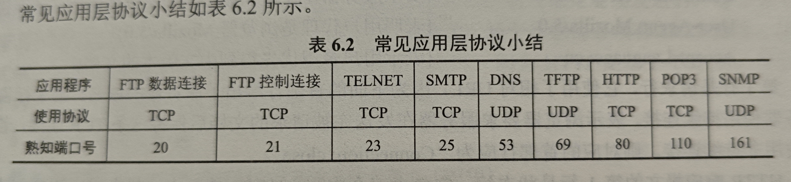

# 网络应用模型

1. **客户/服务器模型**：即C/S模型，总是打开的主机为服务器，接受客户机的请求；特点如下：
    - 计算机地位不平等，服务器可以通过用户权限管理客户机
    - 客户机不直接通信
    - 可扩展性不好
2. **P2P模型**：各个主机在网络上都是对等方，每个节点同时具有下载和上传功能，任意一对对等方直接相互通信;特点如下：
    - 减轻服务器压力，消除了对某个特定节点的完全依赖
    - 可扩展性好
    - 网络健壮性强
    - 缺点是在获取服务的时候还要提供服务，影响整机速度

# 域名系统

DNS即域名系统，DNS系统采用C/S模式，用UDP发送

## 层次域名空间

即域名可以被划分为子域，即.cn属于顶级，.edu属于二级等；特点如下：
1. 英文不区分大小
2. 最多63个字符

顶级域名分为如下类型：
1. 国家顶级，例如.cn
2. 通用顶级域名，例如.com
3. 基础结构域名，用于反向域名解析

## 域名服务器

域名到IP的解析是由运行在域名服务器上的应用完成的；将网络分为不同的区，每个区都有域名服务器，该服务器可以联通所有节点并拥有他们的域名信息；域名信息分布在所有域名服务器上；有如下四种域名服务器：
1. **根域名服务器**：最高层次，地址已知；一共有13个
2. **顶级域名服务器**：在根域名服务器下，管理顶级域名，即.com等
3. **权限域名服务器**：每台主机都在该服务器下登记，包含了所有区域内主机的域名信息，一般也同时充当本地域名服务器
4. **本地域名服务器**：用于处理DNS查询请求

## 域名解析过程

分为递归查询和迭代查询
1. **递归查询**：指向服务器发送DNS请求后，如果服务器不知道，就将该DNS查询发送给下一个服务器，直到获取到结果后递归返回；主机到本地DNS服务器是递归查询，之后一般不用递归查询，因为这样导致根DNS服务器负载过大
2. **迭代查询**：主机用递归查询将DNS请求发送给本地DNS服务器后，服务器向根服务器询问，获取下一个服务器信息后，在向下一个服务器询问，不断迭代，直到获取到域名信息后将其返回给主机

**高速缓冲**：提高DNS查询速度，服务器内一般设置有高速缓冲，缓冲最近查询过的域名信息

**注意**：本地域名服务器发送的DNS请求次数，可以说等于域名的层次数量+1，例如要查询www.abc.xyz.com，那么最多需要四次访问，即首先访问根服务器，得到.com服务器地址，随后访问该服务器得到xyz.com，然后访问他得到abc.xyz.com，最后访问他得到最终IP地址

# 文件传输协议

## FTP的工作原理

FTP服务器有两种进程，使用TCP传输，一个主进程，负责接受新的请求，很多从属进程，负责处理单个请求；特点如下：
1. 提供不同类型主机系统的文件传输能力
2. 提供对远程FTP服务器上的文件管理能力
3. 提供文件共享能力
4. 可以指定文件的类型和格式

## 控制连接和数据连接

FTP服务器和客户机之间建立两条TCP连接，分别为控制连接和数据连接；
1. **控制连接**：建立在服务器21号端口，用于传输控制命令，在会话期间一直建立
2. **数据连接**：建立在服务器20号端口，专门用来传输数据，当发出传输数据的命令时，在建立该连接传输数据，并在传输完成后断开；

传输方式分为主动和被动，她们的区别在于数据连接的建立方式不同：
- **主动传输**：客户端开一个端口，并通过控制连接将端口告知服务端，随后服务端主动在21端口建立和该端口之间的连接
- **被动传输**：客户发送数据传输请求后，服务端随机开一个端口并告知客户端，随后客户端主动连接该端口

# 电子邮件

## 电子邮件系统的组成结构

由**用户代理，邮件服务器和协议**构成；
1. 用户代理：即邮件软件，为用户提供接口来发送，读取邮件
2. 邮件服务器：存储邮件，以及执行邮件发送
3. 发送协议/读取协议：代理向服务器，以及服务器之间发送邮件时使用SMTP，代理从服务器上拉取邮件时使用POP/IMAP

注意，邮件是直接传送给接受端邮件服务器的，不会再中间服务器落地

## 电子邮件格式和MIME

1. 邮件格式：分为信封和内容，内容分为首部和主体，首部包括发件人信息，收件人地址和主题，主体即邮件内容；邮件系统自动生成信封需要的信息;
2. 邮件地址：**收件人邮箱名@邮箱所在主机的域名**
2. MIME：很多文字，或内容，无法使用ASCII传送，因此就有了MIME；MINE首先将非ASCII数据转化为ASCII数据后，交给SMTP进行发送，在接受端再使用MIME还原；这样就可以传输非ASCII数据的文件；包含以下部分：
    - 新的首部字段: 在首部字段添加特殊数据的类型，用于在接受端根据该类型解码
    - 新的邮件格式
    - 定义了新的传送编码，也就是数据转换的规则

## SMTP and POP3

### SMTP

用于控制两个互相通信的SMTP进程交换信息；使用C/S模式；使用TCP连接，端口号为25，只能传送7位ASCII码文本内容,工作流程如下：

1. 连接建立：SMTP客户服务器定期对缓存进行扫描，如果发现有邮件，就尝试直接和目标服务器建立连接(使用HELO命令)；不使用中间服务器，而是直接建立TCP连接，如果目标有故障，就等等再试
2. 邮件传送：  &emsp; 1. 首先发送MAIL命令传输发件人信息  &emsp;  2. 随后发送一个或多个RCPT命令和收件人信息，目标服务器返回相应收件人是否在服务器中； 
    目标服务器接受到每个命令都要回答，确保地址正确，该服务器中有这个接收方；随后开始传送邮件内容(用DATA命令)，并用两个<CRLF><CRLF>表示邮件结束
3. 连接释放

### POP2 and IMAP

1. POP协议，使用TCP，端口为110，很简单的邮件读取协议；用户代理运行POP客户程序，而邮件服务器中运行POP服务器程序；有两种工作方式
    - 下载并保留：读取后邮件仍留在缓存中
    - 下载并删除：读取后从服务器上删除
2. IMAP协议：很复杂，提供了创建文件夹，移动邮件等联机命令，以及允许获取报文的某些部分
3. 随着WWW的发展，很多在浏览器上使用的电子邮件，使用HTTP向邮件服务器发送/读取邮件

# 万维网

## 概念和组成结构

`WWW是一个分布式，联机式的信息存储空间`；空间内的资源，由唯一的URL标识，并通过HTTP进行传输；由如下部分构成
1. 统一资源定位符URL: 用于标记文档,格式为 *<协议>://<主机地址>:<端口>/<文档路径>*
2. 超文本传输协议HTTP: 使用TCP，传输文档
3. 超文本标记语言HTML: 用约定的标记对页面上的信息进行描述

万维网是无数个站点和网页的集合

## 超文本传输协议HTTP

面向事务，定义了请求和响应的格式和规则

### 操作过程

1. 分析页面的URL
2. 使用DNS请求解析地址
3. 获得IP地址
4. 与服务器建立TCP连接
5. 发送HTTP请求
6. 服务器用HTTP响应
7. 释放TCP连接
8. 浏览器将页面显示给用户

### 特点

1. HTTP本身无连接，使用TCP进行传输
2. 无状态，同一个客户两次访问一个服务器会得到一样的响应
3. **Cookie**：用于标识用户，服务器响应时生成随机index，并赋给set-cookie首部字段；用户接受到以后存储该index，并在下次访问时将index添加在请求中，使得服务器可以根据index从数据库中提取出用户之前的访问信息
4. HTTP/1.0非持续连接，HTTP/1.1持续连接
    - 非持续连接：每个网页元素对象的发送都使用单独的TCP连接，也就是获取每个元素时都要建立连接，并在获取后释放；获取一个元素需要2RTT，一般建立多个并行连接
    - 持续连接：在响应后仍然保持连接；
        - 非流水线：请求完以后等待响应，然后才能发送下一个请求
        - 可以一次发送多个请求，此时获取多个元素的时间就是1RTT

### 报文结构

面向文本，有请求报文和响应报文，并且都由三部分组成，即开始行，首部行和主体，二者仅开始行不同
1. 开始行：
    - 请求报文：称为**请求行**，包含方法，即GET，POST，以及URL和版本
    - 响应报文：称为**状态行**，包含版本，状态码和对状态码的解释
2. 首部行：包含一些键值对
3. 主体：请求报文一般不用，响应报文中即是页面数据，但是也有可能不用

请求方法常用类型：

| 方法 | 作用 | 
| ---- | ---- | 
| GET| 请求内容 | 
| POST | 为服务器添加信息 |
| HEAD | 请求内容的首部行，就是GET，但是不返回实际内容(服务器响应该命令但是不返回请求对象)  | 
| PUT | 在指定URL下存储一个文档 |

<h2>例题</h2>
1. 用户使用HTTP获取网页时，需要的时间为2RTT(至少)，因为要先用TCP建立连接

2. 注意，如果某个IP分组，源端口号为80，到达NAT，但是NAT表中没有该表项，则说明这个分组不是对外部HTTP请求的响应，而是对局域网HTTP请求的响应，因此不需要转发，直接丢弃

