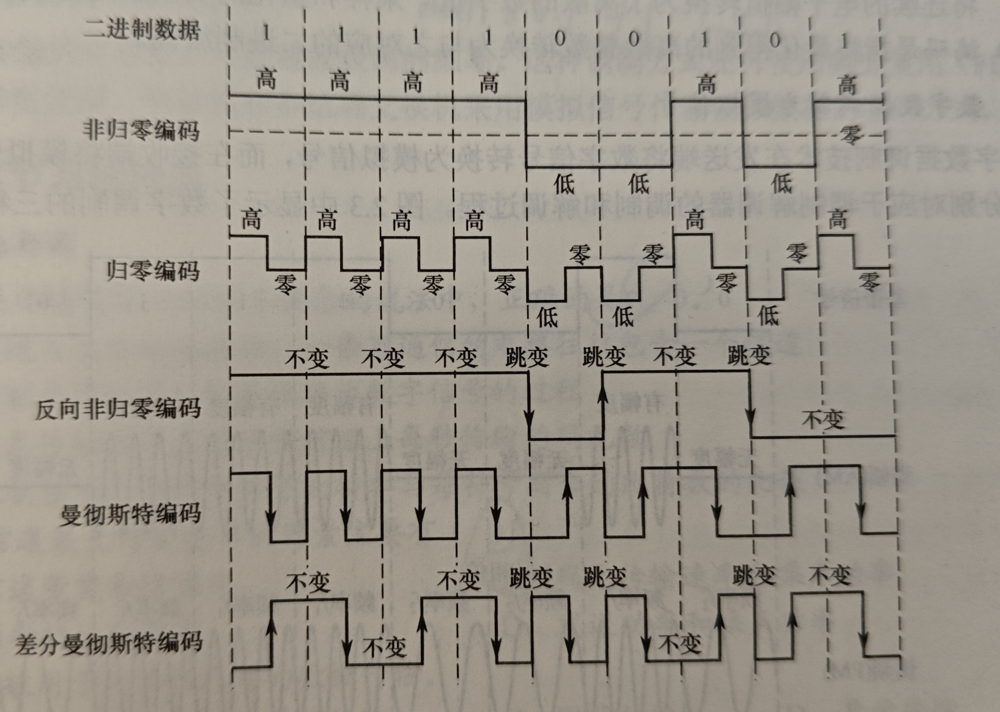

# 通信基础

## 数据，信号和码元

1. 数据指要传输的信息
2. 信号指传输数据的方式，即将数据转为模拟/数字信号后进行传输
3. 码元指一个固定时长内的信号波，表示一个k进制数

## 信源，信道和信宿

信源发送信号，通过信道传输给信宿,注意信道要么发送要么接受，也就是单向的，一个双向通信电路包含两个信道;
信道有如下分类：
1. 模拟信道和数字信道
2. 基带/频带/宽带传输：
    - 基带传输：短距离不经过调制直接传输，一般传输数字信号
    - 频带传输：相当于用FM方式调制后进行传输，可以远距离传输
    - 宽带传输：使用频带传输将链路分为多个信道，每个信道传输不同的信号，提高链路容量
3. 串行传输和并行传输(串行用于计算机网络，并行用于计算机内部等短距离传输)

通信双方的交互方式分为：
1. 单向通信
2. 半双工通信：两方都可以发送和接受，但是一方不能同时发送和接受
3. 全双工通信：一方可以同时发送和接受

## 速率，波特和带宽

1. 速率表示信息传输系统单位时间内传输的数据量，有两种表示：
    - 码元传输速率/波特率：每秒传输的码元数，与进制无关！
    - 信息/数据传输速率：每秒传输的比特数
2. 带宽：传输信号的频率范围，单位为HZ，但是在计算机网络中表示通信线路传输数据的能力

## 信道的极限容量

信号在传输过程中会失真，有可能使得接受端无法还原，受传输距离，噪声干扰，传输速度等影响；

**注意**：在计算信道的极限数据传输速度时，可能要同时考虑奈氏准则和香农定理，例如信道在没有噪声情况下的根据奈氏准则的极限速度小于根据信噪比计算出的香农定理的极限速度，那么最终极限速度应该取第一个也就是更小者，2.1.4第12题

### 奈奎斯特定理(奈氏准则，该准则不考虑噪声)

1. 码间串扰：高频在传输过程中衰减导致码元之间的清晰界限消失

为了避免码间串扰，奈氏准则要求**码元传输速率**小于2W，其中W为信道的带宽，单位为HZ；

**离散电平数量V**：即码元的种类数量，例如有16种码元，就需要4位，数据传输速率就是码元传输速率的四倍

极限数据传输速率= $2Wlog_2V$

结论如下：
- 码元传输速率有上限
- 信道带宽越大，传输能力越强
- 该准则只限制了码元传输速率，但是没有限制信息传输速率，所以要设法让每个码元携带更多的信息

### 香农定理(考虑噪声)

给出了在有噪声的信道中的极限数据传输速率，使用该速率时不会产生误差，即

$$
\text{极限数据传输速率} = Wlog_2(1 + \frac{S}{N})
$$

其中S表示传输信号的功率，N代表噪声功率，S/N表示信噪比，无单位，若有单位DB，那么转化公式如下：$S/N(DB) = 10log_{10}(S/N)$ ,结论如下：
- 在带宽一定，信噪比一定的信道中数据传输速率是有界限的
- 信噪比越大就越快
- 只要低于极限速率，就能实现无差错的传输
- 该极限速率为理想情况，实际要更慢

对比奈氏准则，香农定理还考虑了噪声的影响，给出了数据的极限传输速率，这就表明了一个码元能携带的比特数是有限的，无法通过无脑给码元加比特的方法提高数据传输速率；

## 编码和调制

- 编码表示将数字数据或模拟数据转为数字信号
- 调制表示将数字数据和模拟数据转为模拟信号

有如下四种编码/调制方式：

### 数字数据编码为数字信号

1. 非归零编码: 高电平表示1，低电平表示0，不提供同步
2. 归零编码：高低电平同样表示1/0，但是在码元中间会归零，以此来同步，但是会降低传输效率
3. 反向非归零编码：通过跳变表示0或1，不损失带宽的同时提供同步
4. 曼彻斯特编码：在每个码元中间跳变，向上就是0，向下就是1；电平跳变既作为时钟信号，也传递信息;无法提高抗干扰能力，就是能提供数据同步
5. 差分曼彻斯特：在每个码元中间都跳变，但是这个跳变只是作为时钟信号，而通过每个码元开始时是否跳变表示1/0,不跳就是1；相比于曼彻斯特有更好的抗干扰能力

### 模拟数据编码为数字信号

1. 采样：将连续数据变为离散数据,采样率表示一秒钟采样的次数，根据奈氏准则，采样率必须高于最高频率的两倍才能还原原始信号
2. 量化：将采样后得到的电平值转换为对应的数值
3. 编码：对这些数值进行编码转换为数字信号

### 数字数据调制为模拟信号

**调制解调器**: 开始调制，接收方解调

1. 调幅AM：用两种不同幅度表示0和1，容易受噪声影响
2. 调频FM：用两种不同频率表示0和1，不容易被噪声影响，更好用
3. 调相PM：用两种不同相位表示0和1
4. 正交幅度调频QAM：在频率相同的情况下，融合AM和PM，也就是可以设定m个相位和n个幅度，这时候就有mn中码元，此时数据传输速率为

$$
    R = B log_2(mn)
$$

其中B为波特率，后面那一项表示mn种码元需要的比特数，在乘以波特率就是数据传输速率

### 模拟数据调制为模拟信号

直接发没什么好说的，有频分复用

# 传输介质

传输介质分为：
- 导向传输介质：电磁波在固定介质中被导向，沿着介质传播
- 非导向传播介质：无线传播

### 双绞线

两根铜线相互绞合而成，相互绝缘，传播距离在十几千米内;绞合的目的是抗干扰

### 同轴电缆

最内部有内导体，外面有绝缘层，屏蔽层和绝缘保护套，有很好的抗干扰特性,相比于双绞线有更好的屏蔽性，因此传输速率更快，但是还是用双绞线比较多

### 光纤

利用光脉冲信号进行传输，有纤心和包层构成，纤心很细，并且光的频率很高，因此光纤的宽带很大；
- 多摸光纤(多条不同角度入射的光线在一根光纤中传输)：损耗很高，适合近距离传输
- 单模光纤(光纤的直径减少到光的波长，此时光线一直传播不产生反射)：损耗很小，适合长距离传输

优点：
- 传输损耗小
- 抗电磁干扰能力强
- 保密性好
- 体积小重量轻
- 一根光纤内部至少有两条光纤，所以可以全双工

### 无线传输介质

1. 无线电波:最大优点是简化了通信连接，因为无线电波向所有方向传播，接受设备无需进行特殊设置
2. 微波，红外线和激光: 红外线和激光都将数据转化为各自的信号，并需要发送方和接受方之间有视线通路；微波频段范围很宽，因此容量很大，但是传输距离较短，需要使用中继站；

## 物理层接口的特性

即物理层的主要任务，确定和传输介质接口的一些特性，包括：
1. 机械特性：介质是怎样的，形状和尺寸等
2. 电气特性：电压范围，传输速率等
3. 功能特性 不同电压的意义，每条线的功能
4. 过程特性：各种时间的先后顺序

# 物理层设备

## 中继器

主要功能是放大整形并转发信号，以消除信号的失真和衰减，增大传播距离，但是有几点要注意：
1. 中继器没有存储转发功能，只是放大，因此必须连接两个相同协议的网段；如果两个网段速度不一样，用中继器连接后只能工作在同一较低速率
2. 中继器不能无线延长，一般协议中都规定了最多只能使用多少个中继器
3. 中继器和放大器原理不同，放大器放大模拟信号，中继器放大数字信号，并且是通过整形再生的方式

## 集线器

相当于多端口的中继器，一个端口输入的信号会被整形再生后发送到所有其他端口，如果有多个端口同时输入，那么会失效；作用：
1. 扩大网络输出范围
2. 使组网更加灵活
3. 只能半双工工作，也就是两个主机不能同时发送，因此吞吐率受限
4. 由集线器连接成的多个主机在物理上构成星形，在逻辑上还是总线性，因为只能有一个主机发
5. 多个主机和集线器连接，每个主机平均分得集线器的带宽

## 例题

1. 信道不等于通信电路，一条可双向通信的电路往往包含两个信道
2. 二进制信号在信噪比为127，频率为4kHZ的信道上传输，那么最大数据传输速率为多少(考虑奈式准则)
3. 信号传播速率不会影响信道数据传输速率
4. 一段差分曼彻斯特编码的信号波形图中，第一个码元无法判断表示多少