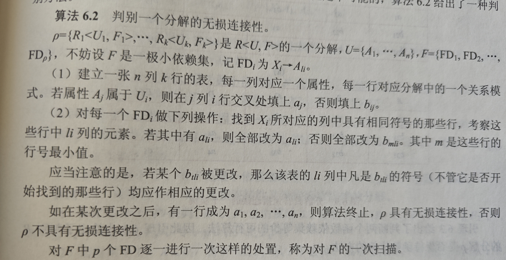

# 数据库模式设计

主要讨论如何设计一个好的数据库模式，通过设计关系模式的方式；此时仅考虑U和F，因此将关系表示为 R<U,F>；

**第一范式**：每个分量都不可再分

**数据依赖**：分为函数依赖和多值依赖，这里先说函数依赖；若Y函数依赖于X，那么当X确定时，Y不变，就类似于Y=f(X)一样；具体定义为：
> 对于一个关系，若有两个元组，他们在X上相等，那么他们在Y上相等

例如存在关系 `U = {Sno, Sdept, Mname, Cno, Grade}` ,Sno表示学生编号，Mname表示系主任名称；Cno表示课程编号，则有Sdept依赖Sno，Grade依赖{Sno,Cno}

**第一范式存在的问题**：
1. 数据冗余: Mname要存储多份
2. 更新异常: 如果要更换系主任，那么要更改大量元组
3. 插入异常: 如果一个系刚成立没有学生，那么无法将这个系的信息存入数据库中
4. 删除异常: 如果一个系的学生信息全部被删除，那么这个系的信息也会被删除
- 要解决这些问题，就需要对模式进行规范化

## 规范化

**术语**：
1. 非平凡函数依赖：Y函数依赖于X并且Y不属于X
2. 平凡的函数依赖：Y函数依赖于X并且属于X，这个一定成立因此没有意义
3. 若Y依赖X，那么X称为**决定因素**
4. 若Y依赖于X，并且不依赖于X的任意一个真子集，那么Y完全依赖X
5. 否则，Y部分依赖于X
6. 若Y非平凡依赖于X并且X不依赖Y，Z非平凡依赖于Y，那么Z传递函数依赖于X

**码**：设U为全体属性的集合，若有属性集K，U完全依赖于K，那么K为候选码；若部分依赖，则K为超码；候选码为超码的真子集

**范式和规范化**：范式表示满足一定要求的设计；有 
$$
1NF \in 2NF \in 3NF \in BCNF \in 4NF \in 5NF
$$
一个低一级的范式通过模式分解可以转换为多个高级的范式，称为规范化

## 2NF

**定义**：非主属性不完全函数依赖于码；因此，码太大了；码中包含的无关信息太多，例如之前的例子中，码为(Sno,Cno)，如果这个表存储的是学生信息，那么如果学生没有选课就无法存储进来；
1. 插入异常
2. 删除异常：学生只选了一门课后退课，学生信息也会被删除
3. 修改复杂

**分解方法**：将码变小，将不完全函数依赖于码的非主属性拆出去

## 3NF

**定义**：如果一个关系模式属于2NF，并且不存在一个非主属性传递依赖于码，那么他属于3NF

## BCNF

**定义**：若有一个关系模式属于1NF，并且每一对非平凡的函数依赖对中，决定因素都包含码(候选码)，那么为BCNF

**如何判断关系模式的范式**：
1. 首先写出所有函数依赖关系对
2. 明确所有候选码，进而找出主属性和非主属性
3. 依次考察每一个函数依赖对，查看是否有非主元素对码的部分函数依赖/非主元素对码的传递依赖/非码作为决定因素

## 多值依赖

例子：有多门学科C，每门学科对应多个老师T，同时对应多个参考书B；

**多值依赖**：有属性集X， Y，Z，其中Z=U-X-Y，给定一对(x,z)值，有一组Y的值，这组值仅仅决定于x而与z无关；也就是 $(x_1,z_1) -> {y_1,y_2}$ 并且 $(x_1,z_2) -> {y_1,y_2}$ 

**性质**：
1. 对称性：如果Y多值依赖于X，那么Z也多值依赖于X
2. 若Y多值依赖X，Z多值依赖X，那么Y-Z多值依赖X
3. 函数依赖是多值依赖的特殊情况，
4. Y多值依赖X，Z多值依赖X，YZ的并多值依赖X，且他们的交多值依赖X
5. **多值依赖的有效性和属性集的大小有关**：如果某多值依赖在属性集U上成立，R包含U，那么在R上不一定成立；如果在R上成立，那么一定在U上成立
6. 在某属性集上，若Y函数依赖X，那么Y的子集也函数依赖X；若Y多值依赖X，不能断言任意Y的子集都多值依赖X

## 4NF

**定义**：如果有多值依赖，那么决定因素中必须包含码，也就是不允许有不为函数依赖的多值依赖(如果决定因素中包含码，那么有Y多值依赖X，就有Y函数依赖X)；可以通过分解的方法将BCNF范式的关系模式转化为多个4NF的关系范式

## 数据依赖的公理系统(模式分解算法的理论基础)

**逻辑蕴含**：对满足一组函数依赖的关系模式，如果对于每个关系，某个函数依赖都成立，那么称这组函数依赖逻辑蕴含这个函数依赖

**Armstrong公理系统**：一套推理规则，用于推导某函数依赖是否被F所蕴含，包括(考虑关系模式R<U,F>)：
1. 自反率：若 $Y \in X \in U$ ，那么Y依赖X被F蕴含
2. 增广率：若Y依赖X被F蕴含，并且Z属于U，那么YZ依赖XZ被F蕴含
3. 传递率：若Y依赖X，Z依赖Y被蕴含，那么Z依赖X被蕴含
4. 由Y，Z依赖X，得YZ依赖于X
5. 伪传递规则：Y依赖X，Z依赖WY，Z就依赖XW
5. 分解规则：Y依赖X并且Z属于Y，那么Z依赖X
6. $A_1A_2\dots A_n$ 依赖X的充分必要条件是他们每一个都分别依赖X

**闭包**：F逻辑蕴含的函数依赖全体为他的闭包，记做 $F^+$

上面的前三条定理称为Armstrong公理系统，他是有效且完备的：
1. 有效：根据该系统推导出的每个F蕴含的函数依赖一定在F的闭包中
2. 完美：F的每一个函数依赖都可以通过该系统从F中推出

**属性集X关于F的闭包**：定义为 $X_F^+ = \{A | X -> A \text{该函数依赖能由F根据系统推导出}\}$ ，用于判断某个函数依赖是否是F的闭包; 通过该公理系统导出某个属性集X在F上的闭包的算法如下：
1. $X^{(0)} = X$
2. 查找F中所有函数依赖，找出其中决定因素包含在 $X^{(i)}$ 的依赖，将被决定因素加入集合中，形成 $X^{(i+1)}$ 
3. 若集合没有变化则停止，否则重复上述过程

**覆盖**：如果 $F^+ = G^+$ 那么说F覆盖G/G覆盖F，或二者等价

**最小依赖集**: $F_m$, 满足如下条件，每一个函数依赖都等价于一个最小依赖集,该集**不唯一**
1. 其中任何一个依赖的右边只有一个属性
2. 去掉任何一个依赖后形成的新函数依赖集都和原集不等价
3. 将任意一个函数依赖左边替换为他的子集后，形成的新函数依赖集和原集都不等价

**求最小依赖集**：
1. 对于每一个依赖，如果右边有多个属性，拆分为每个属性分别依赖决定因素
2. 对于每一个依赖，如果删除以后新函数依赖集和原来等价，那么就删除
3. 对于每一个依赖Y依赖X，如果 $X = B_1B_2\dots B_n$ ，那么对于每个B，如果说 X-B关于F的闭包包含Y，那么就将这个B删掉，来简化X；
4. 实际上就是减少没用的依赖，这些依赖可以由最小依赖集中剩下的依赖推导出

# 模式分解

**关系模式的分解**: 其中U等于所有 $U_i$ 的并；并且不同的 $U_i$ 之间不会相互包含；

$$
    \rho = \{R_1<U_1,F_1>, R_2<U_2,F_2>, \cdots \}
$$

**分解的三个定义**：三个不同的准则，可以判断分解后的模式所满足的范式，相当于定义了分解的有效性；
1. 无损连接性
2. 保持函数依赖
3. 上述两个都要保持

**无损连接性**：对于一个分解 $\rho$ ,以及任意一个关系r，定义 $m_\rho(r)$ 为分解后的各个关系模式在r上的投影的自然连接；如果 $r = m_\rho(r)$ ，那么称这个分解具有无损连接性；判断一个分解具有无损连接性的算法如下：

**保持函数依赖**：即分解前F的闭包等于分解后所有F的并的闭包；即分解后所有F的并和分解前的F等价

## 模式分解算法

**1. 转换为3NF的保持函数依赖的算法**：
1. 对所有F进行极小化处理(找到极小依赖集)
2. 得到所有不再F中出现的属性 $U_0$ ,将这样的属性构成关系模式，并将 $U_0$ 从U中删除(构成的这个模式没有非平凡的函数依赖，只是为了防止这些属性消失)
3. 若有 $X \rightarrow A, XA = U$ ，那么分解停止
4. 否则，对F按照相同左部的原则进行分组；若有 $U_i \in U_j$ ，那么就去掉 $U_i$ (此时将去掉模式对应的F加入到 $U_j$ 对应的F中)，得到最终的分解；

**2. 转换为3NF的既有无损连接性又有保持函数依赖的分解**：

**3. 转换为BCNF的无损连接分解**

**4. 达到4NF的具有无损连接的分解**: