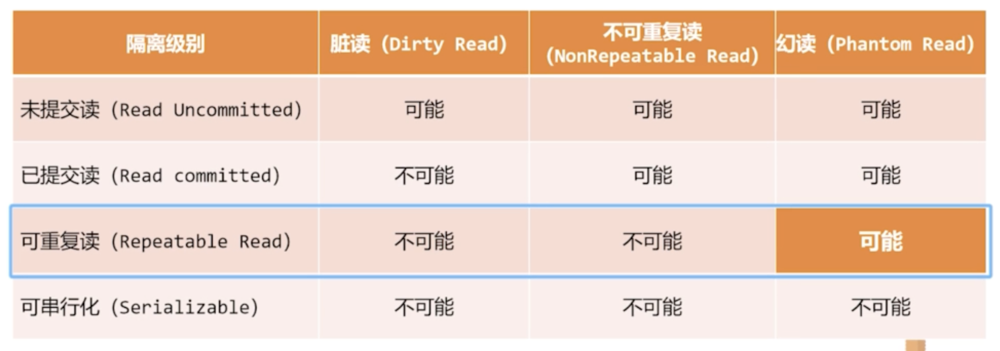

# 并发

**并发修改数据**：通过使用锁实现，锁分为：
- 细粒度锁：例如行锁，只锁住一行
- 粗粒度锁：例如表锁；粗粒度锁的效率比细粒度锁低很多，但是更简单；

有如下方式可以增加锁的效率；
1. 对于锁，尽量使用细粒度锁，并降低加锁时间
2. 在编程方面，不要在循环中包含sql语句，应该尽可能减少程序和数据库之间的交互次数，也就是降低事务的数量；
3. 在查询中如果发现了错误，先rollback，然后在查找问题；因为尽早rollback可以尽早结束事务，尽早释放锁，提高并发度；

**事务的概念** : 事务是访问并可能更新各种数据项的一个程序执行单元，通常由 SQL 和一些高级语言组成; 事务由 begin transaction 和 end transaction 之间的操作组成。数据库在执行事务时必须保持数据的以下四个特性，称为 ACID 特性:
1. 原子性 : 要么全部执行，要么完全不执行。如何保证呢?在写入之前在磁盘上存储旧值，如果该事务在一半失败，则可以恢复之前的旧值让事务看起来没有发生过
1. 隔离性 : 一个事务感受不到其他并行执行的事务，确保事务并发执行的结果和他们串行执行是一样的
1. 一致性 : 以隔离形式执行事务，事务执行前后数据库是一样的，即数据始终符合预定义的规则
1. 持久性 : 事务对数据库的改变必须被持久存储

注意 : 
- 事务的原子性和持久性 : 事务如果被中止了，那么他已经造成的改变必须被撤销，这称为事务已回滚。通常通过维护日志来完成。
- 事务的隔离性 : 事务必须要可以并发执行，因为并发可以大幅提高性能，例如
  1. 提高吞吐量和资源利用率;
  2. 减少等待时间;

## 存储器结构

**分类如下**： 
1. 易失性存储器:崩溃后数据后丢失，例如主存
1. 非易失性存储器:崩溃后数据不会丢失，例如硬盘
1. 稳定存储器:是一种理论上的存储器，其上的数据永远不会丢失，通过备份在非易失性存储器上来实现。要满足原子性和持久性，必须将事务的更改写入稳定存储器，或将日志写入稳定存储器中。

## 可串行化(调度如何实现隔离性:可串行化):

**可串行化** : 需要执行的事务被以一定的顺序排列，称为调度。如果并发地执行事务可能导致数据库一致性被破坏, 一个可以保证事务正确执行，在某种意义上等价于一个串行调度的调度称为可串行化的调度。
1. 冲突 : 对于一个调度中的两条连续执行的命令，如果他们是不同事务对同一数据的操作，并且其中至少有一个是写操作，那么他们就是冲突的(即他们的顺序会对事务的结果造成影响).
1. **冲突等价** : 如果一个调度可以通过交换一系列不冲突的指令，从而编程另外一个调度，那么说这两个调度冲突等价；
1. 冲突可串行化 : 如果一个调度和一个串行调度冲突等价，那么这个调度就是冲突可串行化的
1. 优先图 : 用来考察调度是否是冲突可串行化的。每一个节点表示一个事务，如果有一条边从事务 A 到 B，当且仅当当前调度中，存在一对冲突操作，并且前面的操作属于A，后面的操作属于B；若优先图无环，那么表示他是冲突和串行化的
1. 可串行化次序 : 优先图的拓补序即为可串行化次序，指明了如果事务串行执行，他们的顺序。

如果一个调度不是冲突可串行化的，他的执行结果和串行执行的结果也有可能相同。

## 事务的隔离性和原子性(可恢复调度和无级联调度)

为了保证 ACID，主要是为了保证原子性，如果一个事务中止了，那么依赖他的事务也要中止(B依赖A表示B中读取了A写入的数据); 为了实现这个要求，可以使用如下的调度方法：
1. 可恢复调度 : 被依赖的事务必须先被 Commit，这个调度才算一个可恢复调度
1. 无级联调度 : 若B依赖A，C依赖B，当A失效时，B和C也都失效了，需要进行多次回滚，这种情况称为级联回滚; 对两个事务 A 和 B，如果 B 读取了一个 A 之前写过的数据，那么 A 的 Commit 必须在 B 读取这个数据之前。无级联调度一定是可恢复的。

## 事务的隔离性级别(四个隔离性级别)

**隔离性的目的** : 避免更新丢失，避免脏读，不可重复读，幻读
1. 脏读 : 读取到了别的事务更新了但是还没有提交的数据。
2. 不可重复读 : 同一事务的对同一数据的两次读取中间，有别的事务对要读取的数据进行了update，使得两次读取读到了不一样的值；
3. 幻读 : 不可重复读的特殊场景，同一事务对同一数据的两次读取之间，别的事务在数据中进行增加或者删除操作，使得读取到的数据不同(数据量不同), 不可重复读和幻读都是读到了其他事务已经提交的数据。

如果每个事务都具有一致性，那么可串行化就保证事务的并发执行具有一致性，但是这样会导致并发的程度非常小。因 此一个事务可以以一种对其他事务来说不可串行化的方式执行。隔离性如下:
- **未提交读(产生脏读)** : 最低级别，在事务写数据时，其他事务不能写但是可以读同一数据
- **已提交读(解决脏，但是产生不可重复读)** : 读事务允许其他事务访问数据，但是写事务在没有提交事务前不允许其他事务访问数据，包括读；
- **可重复读(解决不可重复，但是产生幻读)** : 只允许读取一个已经提交的数据，并且两次读取之间这个数据不能被更改。使用 MVCC 实现, 具体规则如下
  1. 为每行数据维护两个字段，分别为创建版本号和结束版本号; 同时事务也具有递增的版本号
  2. 在执行 `select` 时，只会选取创建版本小于事务版本，并且结束版本为null或大于事务版本的数据
  3. 在执行 `insert` 时，将事务版本号赋给新创建数据的创建版本号
  4. 在执行 `delete` 时，将事务版本号赋给删除数据的结束版本号
  5. 在执行 `update` 时，首先将事务版本号赋给待修改数据的结束版本号，随后新添加一个数据，该数据等于原数据修改后的数据，并将事务版本号赋给新数据的创建版本号 
这种隔离级别**有可能**防止幻读 : 在读取一个数据时，别的事务对该数据进行插入，此时当前事务是读取不到这个插入的，但是如果当前事务对数据进行整体的更新，就相当于把新插入数据的版本号改为自己的了，此时就可以读到新插入的数据，两次读取数据的行数就变了，所以不可 避免幻读。
- **可串行化(解决幻读)** : 保证串行化的执行

上述隔离性级别都不允许脏写，即如果数据被一个未提交的事务写过，那么他就不能再次被写。就算某些事务被设定成可串行化，在系统具体执行时可能也是用非可串行化的调度来实现的。

**隔离性级别实现** : 使用并发控制策略来保证隔离性，并发控制策略通过保证调 度都是可串行化的，可恢复并且无级联的。以下为一些并发控制机制:
1. 锁 : 两阶段封锁，将事务分为两个阶段，第一个阶段获取锁并且不释放锁，第二个阶段释放锁但是不获取锁。并搭配共享锁和排他锁，对要读取的数据持有共享锁，多个事务可以对同一个数据持有共享锁。排他锁一次只能被一 个事务持有，并且在排他锁锁住的数据上不能有任何事务持有任何锁。
b. 时间戳:不是很懂，大概就是每个事务都有一个时间戳。每个数据都有两个 时间戳，分别保存最近的读取他的时间戳和最近的写他的时间戳。
c. 多版本和快照隔离:维护数据的多个版本，可以使一个事务读取一个数据的 旧版本，典型技术例如快照隔离:事务开始时保存一份系统的快照，任何读 取都从该快照上读，写也在快照上写，在提交时才真正将快照上发生的改变 写入数据库。如果在提交时发现快照的其他部分已经被改变，那么就中止。

## 大数据量

不同操作对数据量大小的敏感度：
1. 基于主键的等值查找和范围查找：因为有索引，所以受数据量影响不大
2. 随着数据量的增加而线性增长，例如max操作
3. 非线性：关系操作基本可以控制在线性范畴内，但是非关系型操作，例如排序

**大数据量的处理逻辑**：
1. **延迟join操作**：在排序时，当操作时间随着数据量非线性增长时(此时认为造成这种情况的原因是数据存储在硬盘中，要花大量时间进行IO，因此此时数据量的大小表示字节数，而不是记录数), 此时将join延迟到order之后进行，可以大幅降低要一次要排序的数据量(即字节数,同时有时也可以改变记录数)，从而降低排序的开销
2. **消除关联子查询**：即exist，在考虑每一条记录时都要执行一次；

## Redo 日志

因为有缓存机制，所以要保证缓存和磁盘中存储的一致性，但是如果事务提交后系统发生崩溃，事务的更改还没有被写入磁盘应该怎么办?使用 Redo 日志。Redo 日志记录的是物理级别上的页面修改，例如某页面某偏移量更改成了什么
1. 写放大 : 若每次修改后都进行提交，因为数据库以页为单位进行写入，每次对于小数据量的更改都要写入一整页，造成极大开销，称为写放大
2. WAL 技术 : 在事务提交之前先写 Redo 日志。
3. Redo 日志的分类和好处 : 分为记录具体位置的物理修改，记录整个页的修改，记录操作; 他的好处是减少刷盘频率，占用空间小，顺序 IO 提高 IO 效率
4. Redo 日志格式 : 一般包含四个部分, 即类型，空间ID，页ID和数据; 数据可以记录物理层面的变化，或者记录逻辑操作，在系统崩溃后重做这个操作。

以下为 Redo 日志的组成:
- 重做日志缓冲 : 连续内存空间，分为多个 Redo 日志block，512字节
- 重做日志文件 : 保存在硬盘中

**Redo 日志使用的流程** : 先将页面加载到内存，然后修改这个拷贝，向 Redo 日志缓冲中写入，在事务提交时将缓冲日志写到日志文件中。但是这里不一定是直接写到磁盘中的，此时有三种策略(通过设置 innodb_flush_log_at_trx_commit 实现):
a. 设置为 0 : 最低，每次提交时不刷盘，而是每隔一秒刷盘日志缓冲
b. 设置为 1 : 最高，但是最慢，就是每次事务提交时就进行刷盘，直接写到文件中
c. 设置为 2 : 中等，每次事务提交时将日志缓冲写到文件缓冲中，由 os 自己决定什么时候将文件缓冲和文件同步。

**写入 Redo 日志缓冲的过程** :
1. Mini-Transaction : 迷你事务，简称 mtr，对底层页面的一次访问，一个事务包含很多语句，一个语句包含很多 mtr，一个 mtr 对应很多 Redo 日志
1. 缓存写入 : 缓存中维护一个全局变量，指向当前的可以写入的位置，因为缓存是顺序写入的，所以就指向日志末尾。**每个 mtr 对应的一系列日志应该写到一起**，但是这些 mtr 可能因为并发交错执行; 因为为每个mtr设置私有缓冲区，先将mtr对应的redo日志写入其私有缓冲区，在 mtr 结束执行后一起写入缓冲中。
1. END类型符 : 每个 mtr 日志写完后会写入一个特殊的 END 类型日志，在恢复时只有解析到这个类型的日志才会认为解析到了一组完整的 Redo 日志，否则就放弃前面的日志(用来解决崩溃导致mtr日志没有写完的情况)
1. Redo 日志 block 结构 : 包含 block 头，block 体和 block 尾，总共 512 子节， 头部存储了 block 的序号，块内已使用的大小等，体中存储日志，尾存储校验和, 用来判断日志是否写入完整。

**日志文件组** : 日志文件不止一个，他们组成了日志文件组，从第 0 个开始写， 采用循环写，也就是如果最后一个都写满了就从 0 开始写。这会导致覆盖前面的 log，所以就有了检查点这个属性:
1. Write_pos : 现在可以写入日志的位置
1. Checkpoint : 可以理解为指向日志头，每过一段时间就清空一些日志，后移检查点

**如何进行恢复** : 扫描最近的检查点之后的日志，顺序执行所有的日志。在恢复时，如何判断对某个页面的操作进行到了哪一步呢？为每个log和每个页面都维护一个LSN(类似事件戳), 在执行log时，如果log操作对应的页面的LSN大于log的LSN，那么就不执行，否则执行并更新页面的LSN；

## Undo 日志

回滚日志，用于保证事务的原子性，以实现 MVCC，其记录某个特定的版本，对于每个操作，记录他的一个反向操作(因此记录的是逻辑操作日志)，例如如果执行了 insert，那么他就记录一条 delete。在事务未提交时发生崩溃时执行。

## Steal 和 force 策略:

1. **Steal/No Steal** : no steal 不允许将未提交的事务更改写到磁盘上，此时只用 Redo 日志就可以实现恢复，但是并发不够;steal 可以将脏页偷出来并写道磁盘上。
1. **Force/no-force** : force 就是提交之前必须把修改的页写到磁盘上，这个时候崩溃就可以直接重建修改结果，但是提交时间变长;no-force 就是事务修改的页没刷写也可以提交，推迟对页的刷写。
1. **ARIES(steal/no-force 的恢复算法)** : 使用物理 Redo 日志和 undo 日志，在 崩溃后用三个阶段恢复
  - 识别脏页以及当时正在进行的事务
  - 重做历史记录直到崩溃点
  - 回滚未完成的事务。