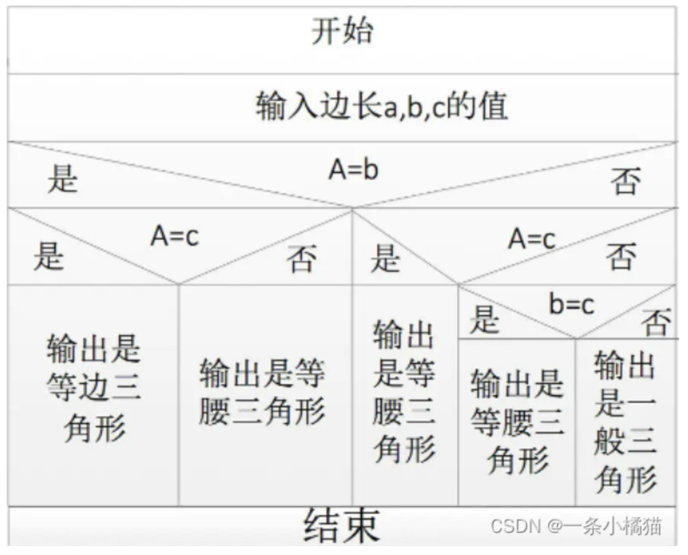

# 详细设计(目的是什么，流程是什么，具体怎么干，有哪些方法)

**定义**: 给出软件结构中各模块的内部过程描述，分为: 
- 模块内部的算法设计，使用结构化构造(顺序，选择，重复)来表示程序过程
- 模块内数据结构设计
- 编写测试用例
- 编写详细设计说明书。

## 设计工具

**设计工具** : 
- 图形工具: 用图来表示过程
- 列表工具
- 语言工具: 用伪代码来表示

**图形工具**: 
- 流程图: 方块表示处理，菱形表示逻辑判断，箭头表示控制流。就是最经典的那种过程图，缺点为: 违反了结构化的精神，使得程序员过早考虑程序控制流程，并且不好表示数据结构
- <a href="https://blog.csdn.net/WHT869706733/article/details/124309726">方块图</a>: 为了弥补流程图在结构化方法上的欠缺，所以有了方块图，每一个方块表示一种结构化构造; 这种图很容易确定局部变量和全局变量的作用域，并且很容易表示递归结构; 从上到下执行，用行来表示顺序; 
- <a href="https://blog.csdn.net/WHT869706733/article/details/124308750">PAD</a> 图: 用快和线的方式来表示程序结构，并且使用了结构化构造, 清晰的描述了程序的执行流; 具有从上到下，从左到右的顺序; 最左边的竖线是程序的主线，随着程序的层次增加，PAD 图逐渐向右延申，每一个结构层次就对应一条竖线; PAD 图既可以表示程序结构也可以表示数据结构，并且可以用软件工具自动转换为高级语言源程序: **他既克服了传统流程图不能表示程序结构的问题，又不像NS那样把所有程序约束在一个方框内**

6. 语言工具: `PDL(Program Design Language)`, 是一种混杂语言，使用自然语言的词汇，但是又使用另一种高级语言的语法。优点就是好更改，好维护，但是相比图形工具没有那么直观

# 详细设计的基础

**详细设计的出发点** : 详细设计在软件体系结构设计之后进行，以需求规格说明文档和需求分析模型，和软件体系结构设计方案和原型为出发点; 软件体系结构设计规定了系统的框架，而详细设计则更关注底层部分，主要为中层设计(模块的内部结构)和底层设计(模块和类的内部，具体的数据结构和算法); 

**详细设计的上下文**: 以需求和软件体系结构作为工作方向和框架，以实现所有需求为目的， 进一步细化原型代码，最终产生能够指导程序员编程的详细设计文档和详细设计原型代码

## 结构化设计过程

设计结果类似软件结构图；用变换流的方式生成，具体参考概要设计部分；

## 面向对象详细设计

**面向对象设计思想** : 一系列自由数据个体，共同协作以完成复杂高级的行为

**面向对象设计过程**: 分为设计模型建立和重构两个部分

**设计模型建立**: 通过职责建立静态模型, 并通过协作建立动态模型;个 静态模型表示系统的组成部分，而动态模型可以用交互图和状态图来表示，表现的是这个系统运行时的行为和构造
1. `通过职责建立静态模型`: 即构造类图;步骤如下： 
    - 抽象对象的指责: 类的职责有方法职责和属性职责, 首先抽象出每个类的职责
    - 抽象类之间的关系: 类之间关系如下图;类图主要分为两个部分，即类的表示和类之间关系的表示，通过成员来表示类的职责，通过连线来表示类之间的关系(未显示的一个关系为依赖关系，虚线箭头表示，表示调用)
    - 添加辅助类: 需求分析得到的概念类不一定能实现全部功能，此时需要一些辅助类，例如接口类，控制器类等
1. `通过协作建立动态模型`: 
    - 抽象对象之间的协作: 将大职责分解给小对象，或者将小职责聚合成大职责，可以用顺序图和状态图来表示对象之间的协作;
    - 明确对象的创建: 即明确对象在何时，由哪个对象创建; 例如组合关系下，被组合的类对象就在组合类对象的构造函数中被创建，而聚合关系中，就在业务函数中创建; **创建的优先级从高到底**为组合，被某一对象记录或管理，创建新对象所需要的数据被某个对象持有，聚合; 
    - 选择控制风格， 主要有集中式(一个控制对象，将职责分配给很多其他对象)，委托式(两个控制对象，分别承担一定的职责)，分散式(没有控制对象，每个对象完全靠自治方式来实现大的职责)

**设计模型重构** : 详细部分在下面3章
1. 根据模块化思想，目标为高内聚低耦合
1. 根据信息隐藏思想，隐藏职责和变更
1. 利用设计模式重构

**为类间协作开发集成测试样例** :
- 类间协作的集成测试: 每个类都是被独立开发的，因此每个类也要进行类间协作的集成测试，以协作图(顺序图)为线索，可以采用自顶向下和自底向上集成
- Mock Object: 类间协作集成测试的桩程序称为 Mock Object。该部分代码十分简单，可以保证正确性

**详细设计文档描述和评审** : 更加强调模块内部结构和行为，比如类接口，类协作, 数据结构等
- 评审: 由于详细设计结束以后整个设计环节就结束了，所以要综合整体进行评审
- 度量
- 测试

# 面向对象详细设计的模块化:

首先进行面向对象模块化的度量，模块间的关系有三种
- 方法调用，耦合度和结构化一样
- 访问，即一个类持有另一个类的引用那么就可以访问这个类
- 继承。

## 耦合度

**访问耦合度** : 由高到低为
- 隐式访问: 连续的接口调用，很难察觉到访问了别的类
- 实现中访问: 通过方法的局部变量访问 
- 成员变量访问: 通过成员变量访问
- 参数访问: 通过参数访问

**如何降低访问耦合度**:
- 针对接口编程: 设置接口类，在调用时根据接口类中规定的抽象接口进行调用，而不是调用类的实际接口
- 接口分离原则(Interface Separate Principle): 在很多时候需要设计一个抽象的接口，其中包含了很多接口，如果某类只需要依赖其中的一个接口，在这种设计下就要依赖所有的接口，增加了不必要的耦合; 因此将这个接口分离成很多部分； 例如 A 需要 123 接口，就将 123 接口单独分离出来构成一个接口类；
- 迪米特法则: 通过方法只能调用`当前类中的方法，类中成员方法，方法中创建的类对象的方法，以及参数重对象的方法` ,从而避免了隐式访问

**继承耦合**:从高到低为
- 修改规格: 随便修改父类继承来的方法的接口, 例如删减，或修改原本接口的参数(缩减参数的域)
- 修改实现: 随便修改父类继承来的方法的实现, 修改实现并改变了接口的行为
- 精化规格: 按照规则修改继承来的方法的接口, 同样也是修改，但是修改后的接口包含了修改前的功能，例如扩大参数域
- 精化实现: 按照规则修改继承来的方法的实现, 同理
- 扩展: 不动继承来的方法，只是添加新的方法 

**降低继承耦合的方法**: 
- Liskov 替换原则(Liskov Substitution Principle): 子类型必须能够替代基类型并且起同样的作用; 否则则说明耦合度比较高
- 用组合代替继承

**耦合的度量:**
- 方法调用耦合: CBO，即一个类调用外界方法的数量和被其他类访问它的方法的数量, 越小越好
- 访问耦合: DAC:一个类包含的其他类实例的数量, 越小越好
- 继承耦合: 
    1. NOC: 一个类的直接子类的数量，越大表示复用程度越高，但是也表示父类越难抽象, 因此要适中
    1. DIT: 继承树根节点到叶节点的距离，越大复用程度越高，但是也表示子类要遵守的约束更多更隐晦，更难满足LSP

## 内聚

**类的内聚**: 面向对象的类的内聚有三种: `方法的内聚，类的内聚，以及继承的内聚`; 这里主要讲类的内聚。
- 方法和属性是否一致: 就是方法中有没有好好用属性
- 属性之间是否体现一个职责
- 属性之间是否抽象: 即所有属性组合在一起能否抽象为一个具体概念；例如商品有生产的年份和日期，进货的年份和日期，将日期单独抽象为一个类，并用两个日期类对象作为商品成员，来表示商品的生产/进货日期的属性

**如何提高内聚**: 
- 集中信息和行为: 类的信息和访问这些信息的方法应该在一个类中
- 单一职责原则(Single Responsibility Principle): 信息和行为应该联合表示一个内聚的概念，比如三角形类中，应该有三角形的属性和计算三角形面积的方法，而不应该有画三角形的方法

# 面向对象详细设计的信息隐藏:一个类应该通过稳定的接口对外表现其所承载的需求，而隐藏他对需求的内部实现的细节。(封装是什么，什么是最重要的封装，怎么能封装变更)

**定义**: 有两方面含义
- 将数据和行为同时包含在类中
- 分离接口和实现: 接口描述类的指责，实现则是类的内部实现机制；通过接口类将二者分离

**封装实现细节** : 在分离了接口和实现以后，还需要隐藏实现，隐藏方法如下： 
1. 封装数据和行为: 只能通过getter和setter来访问数据(在其中添加约束和安全性检查)
1. 封装内部结构: 实现中使用的复杂数据结构，例如stack类中存储数据的结构
1. 封装其他对象的引用: 
1. 封装类型信息: 在多种子类型因为具备一些共性而被当作一种类型进行使用时，应当隐藏具体子类型的类别，只需要知道共性类别；例如LSP方法
1. 封装潜在变更: 将可能发生变更的地方独立出去，抽象为稳定接口，并使用稳定的接口，来屏蔽潜在变更造成的影响；

## OCP

变更是最大的挑战，信息隐藏是为变更而设计的主要思想; 封装变更很有用; 为变更而设计的最终目标是`开闭原则(OCP)`: 如果发生了变更，应该增加而不是修改，有两种方法来实现: `多态和 DIP`

**多态**: 即系统可以更具实际类型的不同表现出不同的行为；多态有以下几种类型:
- 参数化多态: 比如泛化，模板
- 子类型多态: 很多子类型通过基类联系在一起，通过基类表现共有的接口，通过子类来实现不同的行为，在使用时不需要预先知道类型，只用动态绑定；即重写
- 临时性多态: 根据参数的类型不同而做出不同的行为，例如重载

**多态的实现**: 当有变更的需求和新的功能的时候，只用增加新的情况，就可以实现 OCP

**DIP** : 依赖的方向是有区别的，比如一个稳定的方法调用一个不稳定的函数，那么若不稳定函数改变了，那么就要改变调用的方式，所以用不稳定的方法调用稳定的更好；因此DIP指: 
- 抽象不应该依赖于细节，细节应该依赖于抽象，因为抽象稳定但是细节不稳定
- 高层模块和底层模块不应该互相依赖，他们应该都依赖于抽象。

**DIP 的实现**: 当具体类要被依赖时，为其建立抽象接口并分离该接口来实现DIP；例如若 B 要依赖 A，此时 A 是抽象类就没问题; 如果 A 是具体的，那么就为 A 建立抽象接口并实现该接口; 随后 B 在依赖这个接口。

**如何用DIP实现OCP**：当要添加需求时，只用为抽象接口类添加新的实现即可；

# 详细设计中的设计模式

## 策略模式

**定义** : 将策略和上下文分离(使用DIP和减少耦合的设计原则)，当有一个很复杂的模块时，例如有一个计算薪水的模块(上下文类)，以及很多个抽象的策略类，每个策略类有很多的具体实现，上下文可以包含不同的具体实现类来达成复杂的薪水分配功能。参与对象有:
- 上下文类: 被配置了具体的策略信息(即组合了一些策略具体实现类)，实现一些方法供策略获得数据
- 策略: 定义了抽象的策略接口
- 具体策略: 实现上述抽象策略接口, 使用场景为当需要一个行为的不同实现时。

## 抽象工厂模式

**定义**: 在需要创建不同的对象以及使用这些对象时使用,可以保证创建的产品属于一个产品族; 有两套接口，工厂接口表现稳定的工厂行为，产品接口表现稳定的产品行为，可以降低要创建对象的类和创建的类的耦合，因为他们之间隔了一个接口，参与者有
- 抽象工厂: 声明了创建抽象产品的接口
- 具体工厂: 定义了具体产品的创建
- 抽象产品: 声明了产品的接口
- 具体产品: 定义了这些产品接口，定义了具体工厂创建的具体产品
- 客户: 使用抽象工厂的对象 

例如：在UI界面要生成button和box两种组件(两个产品族，即两个抽象产品),对于每种组件，都有windows和mac两种风格(共四个具体产品，对于button，两个具体产品，即windowsButton和macButton分别有不同的实现，表现不同的行为); 此时抽象工厂包含了生成button和box的接口；有两个具体工厂，分别负责生成windows风格组件和mac风格组件；他们实现上述接口；在使用时可以使用不同的具体工厂来生产相同的产品族的产品

## 其他

**单件模式** : 一个类在内存中只能有一个实例，任何想使用这个类的模块都只能得到一个引用; **实现方法** : 类内部有一个静态成员变量为这个类实例的引用，当当类想要使用该实例时，则直接返回这个静态成员; 如果是 null，说明还没有创建，那就创建一个;