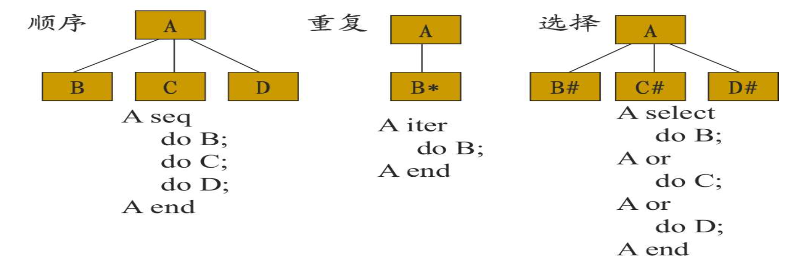

# 概要设计

**定义** : 把需求分析模型转化为软件结构和数据结构，软件结构即将复杂系统模块化
- 软件结构 : 一种层次化表示，像树一样，由需求分析确定的某一软件问题的各个元素，即模块之间的相互控制关系，
- 软件结构的度量和术语 : 宽度，深度，扇入数(当前模块由多个模块控制)，扇出数(当前模块控制的模块数量)，上级模块和下级模块。
- 程序过程 : 用于描述每个模块的细节，比如处理顺序，数据结构等
- 模块 : 是数据集合，或者是可执行语句的集合
- 模块化 : 将整个软件分成多个模块，每个模块都完成一个子功能，所有模块集成起来就完成了软件需求，适当的模块数量可以降低总体成本
- 模块化的方法:
    1. 抽象 : 抽出事物的本质而不关心他的实现细节，就像接口，从概要设计到详细设计的过程实际上就是抽象程度的降低，直到可以用代码来表示
    1. 信息隐蔽 : 即一个模块中的信息，包括语句和数据不被不需要使用他的模块访问，

## 模块独立性

**模块独立性** : 即一个模块只设计软件要求的具体子功能，开发有独立功能且和其他模块不过多交互的模块，用耦合度和内聚性来度量模块的独立性:

**耦合性** : 描述模块间联系的复杂度，耦合性从高到低为
- 内容耦合: 某个模块直接修改或者依赖另一个模块的内容
- 公共耦合: 多个模块共享全局的数据，比如全局变量
- 重复耦合: 很隐蔽，模块中有相同的代码
- 控制耦合: 一个模块给另外一个模块传递控制信息
- 印记耦合: 共享一个数据结构，但是只使用其中一部分，比如给一个模块传递了一个数据结构，但是那个模块只使用了其中一部分
- 数据耦合: 两个模块进行相互访问时，通过参数来交换信息，且局限于数据信息而非控制信息

**内聚性** : 内聚表示的是一个模块内部功能联系的紧密性，越高越好，以下由低到高分为:
- 偶然内聚: 模块执行多个不相关的操作
- 逻辑内聚: 模块执行一系列逻辑相似，但是没有直接关联操作，并且每个操作的调用由其他模块决定，例如开车，走路，坐飞机
- 时间内聚: 模块执行一系列和时间有关的操作
- 过程内聚: 模块执行一些与步骤顺序有关的操作
- 通信内聚: 执行一系列和步骤有关的操作，这些操作在相同数据上进行
- 功能内聚: 模块只执行一个操作或者达到一个单一目的
- 信息内聚: 模块进行很多操作，各有各的入口点，每个操作代码独立，并且所有模块操作在同一个数据结构上完成

**模块定义**:
- 模块的主要秘密: 是模块要实现的用户需求
- 模块的次要秘密: 是实现的具体细节
- 模块的角色: 是模块在整个系统中承担的角色，包括起的作用，和哪些模块有关系 
- 模块的对外接口: 提供给别的模块的接口

## 概要设计的启发式准则:

包括
- 提高模块独立性
- 模块大小适中
- 模块的扇入和扇出数量要适中: 模块的扇出应该较少，如果多会使该模块的控制过程过于复杂;如果模块的扇入很多，那么说明这个模块被多次复用，但是也不能每个都强行多扇入，一般来说
    1. 顶层模块高扇出，中层模块都适中，底层模块高扇入。
- 软件结构的深度和宽度不应该太大
- 模块的作用域在控制域之内: 作用域指模块某个判定条件结果造成影响的模块，控制域指一个模块的子模块和间接子模块
- 降低模块接口复杂度
- 设计单入口，单出口的模块
- 模块功能应该可以预测

## 设计方法:

**结构化程序设计** : 建立在能够构成程序逻辑化结构的逻辑构造上，即顺序，选择，重复，采用自定向下，逐步求精的方法(这一步即将数据流图转换为上述逻辑构造，在转换为软件结构图)，包括面向数据流，面向数据结构
1. **面向数据流的设计** : 将信息流转变为软件结构，信息流(其实就是数据流)的类型决定了转变的方式，信息流有两种类型: <a href="https://blog.csdn.net/lipeijie163/article/details/109703886?utm_medium=distribute.pc_relevant.none-task-blog-2~default~baidujs_baidulandingword~default-9-109703886-blog-52663449.235^v43^pc_blog_bottom_relevance_base2&spm=1001.2101.3001.4242.6&utm_relevant_index=12">变换流，事务流和混合流</a>

    - `变换流` : 外部表示的信息，通过输入进入系统的变换中心，同时变成内部形式，进行一系列 操作以后，在转换成外部形式，然后输出离开系统; `过程` : 首先变换流一共就三个大的模块，输入，变换，输出，分出这三个模块就是第一步分解; 随后，观察数据流图，逐步分析输入，变换和输出，把输入的每一个过程变成输入模块的子模块，其他两个也同样，这就是第二级分解，最后根据度量和启发式规则进一步优化软件结构
    - `事务流` : 带有外界信息的数据，进入事务中心，转换成一个事务流，根据该流的值激励起多条活动路径中的一条事务流; `过程`:事务指引发某一动作的任何数据，信号等，事务中心接受一个事务然后根据事务的值决定所采取的动作。首先确定数据流图中的事务中心，然后分析得到每一条路径。
    - `混合流`: 一般的数据流图既有事务流性质，又有变换流性质，因为设计的软件结构可以综合事务流和变换流; 大体是高层模块用变换流，例如输入，变换，和输出模块，底层模块使用事务流，例如变换模块可以根据输入值来选择不同的动作。
1. **面向数据结构的设计** : 使用顺序，选择，重复类型来描述数据，例如 <a href="https://zhuanlan.zhihu.com/p/374669051">Jackson</a> 方法，该方法 包括一组数据结构符号，和一组映射或转换步骤; 注意，Jackson 图既能表示数据结构，还能表示程序结构，一般先画出数据结构图，然后再根据这个将其转换为程序结构图，即软件结构图。流程如下
    - 首先分析输入和输出的逻辑结构，并用数据结构来描述这些逻辑结构(即用 Jackson 表示输入数据和输出数据的数据结构图)
    - 找出有对应关系的数据结构
    - 为有关系的数据结构创建一个处理框，该处理框的层次和层次较低的那个数据结构的层次对应
    - 画出输入结构和输出结构的其他部分，按照层次来;

 
Jackson图实际上画的就是程序的流程，如果输入和输出的数据结构很好用 Jackson 表示，那么就根据标准方式来画; 否则就直接按照程序的执行步骤来构建软件结构图，毕竟这是结构化设计方法，就是按照功能和过程来构建软件结构

# 软件设计基础:(重要的就是设计的目的，以及软件设计的演化性和决策性)

**软件设计的核心问题** : 控制系统的复杂度，**核心思想**为分解和抽象; 
- 分解是在横向上将一个大的系统分解成很多个子系统;
- 抽象是分离接口和实现，让我们只关注接口，即系统的本质。一般组合使用，即将一个大系统分解为很多子系统，然后再抽象分离子系统的接口和实现。
- 分解和抽象具有层次性，可以对子系统不断运动分解和抽象；

**理解软件设计** : 软件设计具有工程性(满足需求且高质量)和艺术性(简洁，结构清晰)。有两种不同的设计观点
- 理性主义: 看重工程性，将软件设计过程组织成系统，规律的模型建立过程，认为人有缺点但是可以不断完善
- 经验主义: 注重艺术性，因为一些人的因素，例如对需求的不确定性，以及认知能力的有限，因此要给设计框架添加一些灵活性来应对这些因素

## 软件设计的演化性

软件设计分裂为外部表现和内部实现，首先根据外部表现进行初步设计，主要是为了更加贴合需求，称为需求分配; 之后再注重内部实现的坚固性，称为质量反思。如果在 质量反思的时候发现需求分配不合理，还要重新进行需求分配。二者之间可以不断迭代，直到达到完美的设计。

## 软件设计的决策性

软件设计是问题求解和决策的过程，问题空间是用户的需求和约束，解空间是软件的设计方案; 从问题空间到解空间的转换即为决策; **因此设计过程其实是一个设计决策链**

**软件设计的分层** : 概要设计主要负责高层和部分中层，详细设计主要完成中层和部分底层；还有一部分底层是在构造阶段完成的
- 高层: 描述系统高层结构，设计决策等
- 中层: 关注模块的划分，模块之间的关系或者类之间的协作
- 底层: 深入模块和类的内部，关注具体的数据结构，算法和控制结构

# 软件体系结构基础(什么是软件体系结构，他的组成是什么，软件体系结构的抽象和实现，以及具体有哪些软件体系结构风格)

> 软件体系结构设计属于概要设计，主要负责设计各子系统的模块及其调用关系

## 理解软件体系结构
**定义** : 软件的体系结构规定了系统的计算部件和他们之间的交互

**软件体系结构组成有**: 
1. 部件: 是系统的基本单元，执行计算和数据
1. 连接件: 用于连接部件
1. 配置: 规定了部件和连接件交互的方式 
1. 注意: 在详细设计中，交互和计算是交织在一起的，比如一个类的内部就既有计算的方法又有负责交互的方法，但是在软件体系结构中，连接件和部件是同级的，都属于系统的基本单位

**区分软件体系结构的抽象与实现** : 用部件，连接件，配置构成的模型称为**软件体系结构的抽象**，这是不依靠任何一种编程语言的机制的; 要进一步设计，就要将上述组成部分转化为模块，进程等依赖编程机制的模型，这称为软件体系结构的实现; 抽象更体现整体结构的组织， 而实现则聚焦于软件的具体实现机制(如模块划分和模块间连接)
- 部件:
    1. 原始部件: 可以被实现为相应的软件实现机制，如类，数据库等
    1. 复合部件: 是由很多较细粒度的部件和连接件，用局部配置连接成的整体
- 连接件: 也分为原始和复合，和上面一摸一样。原始连接件可以实现为相应的软件实现机制, 例如事件，程序调用等
- 配置: 不是直接指定连接件和部件的关系，而是用部件接口和连接件角色相匹配的方式连接二者，可以做到部件和连接件的一次定义多次使用，具体交互中，参与交互的部件不再固定。

##  体系结构风格初步

| 风格 | 介绍 | 
| --- | --- |
| **主程序/子程序** | 一个主程序和多个子程序，每个子程序相当于一个模块，主程序负责子程序的调用，和结构化设计出来的非常像，但是这里的是用部件和连接件建立的高层架构，可以在每一个子模块中使用结构化分析方法(很像一个没有结构化语言的 Jackson 图) |
| **面向对象式**  | 借鉴了面向对象的思想，将系统组织为多个独立对象，每个对象都是一个部件，每个对象封装其内部数据，并基于数据对外提供服务，基于方法调用的方式来建立连接件 |
| **分层** |  将系统组织为层次式结构，每层都可以作为一个部件，不同部件之间采用程序调用的方式来建立连接; 从内到外抽象程度逐渐提高，因为内层为外层提供服务，外层以内层作为基础。不允许跨层次的连接，也不允许逆向的调用，也就是只能外层调用内层。(上面这三个都基于程序调用来建立连接) |
| **MVC(模型-视图-控制)** | 以程序调用为连接件，将系统功能组织为模型，视图和控制三个部件，模型封装了数据和状态，并负责执行业务逻辑; 视图是对模型中信息的展现，以及负责接受用户输入; 控制则负责根据用户的输入来选择需要执行的业务逻辑，并且可以选择不同状态下视图的展现(视图只能对模型使用查询功能，只有控制才能调用修改模型状态和数据的程序) |

# 软件体系结构的设计和构建(分为设计，原型构建和集成测试)

## 体系结构设计过程

简单过程如下:
1. **分析关键需求和项目约束** : 再设计之前要明确有哪些输入要素，这些要素是设计的出发点和重要依据; 设计的输入要素主要有**需求规格说明文档和项目约束**; 要使得设计能够满足所有的功能性需求和非功能性需求; 而实际上只有一小部分需求会影响体系结构的设计，称为关键需求; 同样，很多环境约束会对体系结构设计的选择产生影响，所以在设计初期要先分析上述两者再进行设计。
1. **选择体系结构风格** : 不同设计风格有不同特点，因此选择的依据是风格的特点能否和**关键需求和项目约束**兼容; 使用软件体系结构风格可以复用前人技术成果
1. **进行软件体系结构逻辑设计(抽象)** : 逻辑设计的目的是构建能够满足需求和约束的软件体系结构抽象设计方案,分为两步
    - 依据概要功能需求和体系结构风格来建立初始设计
    - 依据概要非功能需求和项目约束来改进初始设计(即检查上述设计是否满足非功能需求和约束，对不满足的地方进行改进); 逻辑设计即将需求分配给不同的模块和子系统，主要考虑哪些功能分配到一个模块里，最终导出功能集合对应的包，然后考虑每个包需要依赖的数据，就可以建立依赖关系从而得到初始 的软件体系结构逻辑设计
1. **依赖逻辑设计进行软件体系结构物理设计(实现)** : 将软件体系结构的逻辑设计从**开发包，进程(即运行时的进程)，物理部署**三个角度进行实现，建立物理设计
    - `开发包(构件)设计` : 
        1. 使用共同封闭原则把一同变化的类组织成包
        1. 随系统增长来创建可重用元素，即用共同重用准则和重用发布等价准则来进行包的合并
        1. 应用无环依赖原则，稳定依赖原则，稳定抽象原则来对包进行度量，去掉不好的依赖; 
        1. **包的稳定性度量** : 不稳定性为输出耦合度占输出耦合度和输入耦合度的和的比例(输出耦合度为包中需要依赖包外的类的类的个数) 
        1. **包的抽象程度度量** : 抽象类占所有类的比例
    - `运行时的进程` : 用进程图表现运行时的进程，以及各个进程如何进行通信
    - `物理部署` : 可以用 UML 部署图来描述运行时的物理节点，以及运行在该节点上的静态视图。主要表明构件在物理节点上如何分布以及节点之间的物理连接
1. **完善软件体系结构设计**:
    - 完善设计: 可以添加辅助构件来完成系统特殊功能，例如在客户端和服务端添加系统启动模块来专门负责系统的初始化启动工作
    - 细化设计: 可以细化设计，例如建立关键类和传递的数据对象，来进一步发现问题
1. **定义构件接口**: 添加构件的接口，更好的进行软件体系结构文档化和交流
1. 迭代过程 2-6

**物理包的设计原则** : 提高内聚(共同封闭原则，共同重用原则，重用发布等价原则)，降低耦合(无循环依赖原则，稳定依赖原则，稳定抽象原则)
- 共同封闭原则: 就是需要一起变动的数据放在一个包里
- 共同重用原则: 一起重用的类被放在一个包里
- 重用发布原则: 包里要么都可以重用，要么都不能重用，一个重用单元就可以作为一个发布单元
- 无环依赖原则: 依赖结构不能形成环
- 稳定依赖原则: 依赖要指向稳定的包; **稳定性定义**: 一个包依赖别人的部分占总依赖的比例越多就越不稳定，也就是如果一个包如果过多依赖其他包，同时不怎么被其他包依赖, 就会造成不稳定;
- 稳定抽象原则: 稳定的应该是抽象的，比如结构，不稳定的应该是具体的

## 体系结构的原型构建

原型类似一个完整项目,分为如下步骤：
1. 包的创建: 包是用于将系统组织成层次的机制，可以根据构件的设计来创建包
1. 重要文件的创建: 根据前面的设计在相应包中创建重要文件, 例如源文件，配置文件等
1. 定义构件之间的接口:
1. 关键需求的实现: 实现关键的功能性需求, 来验证体系结构设计的合理性，随后用非功能性需求和约束进行调整

## 集成测试

> 在集成之前，还应该进行详细设计，可以用结构化或者面向对象方法进行详细设计，设计每个模块内部的算法和数据结构，以及接口; 设计的对象即为分好的包; 随后进行编码，并开始集成测试；

**体系结构的集成测试**: 在所有模块完成单元测试以后，需要将模块组合起来进行集成测试，验证整个系统的功能, 有如下集成策略
1. `大爆炸式`: 直接将所有模块都集成起来测试; 错误的定位比较困难; 适用于维护型项目或小型系统
2. `自顶向下式集成`: 对应分层结构，从上层开始集成，底层模块使用桩系统来代替。这种情况下只需要一个驱动程序，但是需要开发很多的桩程序。适用于控制结构比较清晰稳定，底层模块未定义或经常修改的系统(因为主要测的是上层模块), 好处有:
    - 按照深度优先的顺序可以首先验证一个完整的功能需求
    - 利于故障定位
3. `自底向上式集成`: 上层接口使用伪装的驱动程序来代替，对底层组件较早验证，但是对高层的验证较少，高层的错误无法被及时发现; 适用于底层变化少，稳定，上层变动频繁的系统
4. `持续集成`: 提倡尽早集成和频繁集成，即不是在开发完成以后才集成，而是在还未开发的时候就先把模块集成到系统中，在开发完这个模块的某组件后，就将该组件替换模块中的相应桩/驱动，并进行集成和测试; 可以保证不会出现无法集成的情况，并且有利于发现缺陷，但是要频繁集成和测试，工作量比较大, 需要版本控制工具的协助(上面的234三条属于增量式)
5. `桩，驱动，和集成测试样例`: 之前有过，这里不多赘述

**软件体系结构设计文档描述** : 描述软件整体结构，包括模块间的接口，模块间的交互，模块的内部结构，模块对外提供的接口等。