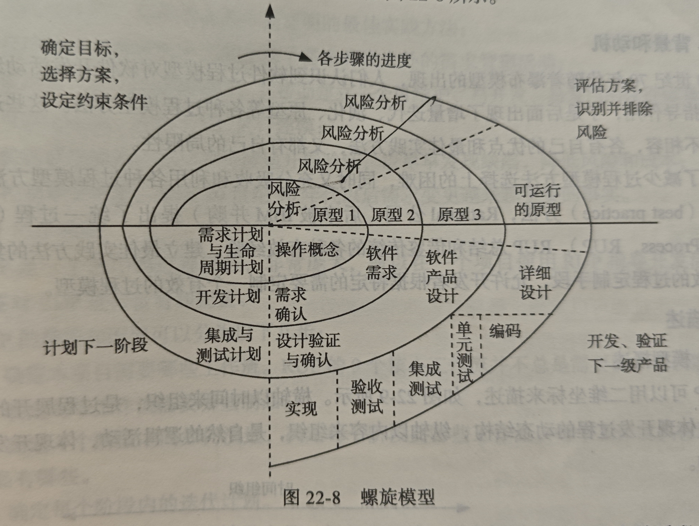
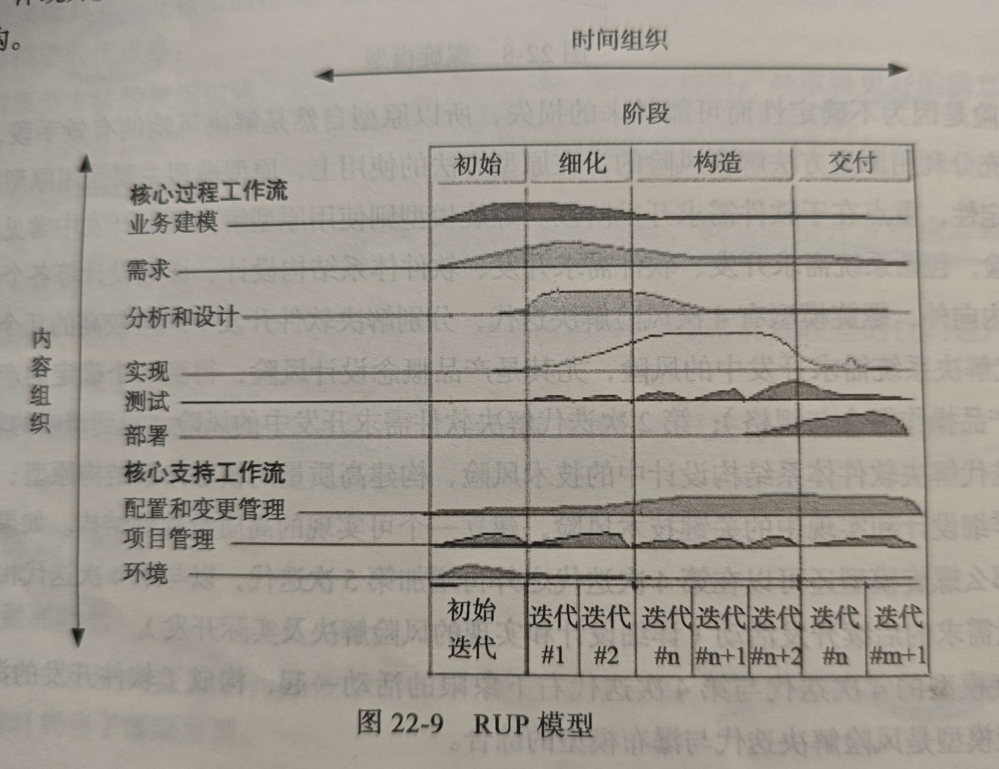

# 软件开发过程模型

## 软件开发各典型阶段:

| 阶段 | 描述 |
| --- | --- | 
| 软件需求工程 | 需求工程目标为建立能妥善解决问题的**软件系统解决方案**，简单来说就是定义软件系统要完成哪些功能; 需求工程的任务有**需求开发和需求管理**; 需求开发可以分为`系统需求开发和软件需求开发`，系统需求开发是为了获得整个系统的期望，包括软件系统，硬件系统和人力配置; 软件需求开发以系统需求为出发点，建立软件系统的解决方案, 最终成品为需求分析模型和规格说明文档 |
| 软件设计 | 目的是用各种软件抽象实体建立系统的结构; 包括软件体系结构设计，详细设计(在九十年代以前还没有明确的软件体系结构设计概念时，和他相应的一个设计过程为概要设计); 软件体系结构设计完成高层设计，使用结构图，UML的包图，构件图和部署图; 该设计过程的主要制品有软件体系结构原型，软件体系结构设计模型，和软件体系结构设计文档; 随后进行的详细设计注重模块内部的具体实现，主要实现中层设计和底层设计，方法有结构图，包图，类图，顺序图等，该过程的制品为软件详细设计模型和软件详细设计文档 | 
| 软件构造 | 包括编程，集成，测试和调试 | 
| 软件测试 | 用于保障软件品质; 有三个层次: `单元测试，集成测试，系统测试`; 在构造时会完成单元测试和一部分集成测试; 软件测试的主要任务包括测试计划, 测试执行，测试报告; 制品为测试通过的高质量软件和测试报告 |
| 软件交付 | 将软件产品交付给客户，主要任务有安装和部署，用户培训，文档支持等，并在该阶段进行项目总结和项目评价 |
| 软件维护 | 保障用户在软件生命周期内的使用，要根据需求的变更进行更改，也要保证产品质量; 包括完善性维护，适应性维护，修正性维护，和预防性维护; 在维护阶段可能会重新进行软件开发阶段的各个过程，也可能使用遗留资产处理，逆向工程，再工程等 |

# 软件生命周期模型(过程模型)

**生命周期模型** : 将软件从生产到报废的生命周期划分为不同的顺序执行的阶段；这个划分即为生命周期模型

**软件过程模型** : 是对软件生命周期模型的更细致准确的描述; 归纳了软件生命周期中各个阶段具体要进行的活动以及他们之间的关联，将这些活动组织为非线性的任务链。同一个软件生命周期可以存在不同的软件过程模型;

## 构建-修复模型

最早的过程模型，对软件开发没有规划和组织，即由开发人员直接开发出软件的第一个版本，随后提交给用户使用; 在使用过程中会发现缺陷，随后修复全部缺陷后进入交付和后期的维护阶段; 适用于一个人也可以完成的小型系统；问题如下:
- 没有对开发工作进行规范和组织
- 没有分析需求的真实性
- 没有考虑软件结构质量
- 没有考虑测试和可维护性

## 瀑布模型

分为需求分析，软件设计，软件实现，软件测试，软件交付和软件维护, 特点如下
- 规定了不同阶段相互衔接的次序(但是允许出现反复和迭代); 
- 每一个阶段的结果都需要验证，只有验证通过了才能作为下一个阶段的基础; 这使得瀑布模型十分重视文档，被认为是`文档驱动`的

**局限性**: 
- 对文档期望过高: 产生巨大工作量，并且无法建立可靠文档
- 对开发活动的线性顺序假设: 在实际工作中往往需要一些后续工作才能验证当前工作是否正确可靠。
- 客户，用户参与度不够: 因为将需求分析设为一个阶段，只有在这个阶段用户才能参与开发
- 里程碑粒度过粗: 即每完成一个阶段才进行验证，相当于每个阶段作为一个里程碑，这 种情况里程碑粒度过粗，无法及时发现缺陷并改进

可以在如下情况中适用:
1. 需求十分成熟
2. 所需技术十分成熟
3. 复杂度适中，不会产生过大的文档负担和过粗的里程碑

## 增量迭代模型

软件开发周期过长从而产生了一下策略:
1. 渐进交付: 每过一段时间交付软件的一部分使用，最后集成所有部分形成完整系统
2. 时间压力导致的并行开发: 同时进行软件的各个阶段以减少开发时间, 例如需求进行第三次迭代时，设计第二次迭代可能正在进行，形成一个流水线

增量迭代模型在开始时完成对前景和范围的界定(不能出现太大的需求变动,要求需求比较成熟和稳定), 将整个开发活动组织成多个迭代，并行的瀑布式开发活动; 每次迭代的增量需求相对独立，可以被开发为产品的独立部分交给用户, 因此增量需求是迭代的主要依据，模型是`需求驱动`的; 
1. 符合软件开发情况，有更好的适用性
2. 缩短开发时间
3. 增强用户反馈

缺点有:
1. 需求必须不能有太大变动，因为并行开发需要一个稳定的范围和前景 
2. 构件是逐渐并于主系统中的，所以要保证系统有一个开放式的结构

## 演化模型

**定义** : 和增量迭代模型类似，都是用迭代方式进行大规模软件开发，但是演化模型用于**需求变更比较频繁，不确定性较多的领域**; 过程为: 
- 首先分析核心需求，用第一次迭代建立 核心系统并交付使用，
- 用户在使用过程中提出变更需求，那么在根据这个请求进行后续迭代， 即在前面迭代的基础上进行精化和增强，修改和扩展。

优点如下:
1. 迭代开发所以有适用性 
2. 并行所以缩点时间
3. 增强了用户的反馈 

缺点有:
1. 无法在项目早期确定前景和范围，所以项目周期和项目调度很难规划
2. 后续迭代是在前面基础上进行更改，容易让后续迭代忽略分析设计，容易变成构件-修复模型

**区别** : 增量迭代需要稳定的需求，就是单纯分成很多个部分开发，但是演化模型的需求可以不稳定，首先开发出关键需求，然后对这个版本不断精化。

## 原型模型

分为演化式原型和抛弃式原型:
1. 演化式: 开始构建一个质量很好的但是不完整的原型，在此原型的基础上不断迭代，修改，最终构成完整系统
2. 抛弃式: 用来解决不确定性，通过模拟未来的产品，可以分析未来的知识，从而消除不 确定性，这一原型不会出现在最终产品中，需要抛弃后另行开发质量更好的改进或替代

具体过程为: 在需求开发阶段，首先进行原型开发，即原型需求，设计原型，构建原型，评估原型，进而得到清晰需求; 随后按照瀑布式过程进行开发; 可以对原型开发进行多次迭代以得到全部清晰需求，后续直接使用线性瀑布式; 也可以整体多次迭代, 每次都通过原型开发得到部分清晰需求; 优点如下:
1. 加强了与用户的交流
2. 适用于十分新颖的领域, 不确定性较多情况下的软件开发

缺点有:
1. 原型的开发成本较高
2. 会不舍得抛弃抛弃式原型，而将该原型融入最终产品中，拉低了产品质量

## 螺旋模型

(是风险解决迭代，原型和瀑布式模型的综合):

通过`风险驱动`，目的是近早发现和解决风险; 使用原型的方法，通过迭代的方式构建原型，通过螺旋表示的方式，进行四次迭代(一般是四次迭代); 分别解决软件开发中风险较高的几个阶段，即系统需求开发，软件需求开发，软件体系结构设计和详细设计中的关键技术风险; 第四次迭代和后续的开发过程组成了瀑布式模型; 

**特点** : 
- 可以近早解决风险
- 但是使用了原型，所以缺点就有原型的缺点，即原型本身也会带来风险，
- 模型过于复杂，不利于管理

## Rational 统一过程

即 RUP，充分吸收了各个过程模型的最佳实践方法，这是一个过程模板，开发者可以根据项目的特性来定制自己的开发过程; 具体来说，RUP 将开发过程分为了四个阶段，即
- 初始: 明确范围和情景，以及定义用例
- 细化: 构造软件体系结构模型和软件体系结构原型
- 构造
- 交付

一共有九种工作流；每个阶段都包含了多次迭代，每次迭代中都有多个工作流并行执行; RUP 在使用时要进行裁剪，因为他是一个很大规模的过程模板，并不是总是需要九个核心工作流, 因此确定每个阶段需要哪些工作流，每个工作流需要哪些制品，以及每个阶段内的迭代计划，优点如下:
1. 吸收和借鉴了传统的最佳实践方法 
2. 可以定制，所以适用面十分广泛
3. 有一套软件工具(UML)的支持，可以帮助它有效实施

缺点:
1. 没有考虑交付之后的维护工作
2. 裁剪和配置十分困难，不能保证每个项目都能定制一个有效的 RUP 过程

## 敏捷过程

随着软件规模越来越大，开发周期越来越长，就出现了过度复杂的情况，并且很难注重需求变更和用户价值，过度强调纪律而损失了个人能力，过度强调文档而损失了开发 的灵活性; 因此诞生了敏捷过程，目的是建立轻量级过程方法，它不是一种过程模型，而只是一些思想和原则，最主要的有
- 个体和互动高于流程和工具
- 工作的软件高于详尽文档
- 客户合作高于合同谈判
- 响应变化高于遵循计划 

有很多践行敏捷思想的过程方法都属于敏捷过程，例如极限编程和 Scrum
- 极限编程的思想: 什么好就一直用什么，比如如果单元测试好就一直单元测试，如果集成测试好就一直集成测试; 