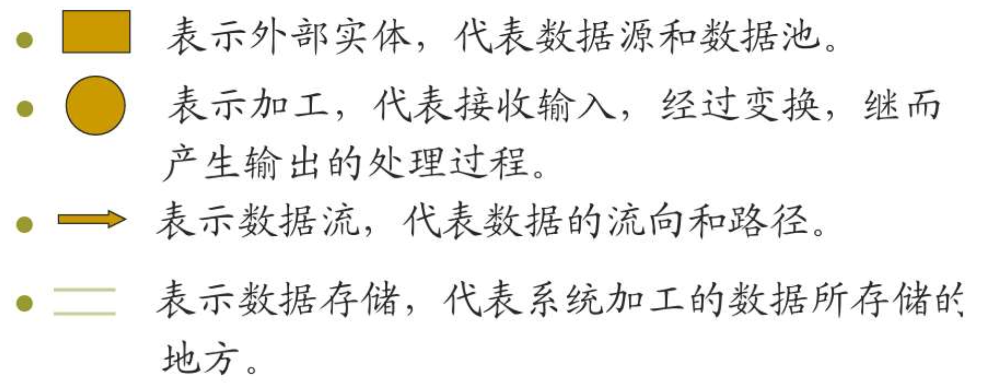
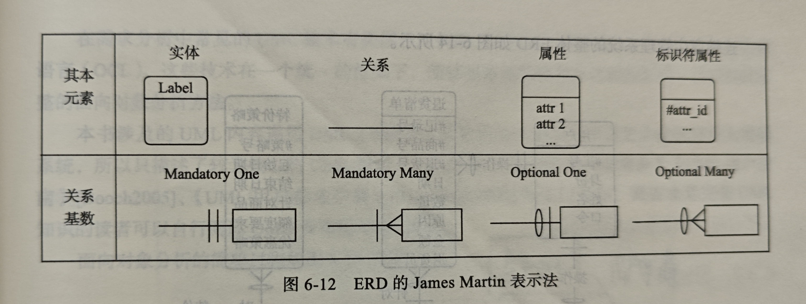
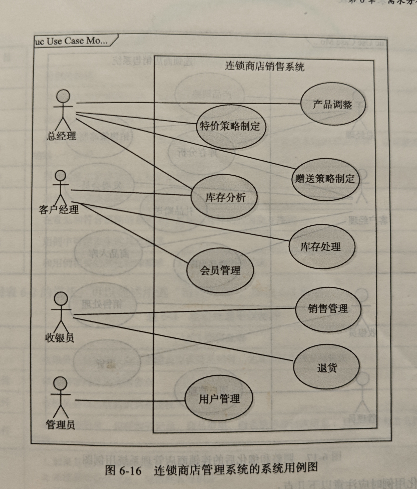
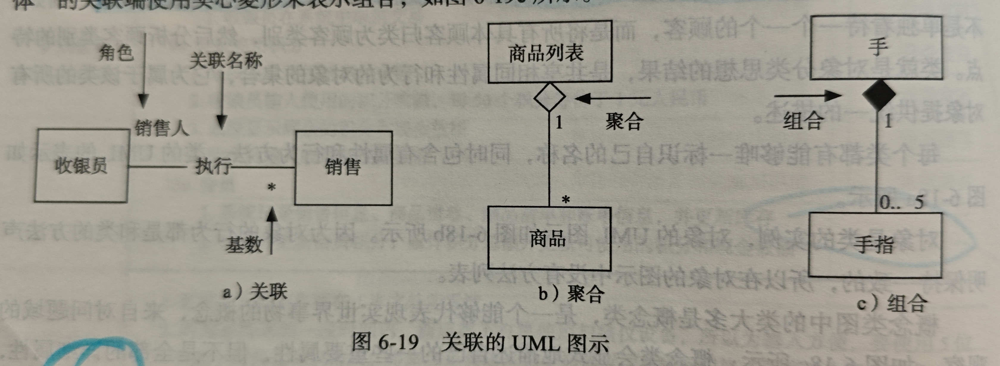
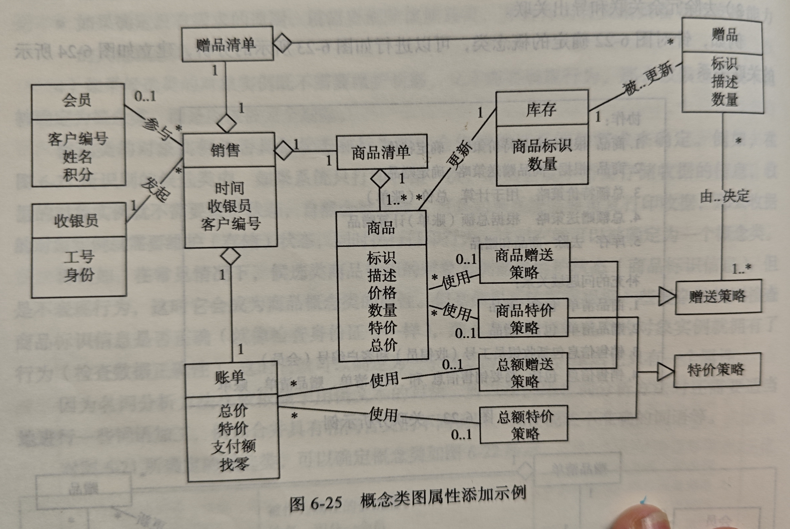
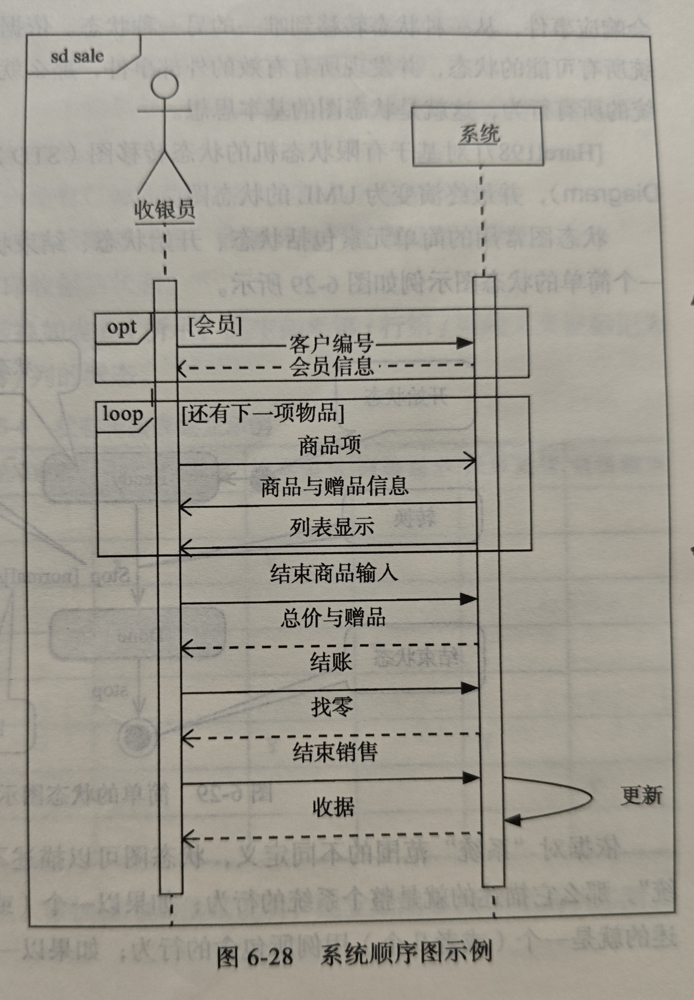
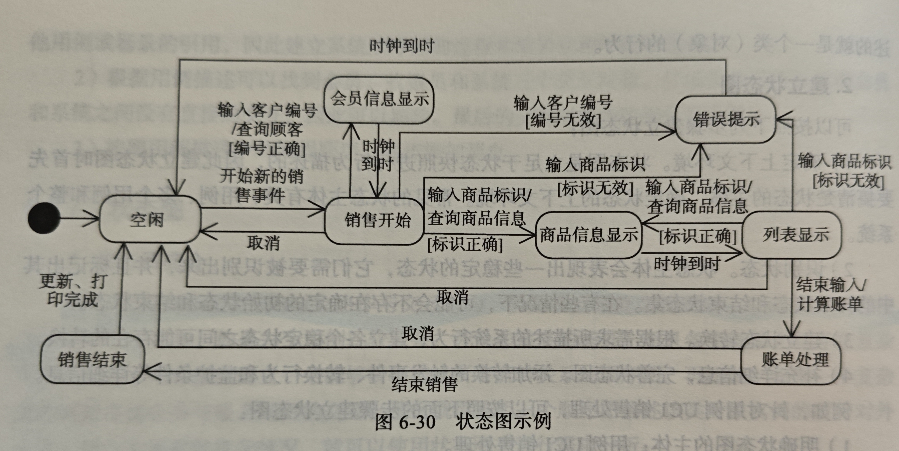

# 需求工程

**需求**是用户对系统的期望，软件系统通过满足用户的期望来解决用户的问题，所以需求开发十分的重要; 如果没法清晰理解用户的需求，那么系统的最终目的, 即解决用户问题的目标很难完成。

**软件工程面临的困境** : 如何开发有效工具来适应现代大规模，复杂性软件的开发和维护, 即实现`正确性，可靠性，实效性，可维护性，安全性，可生存性`;

**传统软件工程方法流程** : 问题定义，需求分析，概要设计，详细设计，编码，测试，维护

## 基本概念:

一些基本概念如下：
1. 软件的作用 : 用户和硬件的接口，计算机系统的指挥者，计算机系统结构设计的重要依据
1. 软件分类 : 系统软件，支撑软件(中间件),应用软件
1. 软件危机 : 开发周期长，费用昂贵，难以维护，可靠性差
1. 产生软件危机的原因:
    - 软件本身的特点
    - 软件开发人员的错误观点
1. 正是因为软件危机的产生，因此诞生了**软件工程**, 即以众多科学原理，以工程化原则解决软件问题的方法
1. 软件工程的基本内容 : 软件设计方法论，软件工具，软件工程标准和规范，软件工程管理，软件工程理论
1. 软件生存期模型 : 生存期指软件的全周期，从概念形成开始，到最终给别的软件让位，根据不同的生存期可以构建不同的生存期模型, 例如瀑布式软件生存期模型, 即定义，分析，设计，编码，测试，维护(严格线性，按步骤，逐步细化)
1. 软件质量要素 : 
    - 正确性 : 完成指定功能的能力 
    - 健壮性 : 在异常情况下仍然能运行的能力 
    - 可靠性 : 按规定成功运行的概率，可以看成上面两者之和
1. 软件工程的三个环境因素:
    - 抽象软件实体 : 例如模块，类等, 是软件工程的正确性基础
    - 虚拟计算机 : 软件工程的实现基础
    - 解决现实问题 : 软件工程的目的

## 问题定义

**确切的定义用户要解决的问题**: 问题的性质，软件的规模，例如使用可行性研究，对软件进行分析和评估，确定软件作用范围。

**生成软件计划** : 范围，资源，成本，进度安排

# 需求工程

**软件需求分析包括的工作** : 问题的认识，评价和综合(通过软件的数据流图和数据结构来评价优缺点，进而改进)，建立需求说明书;审查; 主要内容包括**需求工程，需求基础，需求分类**

**需求工程** : 是所有需求处理活动的总和，包括发现问题，分析问题，整合观点，记录需求，并验证严谨性。三个主要任务:
- 说明目标，
- 达成目标软件应该怎么做,将用户的需求转化为可行的软件行为
- 妥善处理目标随时间变化的情况

**需求工程详细过程** : 分为
- 需求开发包括需求获取，需求分析，需求规格说明，需求验证
- 需求管理

## 需求开发

**需求获取** : 
- 面谈
- 集体获取方法 : 通过很多用户的讨论发现需求，并在讨论中达成需求一致
- 头脑风暴 : 让很多用户自由讨论，来发明需求或发现潜在需求
- 原型 : 建立 一个有形的制品来加深用户和工程师之间的交流

**需求分析** : 
- 边界定义 : 定义项目的范围
- 需求建模 : 展示和解释信息，将信息以清晰的方式集成到一个模型中，是最重要的部分，一般用数据流图，ER 图等

**需求规格说明** : 需求需要编写成文档，主要目的为在系统用户之间交流需求信息，主要任务有定制文档模版，写文档

**需求验证** : 即验证需求规格文档编写的是否满足要求，一般使用同级评审

## 需求管理

**需求管理** : 在需求开发完成以后，需求会贯穿软件的整个生命周期，所以需要需求管理来保证需求作用的持续，稳定和有效发挥，同时管理后续需求的变更。

## 需求基础

**需求的层次性** : 从上倒下为
- 业务需求(目标) : 需求层次最高的需求，描述了组织为什么要开发系统，例如使用该系统以后半年销售额要提高一半; 为了描述该系统，需要描述高层次解决方案，如增加 VIP 服务等
- 用户需求(任务) : 为用户对系统的具体要求，系统能干什么，需要一定的问题域知识支持。
- 系统级需求(系统行为) : 是用户对系统行为的期望，反映了一次外界和系统的交互行为，或者系统的一个实现细节；一系列系统需求联系在一起可以满足一个用户需求；系统需求可以直接映射为系统行为, 描述了开发人员需要实现什么；

**结合层次性的需求开发** : 首先获得业务需求，用业务需求指导需求获取，得到用户需求, 一般到这里就结束，如果系统非常复杂，要继续将用户需求通过需求分析转化为系统级需求

**需求，问题域，规格说明文档的区别** : 三者有联系但是又有不同。
- 需求是期望
- 问题域反应现实世界运行的规律，是需求的生产地和解决地
- 规格说明是软件的方案描述，包含了软件运行的机制，要根据问题域来实现需求，并需要和现实世界进行互动并改变现实世界，才能实现需求

## 需求分类:

**需求谱系** : 常说的需求其实是软件需求，而真正的需求包含如下部分
1. 项目需求 : 对项目的期望，例如成本要控制在某个值以下
2. 过程需求 : 例如要使用CICD的方法进行开发
3. 系统需求
    - 软件需求
    - 硬件需求 : 例如需要使用专用服务器
    - 其他需求 : 例如对人力资源的需求
4. 不切实际的期望 : 无法实现的需求

**软件需求的分类** : 分为功能需求和非功能需求
- 功能需求 : 最常见，主要和重要的需求；用户希望系统能够执行的活动，是最需要按照上述的需求层次进行展开的需求类型；
- 性能需求 : 在一定的资源, 需要多好多块的完成任务的功能，例如用户查询必须在10秒内完成
- 质量属性 : 一般是隐式的，但会极大的影响软件体系结构的设计，包括
    1. 可靠性 : 在一定情况下，系统执行某功能的能力, 例如在通信时，如果网络发生故障，那么系统不能发生故障
    1. 可用性 : 系统在投入使用时可操作和可访问的程度
    1. 安全性
    1. 可维护性
    1. 可移植性
    1. 易用性
- 对外接口 : 系统和其他系统需要建立的接口，包括用户界面，硬件接口，通信接口等
- 约束 :
    1. 开发运行环境
    2. 问题域内的标准
    3. 商业规则
- 数据需求 : 对功能需求的补充，如果涉及到数据且没有定义数据结构，那么就需要数据需求，例如需要存储怎样的数据，以及数据的可访问性

# 需求分析方法

主要包括**结构化分析方法，面向对象分析**, 目的为对需求进行建模，得到分析模型；

**区别** : 结构化的目的是使得软件拥有更加合理的结构，它只要基于功能将软件结构按分为模块，通过对这些模块的不断细化，最终构造出程序的完整执行过程。而面向对象注重数据，通过将数据和方法封装成对象，而只关系对象的属性以及对象之间的联系，通过对象来理解，模拟现实世界，从而解决问题。相比之下，因为数据具有更好的稳定性，所以面向对象方法更好用一点。

**建模** : 使用抽象和分解方法
- 抽象：关注重要信息，忽略深层次细节
- 分解：将单个复杂问题分解为多个容易的子问题, 从而降低问题复杂度

**常见需求分析模型**: 
1. 结构化： 
    - 数据流图
    - 实体关系图
2. 面向对象方法：
    - 用例图
    - 类图
    - 交互图(顺序图)
    - 状态图

## 数据流图

**定义** : 将系统看作过程的集合；基本模型元素包括: 
- 外部实体 : 人或其他系统
- 过程 : 施加于数据的动作或行为，使数据被转换，存储或分布
- 数据流 : 表示数据的运动，必须和过程产生关联，即必须是过程的输入或输出
- 数据存储 : 静止的数据，在内部需要存储的数据(若流入/流出存储的数据流和存储区数据完全相同，那么数据流不需要额外命名)

**语法规则** :
1. 过程必须既有输入也有输出，并且输入/输出数据应有所差异
2. 数据流必须和过程关联，要么是过程的输入，要么是输出 
3. 过程使用动词，其他使用名词

**层次结构**: 在系统较为复杂时，无法使用一个数据流图描述整个系统，因此采用分层的方式，通过过程的不同抽象程度来分治的描述系统；
1. 上下文图 : 是系统功能的最高抽象，将整个系统看作一个过程, 描述了所有外部实体和系统过程的交互
2. 0 层图 : 对上下文图中唯一过程的分解，需要表示出系统的所有功能
3. N 层图 : 是对 0 层图的每个过程进行分解的结果，直到产生的结果是原始数据流图，即每一个过程都无法分解; 此时不显示外部实体，父过程的输入输出数据流称为子图的接口流，从空白区域引出; **要保证数据流图的平衡，即要保证输入输出的个数不变**; 子过程的编号必须以父过程的编号为前缀

## 实体关系图

**定义**：弥补了数据流图没有详细描述数据定义的缺点，通过**实体，属性和关系**来详细描述数据；
- 实体：在系统中存储的现实世界事物的类别描述
- 关系：实体间存在关系，每个实体针对一个关系都有**最大基数和最小基数**(最小基数中`optional,mandatory`分别表示0，1; 最大基数中`one,many`分别表示1,n)
- 属性：实体的特征；可以唯一标识一个实例的属性/属性组称为标识符/键

# 面向对象的需求分析

**面向对象分析方法** : 认为系统是对象的集合，用统一建模语言UML来作为面向对象分析的主要模型技术。UML 是很多技术的集合，例如用例图，类图等等，接下来详细介绍这些模型技术

## 用例图

**用例** : 进行需求获取的主要手段，表现为在系统和外界交互时执行的行为序列，包括正确的和错误的行为; 用例包含了不同状态下系统对用户请求的响应，一个行为序列称为一个场景，一个用例包含了多个关于某一目标的场景; 用例是一个理想的容器，用交互的方式来记录需求

**用例图** : 一个系统所有用例的集合，以用例为单位的一个系统功能展示模型，用例的基本元素有:
1. 参与者 : 发起或参与用例的一个外部用户,或其他软件系统
2. 用例 : 场景的集合，用椭圆标识
3. 关系
4. 系统边界 : 即系统成分和系统外事物的分界线 

建立用例图的过程如下:
1. 进行目标分析确定解决方向
2. 寻找参与者
3. 寻找用例 : 根据参与者来找用例，参与者的每一个目标就是一个用例 
4. 细化用例 : 对用例进行细化/合并，直到其满足`为对应一个业务事件，由一个用户发起并在一个连续时间段内完成，可以增加业务价值的任务`

**用例描述** : 找到用户之后就要描述用例，用文本信息描述用例的名称，参与者，触发条件，各种条件，以及正常流程，扩展流程等

## 概念类图

**基本元素有** :
1. 类 : 共享同一组属性和方法的对象的集合; 包含名称，属性和方法，这些属性和方法是该类对象都有的; 概念类图中出现的类大部分都是概念类，即不会显示类的行为(方法)，只有重要属性列表; 
2. 对象 : 类的实例，包括
    - 标识符 : 使用对象的引用用来唯一的标识一个对象;
    - 状态 : 属性和属性值
    - 行为 : 在状态改变或者收到外界消息时采取的行动(基于状态); 一般不定义，都是由类来定义的
3. 链接 : 对象间的协作关系称为链接; 单向/双向，如果 A 链接指向 B，就表示 A 就可以通过该链接找到 B，并向他发送消息
4. 关联 : 类之间的关系为关联; 关联是链接的抽象(关联和链接就类似类和对象)，若两个类之间如果没有关联，那么这两个类的对象就没有办法创建链接; 关联有名称和终端，终端包括角色和基数，终端其实就是关联连接的类; 两个特殊情况:
    - 聚合: 可以单独存在
    - 组合: 不能单独存在
5. 继承 : 用三角来表示继承，子类继承父类所有属性和方法

**建立概念类图的过程** : 为每个用例文本建立局部的概念类图，随后再综合进行合并，具体步骤如下
1. 识别候选类 : 名词分析，将用例文档中的场景描述中出现的名词作为候选类
2. 确定概念类 : 在上述候选类种，考察候选类有没有状态，需不需要表现一定的行为，如果都有就是概念类，如果只有状态那就作为别的概念类的属性，否则就丢弃
3. 识别关联 : 通过分析文本
4. 识别重要属性

## 交互图

**定义** : 描述对象之间协作的技术; 一般描述的是单个用例的场景。
1. 顺序图 : 纵轴表示时间，横轴表示参与交互的对象，每行中间表示传递的信息，传递方式有同步消息，异步消息和返回消息等
2. 系统顺序图 : 一般在这个阶段只用建立系统顺序图，即只描述参与者和系统的交互行为，重点展示系统级事件; 建立步骤如下：
    - 确定上下文环境：找到和当前场景关联的其他场景
    - 对象分析：找出场景中和系统存在实际交互关系的对象
    - 按照用例中的步骤逐步添加消息

## 状态图

**状态图** : 顺序图很难表示复杂的系统，此时用状态图，状态图是基于有限状态机的思想，即系统只能处于一个状态，并且只有外部事件可以改变系统的状态; 状态图通过列出了所有系统可能处于的状态，以及造成他们之间转换的事件, 来完整描述系统行为;
- 初始状态
- 状态
- 结束状态
- 转换
- 事件: 引发状态转换的事件
- 监护条件: 即某个活动要发生需要满足的条件
- 活动: 状态发生改变时需要执行的动作

**状态图的建立** :
1. 确定上下文环境，即描述的主体
1. 识别状态
1. 建立状态转换
1. 补充信息：添加转换的触发事件，转换行为和监护条件等

## 总结

**使用需求分析方法细化和明确需求** :
1. 上述的这些需求分析方法不是仅仅将需求用例换一个方式表示，而是用这些方法来细化和明确需求，发现其中的问题; 例如对一个用例文档，可以用顺序图发现一些问题并改正，然后用概念类图再发现一些问题并改正。
2. 建立系统级需求 : 最后建立的需求分析模型可以把用户需求转化为系统级需求。

# 需求文档化和验证:

**为什么要文档化** : 因为需求开发工作需要开发人员进行大量的交流,而软件需求是需要进行广泛交流的内容，所以需要在需求开发阶段文档化需求

## 软件需求规格说明文档

有两种说明文档:
- 用例文档 : 用例文档以用户的视角, 以用例的形式描述软件系统和外界的交互
- 软件需求规格说明文档: 从软件产品角度，以系统级需求列表的形式来描绘软件系统解决方案

**文档化需求的注意事项**: 
1. 技术文档书写要点(需求文档也属于技术文档，因此也要满足这些要求) : 简洁, 精确，易读，易修改
2. 需求文档书写要点 : 使用用户术语，可行性(需求具有技术可行性)，可验证。
3. 软件需求规格说明文档 : 使用标准模版，保持需求集的完备性和一致性，以及为需求划分优先级

## 后续部分

**验证和确认需求** : 需求文档可能写错，所以需要验证需求，主要方法为评审

**开发测试用例** : 在需求开发完成以后，就可以以需求为基础来开发测试样例; 在开发测试用例时也可以发现需求的问题，因此也被看作有效的需求验证方法

**度量需求** : 需要收集的度量数据:用例数量，用例中的场景数量，平均行数，软件需求数量，功能点数量，通过分析这些度量数据可以看出需求文档在各个方面的问题
- 度量需求功能点 : 功能点是度量软件规模大小的抽象概念，使用功能点来估算软件规模和复杂度有较好效果