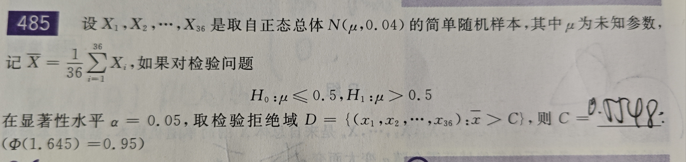
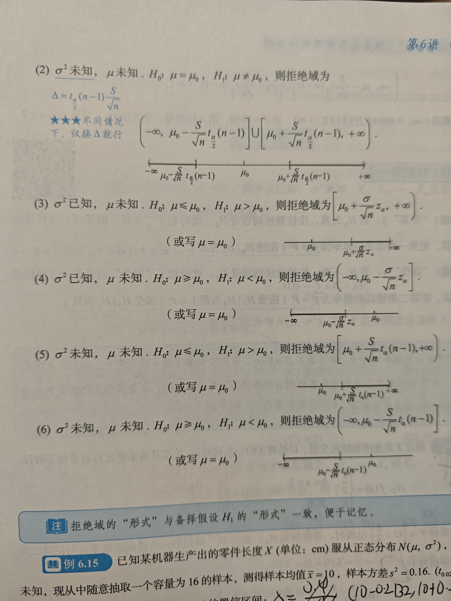
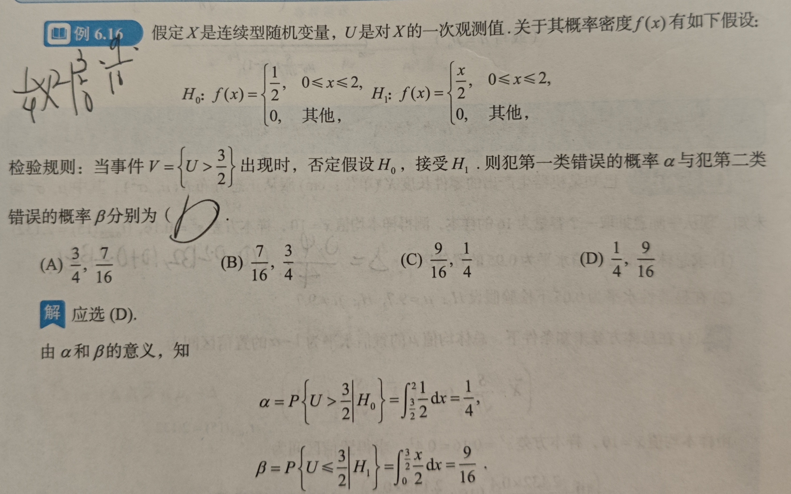

# 总体和样本

1. **总体**：研究对象全体，由**个体**组成；在研究总体时关注某个数量指标X以及他的分布情况，说总体的分布就是总体中X的分布；例如总体为学生，X表示学生的成绩，那么通过研究X的分布来研究考试情况

2. **样本**：n个相互独立且**与总体有同样分布**的随机变序列称为来自总体X的容量为n的样本；一次抽样结果的n个具体数值为样本的一个观测值/样本值

3. **样本的分布**：知道总体X的分布，因为每个随机变量之间都独立，因此可以很简单的用总体的分布求出样本的分布

# 统计量及其分布

1. **统计量**：设有一个来自总体X的容量为n的样本，g为n元函数，那么g(样本)为样本的一个统计量，其实就是随机变量的一个函数，g(样本值)为这个统计量的观测值

## 常用统计量

有样本数字特征和顺序统计量；

### 样本数字特征

1. **均值**： $\bar{X} = \frac{1}{n}\sum X_i$
2. **方差**： $S^2 = \frac{1}{n-1}\sum (X_i - \bar{X})^2$ ,注意同一样本的均值和方差是独立的
3. **样本k阶原点矩**： $A_k = \frac{1}{n} \sum X_i^k$ ,样本随机变量序列的原点矩实际上就是总体X的k次方的期望，可以轻易通过E的运算规则得到这个结论，因此可以用于矩估计
4. **样本k阶中心矩**： $B_k = \frac{1}{n} \sum (X_i - \bar{X})^k$

### 顺序统计量

将样本按照从小到大的顺序排列，第k个随机变量称为第k顺序统计量；一般研究最小和最大随机变量，并可以很方便的得到第1，n顺序统计量的分布函数  

### 性质

总体均值和方差分别为 $\mu, \sigma^2$ ，那么有：

$$
    EX_i = \mu,DX_i = \sigma^2 \\
    E\bar{X} = EX = \mu , D\bar{X} = \frac{1}{n}DX , E(S^2) = DX = \sigma^2
$$

## 三大分布

### $\chi^2$分布

1. **定义**：随机变量序列相互独立并且都**服从标准正态分布**，那么 $X = \sum X_i^2$ 服从自由度为n的 $\chi^2$ 分布
2. **上a分位数**：实际上就是关于n和a的一个函数，给定一个卡方分布，以及一个a，他的上a分位数就是随机变量大于这个数的概率等于a，相当于一个横坐标；一般通过查表得到
3. **性质**：
    - $若 X_1 \sim \chi^2(n_1) , X_2 \sim \chi^2(n_2) , 二者独立 \rightarrow X_1 + X_2 = \chi^2(n_1+n_2)$
    - $X \sim \chi^2(n) \rightarrow EX = n,DX = 2n$
    - $\bar{X} \sim N(\mu,\frac{\sigma^2}{n})$ ,即均值满足这样的正态部分
    - $\frac{(n-1)S^2}{\sigma^2} \sim \chi^2(n-1)$

### t分布

1. **定义**：有随机变量X，Y，分别服从标准正态分布和自由度为n的卡方分布，并且相互独立，那么随机变量 $t = \frac{X}{\sqrt{Y/n}}$ 服从自由度为n的t分布
2. **上a分位数**：同样,表示为 $t_\alpha(n)$
3. **性质**：
    - t分布的概率密度函数是偶函数
    - 因为概率密度函数的对称性，长得和正态分布差不多，因此对于上a分位数有 $t_{1-\alpha}(n) = -t_\alpha(n)$

### F分布

1. **定义**：随机变量X，Y独立并且分别服从自由度为n1和n2的卡方分布，那么有 $F = \frac{X/n_1}{Y/n_2}$ 服从自由度为 $(n_1,n_2)$ 的F分布；
2. **上a分位数**：表示为 $F_\alpha(n_1,n_2)$
3. **性质**：
    - 若 $F \sim F(n_1,n_2) \rightarrow \frac{1}{F} \sim F(n_2,n_1)$
    - $F_{1-\alpha}(n_1,n_2) = \frac{1}{F_\alpha(n_2,n_1)}$
    - $若t\sim t(n) \rightarrow t^2 \sim F(1,n)$

# 参数的点估计

即用采样得到的观测值来估计分布中的参数；总体X的分布函数为 $F(X;\theta)$ ，其中 $\theta$ 为未知参数，从中取一个样本，通过样本作为参数来构造一个统计量(函数)来估计这个参数，称这个统计量就是参数的估计，称为估计量；将实际的观测值带入统计量中即可得到估计值；建立适当统计量，并通过观测值给出估计值的问题称为**点估计问题**，有如下两种估计方法

## 矩估计

1. 对于一个参数：
    - 令样本的均值等于总体分布的均值，其中总体分布的均值带有参数，构建方程并解参数
    - 如果均值不能用，可以用高阶原点矩
2. 对于两个参数：可以用不同阶的矩建立多个方程，从而求出参数；

## 最大似然估计

根本思想是构建似然函数，表示在 $\theta = \hat{\theta}$ 的条件下得到采样结果的概率，并对该似然函数求导，得出使得似然函数最大的参数值为估计值；步骤为：
1. 写似然函数：

$$
    L(x_1,x_2,\cdots,x_n:\theta) = \prod p(x_i;\theta) \quad X为离散变量    \\
    L(x_1,x_2,\cdots,x_n:\theta) = \prod f(x_i;\theta) \quad X为连续变量
$$

2. 该函数的参数实际上只有 $\theta$ ,此时求参数的最大似然统计量，即对似然函数对 $\theta$ 求偏导，找出函数取最小值时参数的值，即为参数的最大估计量，用X表示，然后在将取样得到的X带入即可得到参数的估计值
3. 最大似然估计量的不变形原则：如果 $\hat{\theta}$ 为参数的最大似然估计值，并且以参数为输入的函数u有反函数，那么将估计值带入u，即可得到u的最大似然估计值，即 $\hat{u} = u(\hat{\theta})$

## 估计量的评价标准

1. 无偏性：估计量的均值为参数，$E\hat{\theta} = E\theta$
2. 有效性：如果有两个估计量都是参数的无偏估计，那么方差更小的估计量更有效
3. 一致性：针对大样本，估计量依概率收敛到参数

# 参数的区间估计

1. **概念**：分布函数中有未知参数，对于a，如果确定了两个统计量 $\hat{\theta_1},\hat{\theta_2}$ ,使得未知参数在他们的区间内的概率为1-a，那么这个区间就是参数的置信度为1-a的置信区间，1-a为置信度/置信水平，a为显著性水平

## 正态分布中均值和方差的置信区间

从正态分布的X中抽取样本，容量为n，均值和方差分别为 $\bar{X},S^2$
1. 知道方差，均值的置信度为1-a的置信度区间为(z表示标准正态分布的上a分位数)：

$$
    (\bar{X}-\frac{\sigma}{\sqrt{n}}z_{\frac{a}{2}},\bar{X}+\frac{\sigma}{\sqrt{n}}z_{\frac{a}{2}})
$$

2. 不知道方差，均值的置信度为1-a的置信度区间为,注意 $\Delta$ 就是左区间中后面减的那一项：

$$
    (\bar{X}-\frac{S}{\sqrt{n}}t_{\frac{a}{2}}(n-1),\bar{X}+\Delta)
$$

3. 知道均值，方差的置信度区间为：

$$
    (\frac{sum (X_i - \mu)^2}{\chi^2_{\frac{a}{2}}(n-1)},\frac{sum (X_i - \mu)^2}{\chi^2_{1-\frac{a}{2}}(n-1)})
$$

4. 不知道均值，方差的置信度区间为：

$$
    (\frac{(n-1)S^2}{\chi^2_{\frac{a}{2}}(n-1)},\frac{(n-1)S^2}{\chi^2_{1-\frac{a}{2}}(n-1)})
$$

证明过程见书149，目前记住就好

# 假设检验

对总体分布中未知参数的每一种论断称为统计假设，根据样本/采样结果判断假设是否成立称为假设检验

**原假设/备择假设**：不能轻易否定的假设为原假设，其否定为备择假设/对立假设

**小概率原理和显著性水平**：也就是验证假设是不是成立；显著性水平即上面的a，根据a可以得出拒绝域，若采样的结果落在拒绝域中，则可以拒绝原假设，即说明原假设不对；显著性水平a表示的认为的小概率事件的概率，例如0.001，采样落在拒绝区间，就是小概率事件发生了，此时就可以证明原假设不对

## 正态分布的检验和拒绝域

**注意**：
1. a表示显著性水平，表示犯第一类错误的概率，即H0正确的情况下拒绝H0的概率，因此a越大，拒绝H0的概率就越大，拒绝域就会变大，根据假设检验的公式也可以得出相同的结论，a变大，那么上a分位数变小，则接受区间变小；**置信度**：区间估计中的置信度表示这个区间包含真实参数的信息，因此如果置信度降低，那么区间会变小；
2. 不依赖公式，根据显著性水平来做，即先假设均值为某个值，然后得出犯第一类错误的概率，就可以求出拒绝域，例如：

1. 知道方差，不知道均值，原假设为 $H_0 : \mu = \mu_0$ ，则拒绝域为：

$$
    (-\infty , \mu_0 - \Delta] \cup [\mu_0 + \Delta , \infty) , \quad \Delta = \frac{\sigma}{\sqrt{n}}z_{\frac{a}{2}}
$$

# 两类错误

1. **弃真**：若H0为真，但是否定了H0；概率为H0为真的条件下拒绝H0的概率
2. **取伪**：若H0为假，但是接受了H0；概率为H1为真的条件下接受H0的概率

具体见习题：例子6.16

