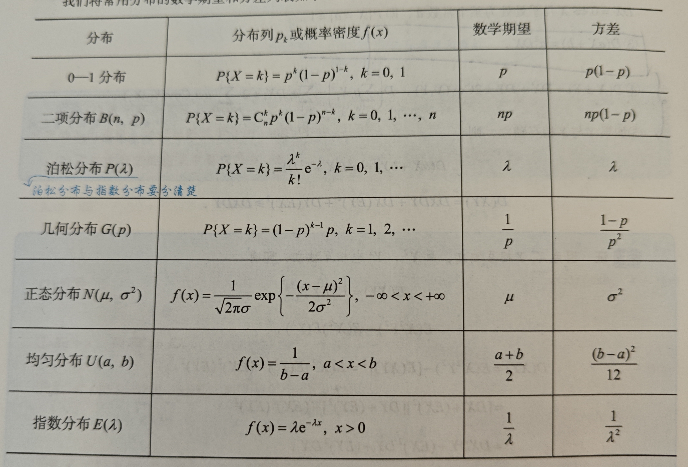

# 一维随机变量的数字特征

## 随机变量的数学期望

1. 若X为离散随机变量，并且分布列为 $p_i$ ,并且级数 $\sum p_i x_i$ 绝对收敛，那么级数和为X的数学期望，写作EX；简单来说，就是每个可能取值和其概率的乘积的和，对于连续性也是如此
2. 若X为离散型随机变量，概率密度函数为f(X)，并且积分 $\int xf(x)dx$ 收敛，那么积分和就是X的数学期望,有如下性质：

**性质**：
- Ea = a
- E(aX + bY) = aEX + bEY
- 若XY独立，那么有 $E(XY) = EXEY$
- $E(X^2) = D(X) + (EX)^2$

## 随机变量的方差，标准差

$DX = E[(X-EX)^2] = E(X^2) - (EX)^2$ ，DX为方差，DX开根号为标准差，即 $\sigma$ ，随机变量 $X^* = \frac{X-EX}{\sqrt{DX}}$ 为X得标准化随机变量，此时他的均值为0，方差为1；性质如下：

**性质**：
1. $DX \ge 0$
2. Dc = 0
3. $D(aX + b) = a^2DX$ 
4. $D(X\pm Y) = DX + DY \pm 2Cov(X,Y)$ ，在XY不独立情况下成立 
在XY独立的情况下有以下两条
5. $D(X + Y) = DX + DY$
6. $D(XY) = DXDY + DX(EY)^2 + DY(EX)^2$ ，这一条可以自己推导

## 常用分布的数学期望和方差如下：

# 二维随机变量的数字特征

这里主要考虑二维随机变量函数的数学特征,由如下情况：
1. 如果XY为离散型，联合分布率为 $p_{ij}$ ,若级数 $\sum \sum g(x_i,y_j)p_{ij}$ 绝对收敛，那么该值为Z的数学期望,Z=g(x,y)；
2. 如果XY为离散型，联合概率密度为 $f(x,y)$ ，若积分 $\iint g(x,y)f(x,y)dxdy$ 收敛，那么该值为Z的数学期望

## 协方差和相关系数

这两个值都用来考察XY的相关性；

1. **协方差Cov**：如果XY的方差都存在，那么有 $Cov(X,Y) = E[E(X-EX)E(Y-EY)] = E(XY) - EX \cdot EY$ ,EXY使用上面说的二维随机变量的函数的期望计算方法计算
2. **相关系数**：$\rho$ 表示相关系数，取值为-1到1，0表示完全不线性相关(但是可能非线性相关)，$\pm 1$表示完全线性相关，此时有 Y=aX + b,计算方法为 $\rho = \frac{Cov(X,Y)}{\sqrt{DX \cdot DY}}$ ,注意，XY的标准化随机变量的相关系数和原来一样；有如下性质；

**性质**：
1. Cov(X,Y) = Cov(Y,X)
2. Cov(aX,bY) = abCov(X,Y)
3. $Cov(X_1+X_2,Y) = Cov(X_1,Y) + Cov(X_2,Y)$
4. $\rho = 1 \quad \Leftrightarrow \quad P\{Y = aX + b\} = 1(a>0)$

# 独立性和不独立性的判定，切比雪夫不等式

## 独立性和不相关性的判定

1. XY独立的定义是 $F(x,y) = F_X(x) \cdot F_Y(y)$
2. XY不相关一般指XY之间不存在线性相关性，即相关系数 $\rho=0$ ,充要条件为

$$
    \rho = 0 \Leftrightarrow Cov(X,Y) = 0 \Leftrightarrow E(XY) = E(X) \cdot E(Y) \Leftrightarrow D(X \pm Y ) = DX + DY
$$

有如下重要结论：
1. 如果XY独立，那么他们不相关；如果他们不相关，那么不一定独立；如果他们相关，那么肯定不独立
2. 如果XY服从二维正态分布，那么他们独立

因此要判断独立性/相关性，先计算Cov来判断是否相关，如果相关则不独立，否则在用定义判断是否独立(用分布函数/概率密度)

## 切比雪夫不等式

如果X的期望和方差都存在，那么对于任意 $\epsilon > 0$ 都有

$$
    P\{|X - EX| \ge \epsilon\} \le \frac{DX}{\epsilon^2}
$$

该不等式表明了方差的意义，即方差越大，那么X偏离均值(中心点)的可能性越高，随机变量分布越分散