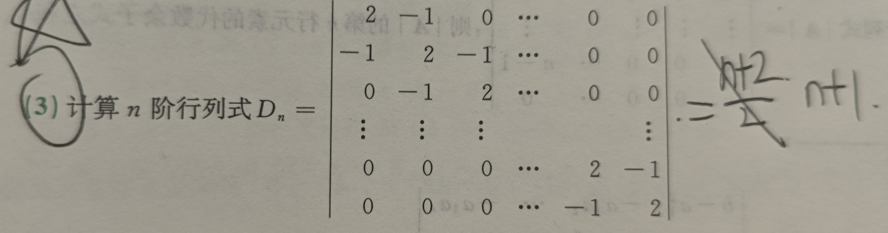

# 行列式

## 行列式的本质定义

n阶行列式是由n个n维向量组成的，表示由这n个n维向量围成的物体的体积。(例如二阶行列式就是两个向量围成的一个平行四边形)
,二阶行列式计算规则就不说了，三阶行列式计算规则为

$$
\begin{vmatrix}
a_{11} & a_{12} & a_{13} \\
a_{21} & a_{22} & a_{23} \\
a_{31} & a_{32} & a_{33}
\end{vmatrix}
= 11*22*33 + 13*21*32 + 31*12*23 - 13*22*31 - 11*23*32 - 33*21*12
$$

注意，如果行列式任意一行或任意一列全部为0，那么行列式为0；如果行列式结果为0，那么就说这些向量线形相关。

## 行列式的性质

1. 行列式的行列互换，值不变，即 $|A| = |A^T|$
1. 行列式若某行(列)全部为0，那么值为0。若某两行相等或者成比例，那么值也为0
1. 若某行有公因子k，可以把k提到外面
1. 若行列式中某行的元素都是两个数之和，那么可以写成两个行列式相加
1. 行列式中两行互换则变号
1. 行列式中将某行的k倍加到另一行上，不变

## 行列式的展开公式

1. 余子式：$M_{ij}$ 为行列式删掉第i行第j列后的行列式
1. 代数余子式： $A_{ij} = (-1)^{i+j}M_{ij}$
1. 行列式的值：某一行或列每个元素乘对应代数余子式的和

通过这个展开公式，可以将行列式降阶从而更方便计算

## 特殊行列式

1. 上下三角行列式：对角线上的元素乘积
1. 副对角线行列式： $(-1)^{\frac{n(n-1)}{2}} a_{1n}a_{2,n-1}\cdots a_{n1}$ 
1. 拉普拉斯展开式：可以将矩阵中的子矩阵作为元素，此时可以使用上述两个公式计算行列式的值；注意，必须化成主对角线的形式，也就是如果，也就是要将负对角线上的AB换到主对角线上才能用拉普拉斯展开

$$
\begin{vmatrix}
O & A \\
B & O \\
\end{vmatrix}
= (-1)^{mn}|A||B|
$$

1. 范德蒙德行列式:

$$
\begin{vmatrix}
1 & 1 & \cdots & 1 \\
x_1 & x_2 & \cdots & x_n \\
x_1^2 & x_2^2 & \cdots & x_n^2 \\
x_1^{n-1} & x_2^{n-1} & \cdots & x_n^{n-1} \\
\end{vmatrix}
= \prod_{1<i<j<n} (x_j-x_i)
$$

2. 箭形行列式，可以通过加边法，将行列式化为这种形式进而计算行列式的值

$$
\begin{vmatrix}
a & b1 & b2 & \cdots & bn \\
c1 & d1 & 0 & \cdots & 0 \\
c2 & 0 & d2 & \cdots & 0 \\
... \\
\end{vmatrix}
= (\prod d)(a - \sum \frac{bc}{d})
$$

## 计算

行列式主要就是考计算，后面多做做题

### 克拉默法则

对于n个方程n个未知数的非齐次线性方程组，如果参数矩阵是满秩的，那么方程有唯一解，并且有

$$
    x_i = \frac{D_i}{D}, D_i \text{是由用B替换D中第i列元素得到的行列式}
$$

## 例题

1. 特殊行列式：三对角矩阵的递推公式,三对角矩阵即对角线上为一个值，每个值上下都有一个相同的值，处理这类矩阵时，可以按第一行展开，从而得到D和D1,D2的关系，例如

