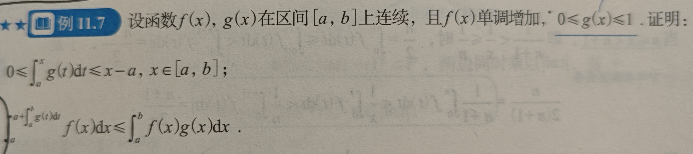

# 一元函数积分学的应用

## 几何应用

1. 注意，在参数方程表示的情况下，面积和体积都是dx，而弧长和表面积都是dt
2. 如果要计算旋转体的体积，那么一定要通过直角坐标系来计算；如果只给出了参数方程，那么先用xy列出公式，然后在代换为参数计算

### 用定积分表达和计算平面图形的面积

1. 如果是参数方程一般换元之后再算
1. 如果是极坐标方程，那么计算公式为 $\frac{1}{2}\int_a^b |r_1^2(\theta) - r_2^2(\theta)|d\theta$ ，想当于把每一个小扇形看成直角三角形来计算; 如果给出极坐标方程 $r(\theta)$ ，那么该函数图像和极坐标轴围成图形的面积为 $\int \frac{1}{2} r^2(\theta)d\theta$

### 用定积分表达和计算旋转体的面积

1. 曲线在某个区间内绕x一圈围成的体积为 $V = \int^b_a \pi f^2(x)dx$
1. 曲线在某个区间内绕y一圈围成的体积为 $V = \int^b_a 2\pi x |f(x)|dx$
1. 平面曲线在一定区间内的部分绕定直线旋转: $L: f(x),L_0: Ax+By+C=0, V = \frac{\pi}{(A^2+B^2)^{\frac{3}{2}}}\int_a^b [Ax+By+C]^2|Af'(x)-B|dx$
1. 如果是参数方程，那么可以直接写成直角坐标方程的形式，然后将x替换成参数方程的形式就可以了

### 用定积分计算旋转体的侧面积

1. 对于y=f(x),绕x轴旋转的旋转体的侧面积为
$$
    S = 2\pi \int |y|\sqrt{1+(y')^2}dx
$$
其中前面的部分是圆周长，后面那一部分相当于一个很短圆柱体的高，相当于 $\sqrt{dx^2+dy^2}$ ,乘起来就是底面周长乘圆柱体的高，
就可以得到圆柱体的侧面积

### 用定积分表达和计算函数的平均值

1. 计算f(x)在区间ab上的均值， $means = \frac{1}{b-a}\int_a^b f(x)dx = y(\epsilon)$
1. 例题：已知 $f(x+2)-f(x) = x, \int_0^2 f(x)dx = 0, \text{cal mean of} f(x) on [1,3]$ ,答案为 $\frac{1}{4}$

### 其他几何应用

1. 平面上曲边梯形的形心坐标公式： 
$$
\begin{cases}
    & x = \frac{\int^b_a xf(x)dx}{\int^b_a f(x)dx}  \\
    & ----------\\
    & y = \frac{\frac{1}{2}\int_a^b f^2(x)dx}{\int^b_a f(x)dx}
\end{cases}
$$
1. 平面曲线的弧长：
    - 直角坐标方程： $s = \int^b_a \sqrt{1+[y'(x)]^2}dx$
    - 参数方程: $s = \int_a^b \sqrt{[x'(t)]^2 + [y'(t)]^2}dt$
    - 极坐标方程: $s = \int^b_a \sqrt{[r(\theta)]^2 + [r'(\theta)]^2}d\theta$
    - 例题： $\int \sqrt{1+x^2}dx$
    - 注意，如果给出了极坐标方程，但是反解不出来，也就是得不到r的表达式，那么可以试着将它转化为xy的参数方程；

1. 旋转曲面的表面积,其实就是弧长乘 $2\pi h$：
    - 直角坐标： $S = 2\pi \int_a^b |y| \sqrt{1+(y'_x)^2}dx$
    - 参数方程： $S = 2\pi \int_a^b|y(t)|\sqrt{(x'_t)^2 + (y'_t)^2}dt$
    - 极坐标： $S = 2\pi \int_a^b |r(\theta)sin\theta| \sqrt{[r(\theta)]^2+[r'(\theta)]^2}d\theta$

2. 如果是绕y轴旋转成的曲面的表面积，那么一般有两种方法：
    - 直角坐标：反解出y，然后 $S = 2\pi \int_a^b |x|\sqrt{1 + [x'(y)]^2}dy$
    - 化为参数方程，直接使用参数方程形式求解，此时为 $S = 2\pi \int_a^b |x(t)| \sqrt{}dt$

## 积分等式和不等式

### 积分等式

1. 中值定理： 有f(x),g(x)，且g在某区间上不变号，那么有 $\int_a^b f(x)g(x)dx = f(\epsilon)\int_a^b g(x)dx$; 一般在题目中没有明确给出被积函数时使用，例如：
    - 计算 $\lim_{x \to \infty} \int^2_1 f(x)e^{-x^n}dx$
    - 常用于知道f(x)的某几个值,但未明确给出f(x),但是给出了f(x)g(x)的不定积分的值(g(x)已知), 此时可以得到区间中一个f(x)的值，并继续利用罗尔定理/拉格朗日中值定理得到导数的范围，例如 $f(0)=2,f(\frac{\pi}{2})=1,\int^{\frac{\pi}{2}}_0 f(x)e^{sinx}cosxdx = 2(e-1), \text{证明存在} \xi \in (0,\frac{\pi}{2}),f''(\xi)<0$
1. 夹逼准则: 若在0-1上f(x)连续，那么有
$$
    \lim_{n \to \infty} \int_0^1 x^nf(x)dx = 0
$$
1. 积分法 

### 积分不等式

1. 函数单调性：将某一积分上限变量化，如果积分上限很复杂的话就这么干，然后构造辅助函数并分析该函数单调性，以此来证明不等式，例如:

1. 拉格朗日中值定理: 多用于f(x)一阶可导并且式子中出现一阶导数的情况,将f(x)代换成 $f'(\epsilon)x$ 的形式
1. 泰勒公式：多用于f(x)二阶可导,情况同上，也就是给出一阶导数就用拉格朗日，二阶以上就用泰勒展开，记住泰勒展开式为 $f(x_0)+f'(x_0)(x-x_0)+\frac{f''(\epsilon)}{2!}(x-x_0)^2$ ,其中 $\epsilon$ 处于x和 $x_0$ 之间
1. 积分法：
1. 牛顿-莱布尼兹公式: 证明f(x)和f'(x)的关系例如证明 $f(a)=f(b)=0, |f(x)| < \frac{1}{2} \int_a^b |f'(x)|dx$,将f(x)化为变限积分计算

**总结**：如何将f转化为f', 有：
    - 拉格朗日
    - 构建变限积分

## 物理应用

1. 变力沿直线做功：在每个x上受到的力为f(x)，那么从物体从a到b力做的功为 $\int_a^b f(x)dx$
    - 例题：将钉子打到木头里受到的力和深度呈正比，每次打击做的功一样，第一次打击进入1cm，下一次打击进入几cm
1. 抽水做功：计算公式为 $W = \rho gSH$ ，S为某一水面的面积，H为要将他提高的高度，如果水面对于深度x的函数为f(x)，那么 $W = \rho g\int_0^b xf(x)dx$
1. 静水压力：343自己看吧