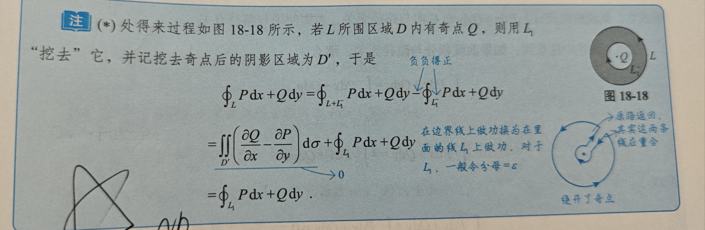

# 三重积分

### 概念和性质

$\iiint f(x,y,z)dv$ 为三重积分，有如下性质：
1. $\iiint 1dv$ 表示空间体积
2. 满足普通积分的线性性质和可加性，即整体的积分等于空间各个部分的积分和
3. 估值定理： $mV <= \iiint f(x,y,z)dv <= MV$
4. 中值定理： $\iiint f(x,y,z)dv = f(x_0,y_0,z_0)V$

### 普通对称性和轮换对称性

分析方法和二重积分完全一样，实际做题中一定要先分析对称性；一定要注意轮换对称性，即如果积分的区域有f(x,y,z)=f(y,z,x)...，那么在被积函数中可以随机的将x和y交换，或x和z交换，注意一定是交换而不是替换，也就是x变为y的同时y也要变为x！因此有没有轮换对称性只和积分区域有关系啊！不要老想着他和被积函数有关系，例题：
1. 有曲线 $x^2+y^2+z^2=0,x+y+z=0$ ,计算 $\int xyds$ 第一型空间曲线积分

## 计算

1. **投影穿线**：如果空间有上曲面和下曲面，并且没有侧面或者侧面是柱面，此时先积z，在积分x和y
2. **定限截面**：如果空间是旋转体，每一个横截面都是固定形式的，那么先积分x和y，再积分z
3. **球面坐标系**：积分区域为球，或者锥；此时做如下变换

$$
    x = rsin\psi cos\theta \\
    y = rsin\psi sin\theta  \\
    z = rcos\psi    \\
    dv = r^2 sin\psi drd\theta d\psi
$$

注意 $\psi$ 的范围，当他为0时就是z轴，顶点在原点，向两边的旋转；例如锥面 $\sqrt{x^2+y^2} < z < 1$ 的 $0 < \psi < \frac{\pi}{4}, 0 < r < \frac{1}{cos\psi}$

4. **换元法**：如果做如下变换：

$$
    x = x(u,v,w)    \\
    y = y(u,v,w)    \\
    z = z(u,v,w)    \\
    dv = |\frac{\delta(x,y,z)}{\delta(u,v,w)}|dudvdw (雅可比行列式)  \\
$$

例如上面的球面变换，还有柱面变换：

$$
    x = rcos\theta \\
    y = rsin\theta \\
    z = z   \\
    dv = r drd\theta dz
$$

这里可以看看书上的例18.5，将一个椭球拉伸到球体的变换；

## 应用

1. 体积的应用(前面已经说过了)
2. 重心的计算，设体密度为 $\rho(x,y,z)$ ，那么重心 $\bar{x} = \frac{\iiint x\rho(x,y,z)dv}{\iiint \rho(x,y,z)dv}$ ,y和z也是同样的计算方法
3. 如果体密度为定值，那么重心的计算公式就可以转化为形心的计算，即 $\bar{x} = \frac{\iiint xdv}{\iiint dv}$ ，此时有 $\iiint xdv = V \cdot \bar{x}$ ，也就是知道性心和体积可以很方便的求出积分的值
4. 转动惯量，对x轴的转动惯量为 $\iiint (y^2+z^2)\rho(x,y,z)dv$ ，同理可得对yz轴的转动惯量，对原点的转动惯量为 $\iiint (x^2+y^2+z^2)\rho(x,y,z)dv$
5. 引力：物体对某一点M0处质量为m的质点的引力分别为(这里只记录对x轴方向的引力): 

$$
Gm\iiint \frac{\rho(x,y,z)(x-x_0)}{[(x-x_0)^2+(y-y_0)^2+(z-z_0)^2]^\frac{3}{2}}dv
$$

# 第一型曲线积分

### 概念和性质

$\int f(x,y)ds$ 或 $\int f(x,y,z)ds$ 表示曲线积分，分别为平面曲线和空间曲线；性质如下：
1. 被积函数为1时表示曲线弧长
2. 其他性质都和普通积分一致

### 普通对称性和轮换对称性

和普通积分一致；注意如果发现积分区域是对称的，但是被积函数不对称，可以将被积函数拆成对称的性质，例如拆成很多个 $x^2,y^2$ 相加

## 计算

### 平面情况

按照平面曲线方程的形式可以分为如下三种：
- 由y=y(x)给出，此时：

$$
\int f(x,y)ds = \int f(x,y(x))\sqrt{1+y'(x)^2}dx
$$

- 由参数式给出，则此时：

$$
    \int f(x,y)ds = \int f(x(t),y(t))\sqrt{x'(t)^2+y'(t)^2}dt
$$

- 由极坐标形式给出，即给出 $r = r(\theta)$ ，那么有,注意这里代换f中x和y时的特别之处

$$
    \int f(x,y)ds = \int f(rcos\theta , rsin\theta)\sqrt{r(\theta)^2 + r'(\theta)^2}d\theta
$$

### 空间情况

只有一种情况，就是空间曲线有参数式给出，如果不是参数式，首先看看能不能化成参数式，要么就是分析对称性来求解

$$
    \int f(x,y,z)ds = \int f(x(t),y(t),z(t))\sqrt{x'(t)^2+y'(t)^2+z'(t)^2} dt
$$

## 应用

1. 计算弧长
2. 重心的计算公式，和前面三重积分一样
3. 形心的计算公式，也拥有和前面三重积分一样的性质，也有 $\int xds = \bar{x} \cdot l$
4. 转动惯量：553-554,同三重积分的转动惯量

# 第一型曲面积分

### 概念和性质

其实就是把二重积分的平面换成空间内的曲面，形式基本都一样，只是积分区域此时由空间曲面表示，并且被积函数是三元的，如下：

$$
    \iint f(x,y,z)ds
$$

1. 被积函数为1，表示曲面的面积
2. 其他性质全部都一样

## 计算

很简单，将曲面积分转化为二重积分后计算二重积分；具体有三步：
1. 选取一个平面，例如xOy平面，将这个曲面投影到这个平面上，计算出投影后的区域，注意，选取的投影平面上，任意两个投影点不能重合；如果哪个平面都不满足上面的条件，那么可以拆分曲面；**如何计算投影平面区域**：一般都是看出来的，但是若空间曲面是某个曲面截另一个曲面得出的，那么可以算这两个曲面的交线在投影平面上的投影，从而得出投影区域
2. 消去某个变量，例如，如果要投影到xOy中，此时就要消去z，即用z=z(x,y)带入到被积函数中来消去z
3. 做如下变换,彻底换成二重积分然后计算

$$
    dS = \sqrt{1 + (z'_x)^2 + (z'_y)^2}dxdy
$$

**化为第二型曲面积分后使用高斯公式计算**：首先写出曲面的单位法向量 $(cos\alpha,cos\beta,cos\gamma)$ ,随后将被积函数中，找出三个部分凑出这三个法向量，随后进行变换，即 $cos\alpha = dydz$ ,随后即可使用高斯公式等进行计算

## 应用

1. 被积函数为1表示曲面面积
2. 重心计算方法和上面一样
3. 形心的性质也和上面一样，即 $\iint xdS = \bar{x} \cdot S$
4. 转动惯量同三重积分的转动惯量

# 平面第二性曲线积分

和前面的积分有很大不同，他的设定是某质点在变力的推动下沿着某个曲线做功，积分的值为做功的和，即,其中P和Q分别为变力在横向和纵向上的分量

$$
    W = \int_L dW = \int_L f(x,y)ds \\
    = \int P(x,y)dx + Q(x,y)dy
$$

**概念和性质**：
1. 首先，第二型曲线积分定义在有向曲线上
2. 积分的线性性质和前面一样
3. 积分的有向性，即 $\int_{AB} Fds = - \int_{BA} Fds$
4. 对称性：此时的对称性和一般积分的对称性不同，因为是定义在有向曲线上，因此没有几何概念上的对称性，只有物理概念上的对称性，要得到力的表达式并确定好方向后，看在数量大小上是否相等

## 计算

### 基本方法-化为定积分

1. 如果曲线由参数方程表示，那么做如下变换：

$$
    \int P(x,y)dx + Q(x,y)dy = \int P(x(t),y(t))x'(t) + Q(x(t),y(t))y'(t)dt
$$

2. 如果曲线由y=y(x)给出，那么可以把他化成参数表示形式，x=x，y=y(x)，然后运用上面方法

### 格林公式

如果曲线围成了一个封闭的有界区域，并且**P,Q在区域内有连续偏导数，并且没有奇点(没有奇点即没有使偏导数不存在的点/不破坏偏导数连续性质的点)**,L取**正向，即沿着该方向，左手始终在曲线围成的区域内**，那么此时有 $\int Pdx + Qdy = \iint (\frac{dQ}{dx} - \frac{dP}{dy})d\sigma$ ,也就是将第二型曲线积分转化为二重积分，有如下特殊情况：

1. **曲线封闭且内部没有奇点**，此时直接使用
2. **非封闭曲线并且 $\frac{dQ}{dx} \neq \frac{dP}{dy}$** ,此时添加一段让他封闭后运用格林公式，计算出结果后在减去添加那一段的第二型曲线积分
3. **曲线封闭但是内部有奇点，但是除奇点外有 $\frac{dQ}{dx}=\frac{dP}{dy}$** ，此时可以更换路径，即在区域内部构建一个新的封闭区域，该区域包含了奇点，此时原曲线积分等于该区域的曲线积分(二者同向);推导过程见P567，

### 平面曲线积分和积分路径无关

即有封闭区域G，P，Q在G内有连续偏导数，如果在G内任意两点A，B，从A到B的任意两条曲线的曲线积分都相等(注意，并不是任意，替换的曲线和原曲线链接后围成的区域内不能有奇点)，那么此时称**某曲线积分在G内与路径无关**，也就是从A到B在到A的环路的曲线积分为0，此时可以推导出 $\frac{dQ}{dx} = \frac{dP}{dy}$ ，因此上面的说法和如下定理等价：
1. $\frac{dQ}{dx} = \frac{dP}{dy}$
2. 积分和路径无关
3. $du = Pdx + Qdy$ ,P和Q为某二元函数的全微分

**注意**：
1. 有奇点的情况下，并且dQ/dx - dP/dy为0，那么考虑是否封闭：
    - 若封闭就使用格林公式
    - 不封闭就只能路径变换，而不能添加曲线变成封闭

此时要计算这个曲线积分，有如下方法：
1. 因为和路径无关，因此可以先横移，在纵向移动，计算两段'直线'积分，简化计算
2. 也可以按照一般的曲线积分进行计算
3. 利用凑微分导出以P和Q为全微分的二元函数，化成 $\int d(u(x,y))$ 的形式，然后就可以很轻松的求解

# 第二型曲面积分

如果有向量函数，使得空间中每个点都对应一个向量，即 $F(x,y,z) = P(x,y,z)i + Q(x,y,z)j + R(x,y,z)k$ ，那么对于一个有向曲面，他的通过某个方向的流量即是第二型曲面积分，即：

$$
    \pm \iint P(x,y,z)dydz + Q(x,y,z)dxdz + R(x,y,z)dxdy
$$

他的性质和平面第二型曲线积分一样，注意他的方向，向坐标轴正向则上式为正，否则为负；例如上面为正方向，那么上式就为+

### 对称性

和平面曲线积分相同，这里最好分开讨论对称性

## 计算

### 基本方法：

化成二重积分计算，将其拆成三个积分，将积分投影到对应的平面上，如果投影是一条线，那么这一项是0；如果有两个点的投影重合，那么需要拆成多个面计算；注意因为他的末尾已经是dxdy的形式了，所以不用像第一型曲面积分那样做转化，直接将z=z(x,y)带入，求出投影区域然后计算就好了

### 投影转换法

1. **曲面正向单位法向量**的求法：此处拿上下面法向量举例，投影区域有z=z(x,y)，z有一阶连续偏导数，那么法向量为

$$
    n = \pm \frac{1}{\sqrt{1 + (\frac{dz}{dx})^2 + (\frac{dz}{dy})^2}} (-\frac{dz}{dx},-\frac{dz}{dy},1)
$$

正负的判断方式同上；转换投影定理如下，如果z有连续偏导数，并且PQR在曲面上连续，那么有如下公式，这就是将区域投影到xOy平面上，转换为二重积分计算，同样也可以投影到另外两个平面计算; **注意**：求出曲面法向量后，求出他的方向余弦，然后，如果要将 dxdz转化为 dxdy,相当于将dz转化为dy，那么就将 $Q * \frac{cosb}{cos\gamma}$ ，其中cosb为对y轴的方向余弦，gamma为对z轴的方向余弦，然后即可华为下面的这种形式；注意一定要按上面的步骤来，不然正负性可能有问题

$$
\iint Pdydz + Qdzdx + Rdxdy \\
= \pm \iint (-P\frac{dz}{dx} - Q\frac{dz}{dy} + R)dxdy
$$

### 转换为第一性曲面积分

如果目标平面是一个曲面，并且可以很方便的计算出他的单位法向量(a,b,c)，那么原式可以化成：

$$
    \iint Pdydz + Qdxdz+ Rdxdy = \iint (Pa+Qb+Rc)dS
$$

### 高斯公式

空间区域由光滑封闭曲面围成，并且PQR在曲面上都有**一阶连续偏导数，P有对x的偏导，Q有对y的偏导...**,外侧为正向，那么对曲面的积分可以表示成：

$$
\iint Pdydz + Qdxdz + Rdxdy = \iiint (\frac{dP}{dx} + \frac{dQ}{dy} + \frac{dR}{dz})dv
$$

也就是将其转化为三重积分进行计算，一定要注意高斯公式的使用条件；有如下几种情况：

1. **内部无奇点，直接使用**，奇点即被积函数不存在，或者偏导数不连续的点
2. **非封闭曲面，添加一段曲面让他封闭**
3. **封闭曲面，但是内部有奇点，并且除奇点外有 $\frac{dP}{dx}+\frac{dQ}{dy}+\frac{dR}{dz}=0$** ,此时可以做一个内部的封闭曲面，包含所有奇点，并且指向外侧，此时他的积分就等于外面的曲面(指向外侧)的积分，证明和上面格林公式的证明一样；

**注意**：
1. 如果遇到分母是x方+y方+z方的形式，并且散度为0，此时有两种选择：
    - 构建一个包含曲面或被曲面包含的圆，来消掉分母，并使用高斯公式进行计算
    - 若原曲面不是封闭的，添加曲面将其转为封闭的但是不包括原点的曲面，随后使用高斯公式进行计算
2. 当散度为0，想要用更大/更小的区域替换原区域时，注意，两个区域必须都完全包含奇点，而该点不能再曲面上；否则只能用第二种方法，例如330 133题

# 空间第二性曲线积分的计算

形式为 $\int Pdx + Qdy + Rdz, \int grad f(x,y,z)ds$ ,如果是第二种表示方式，那么梯度的各个分量分别表示PQR，有两种方法求解：

1. **化为参数方程**：

$$
    I = \int P(x(t),y(t),z(t))x'(t) + \cdots dt
$$

2. **斯托克斯公式**：存在一个空间区域，在这个空间区域内有一个光滑曲面，而目标空间曲线为该曲面的边界，他的方向和该曲面的法向量构成右手系，并且被积函数在空间区域内有连续偏导数，此时有如下公式，将其转化为第一型曲面积分，其中cos分别为曲面的单位外法向量

$$
    I = \iint 
\begin{vmatrix}
cosa & cosb & cosc \\
\frac{d}{dx}  & \frac{d}{dy} & \frac{d}{dz} \\
P & Q & R
\end{vmatrix}
dS
$$

**化成第一行曲面积分后的被积函数实际上就是向量场的旋度和法向量方向向量的内积**; 最好找一个平面，这时候方向向量是一定的，如何根据曲线计算该平面方程呢：选取三个特殊点，形成两个向量，做外积得到法向量，随后即可得到空间平面方程；但是很大概率围不成平面，此时直接用曲面的法向量其实更方便；

若此时围成的是曲面，那么被积函数转化为 

$$
    I = \iint 
\begin{vmatrix}
dydz & dzdx & dxdy \\
\frac{d}{dx}  & \frac{d}{dy} & \frac{d}{dz} \\
P & Q & R
\end{vmatrix}
dS
$$

即将空间第二型曲线积分转换为第二型曲面积分，其中曲面的方向根据曲线的方向和右手定则确定