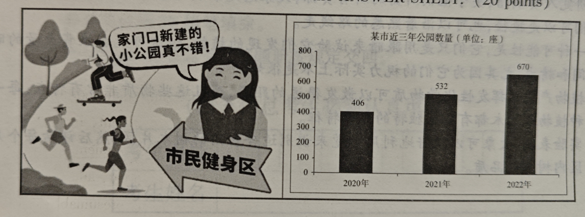
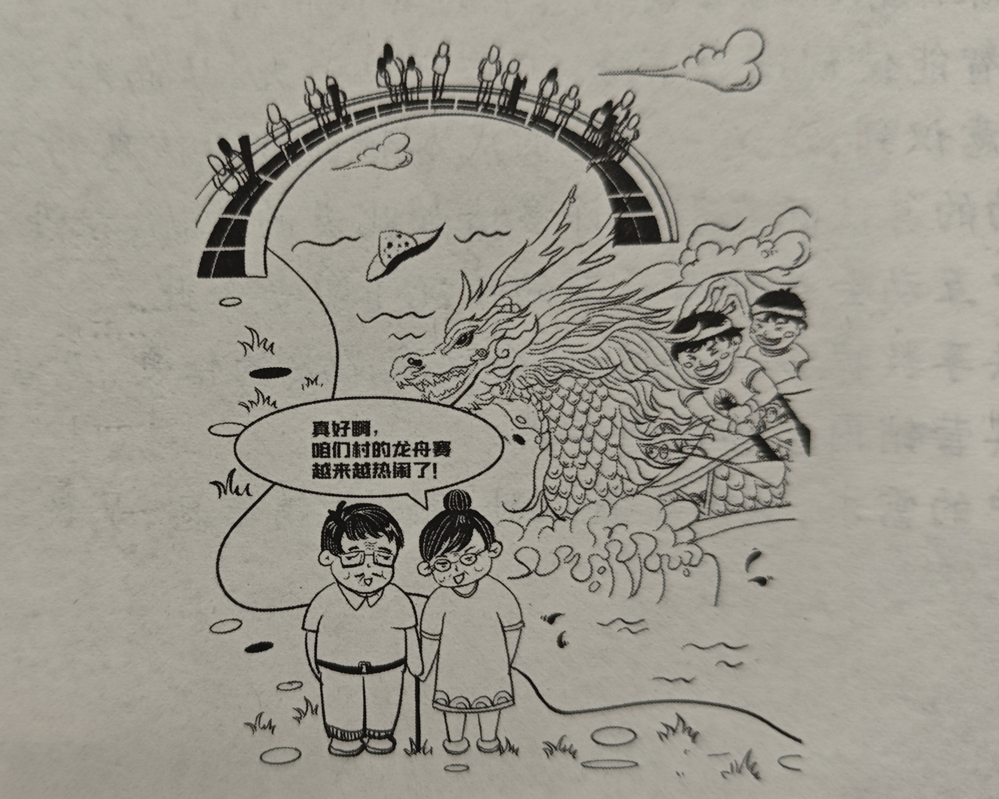
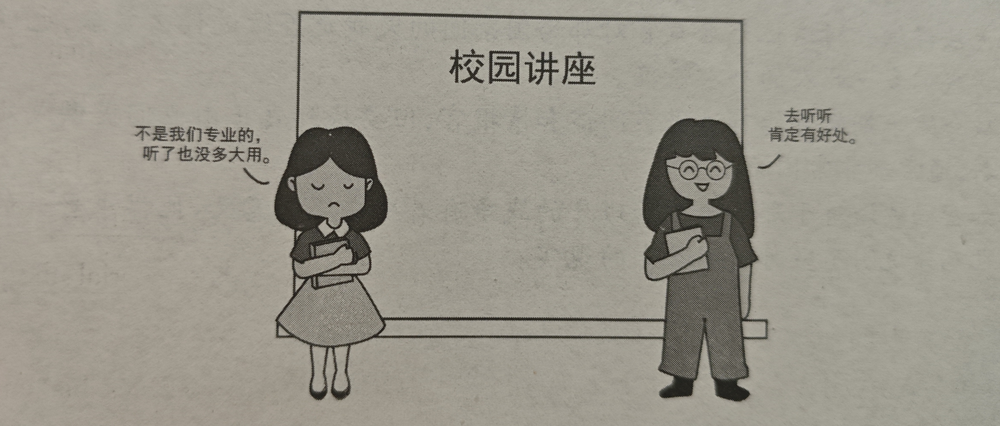
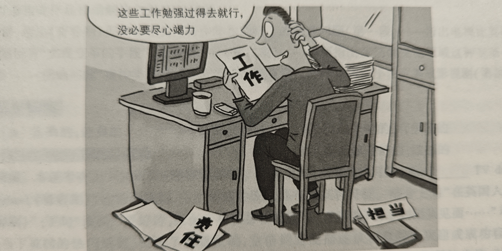
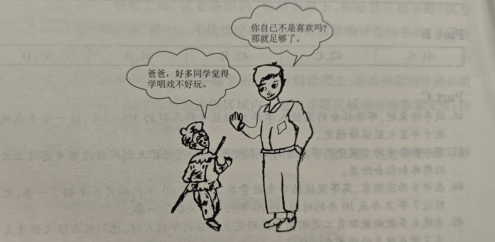

三种形式：图画/图表/文字评论

## 图画作文

- 首段：描述图画/图表，结合文字描述:
    1. These are 2 simple yet/but enlightening drawings...
    2. 描述(详细描述)
- 第二段: 现象，原因，危害，问题
    - 将图片对应的现象映射到现实中: The temporary Chinese family are characterised by..., and such a scene above can be associated with ... in reality(但是也可以不按这个模版写)
    - 进一步详细说明现象: Admittedly...
    - 这种现象值得关注，并表述关注的原因: The phenomenon is particularly worth attention for the reason that they only care about..., ignoring...
- 末段：建议+展望+号召

## 图画描述了好或坏的品质

- 首段：正常描述画面
- 第二段：
    - In the daily life, it's not uncomon for us to be confronted with condition where.../In the comteporary society, the tendency of... pervades broadly
    - Those who possess this quality tend to...
    - By contrast, those who lack it may...
- 第三段: In conclusion, the quality reflects..., for which reason we should strive to cultivate this commendable virtue. Only by embracing such a proactive habit can we ..., and ultimately reach our full potential.

## 10.23

Write an essay based on the table below, In your essay, you should,
- describe the table briefly
- interpret the table and,
- give your comments.

| 年份 | 空调 | 洗衣机 | 电冰箱 | 
| --- | --- | --- | --- |
| 2014 | 75.2 | 83.7 | 85.5 |
| 2017 | 96.1 | 91.7 | 95.3 | 
| 2020 | 117.7 | 96.7 | 101.8 |
| 2023 | 145.9 | 98.2 | 103.4 |

**Answer**: 
&emsp; &emsp;This is a concise but enlightening chart. A row of Chinese characters can be noticed under the chart, which say 
'Average possessed number of main product of residents nationwide recently', specifying the topic of data. There are four columns in the chart, depicting the rising number of air-conditioners,washing machines, fridges owned by Chinese family from 2014 to 2023. The data of 2023 are nearly twice as large as the ones in 2014, which means such massive progress take place wihin ten years. 
&emsp;&emsp; In the 21st century, Chinese society has experienced rapid development in all respects, and such improvement lead
to the phenomenon - the continuous surge of Chinese residents' possession of manufactured product - which is manifested in the chart. It is precisely the evlotion of manufacure and economy that constitute the main impetus behind such progress. During the past decade, we diligent Chinese people have spare no effort to advance technology with perseverence, and we could conspicuously see the positive change in our daily life. Not only do I live a better life, but I also feel deeply proud of our nation's developmen. 
&emsp;&emsp; In conclusion, Chinese people has accomplished great success in past decade and improved quality of life.
Besides, I am convinced that our step to a promising future will never cease and I'm looking forward to seeing that day come.

# 10.26

**Instruction**: 

Write an essay based on the picture and the chart below. In your essay, you should 
1. describe the picture and the chart briefly
2. interpret the implied meaning, and 
3. give your comments.

**Ans**:

&emsp;&emsp; These are concise yet instructive picture and chart. The left picture showed a woman commending a residents sports district, saying 'the new constructed park is so nice', while many people relish a jolly moment of sports. Additionally, about the other chart, as specified by the title above, the data depict number of parks in the past three years. And we can note that the number of parks escalate steadily during 2020 to 2022 from 406 to 670.

&emsp;&emsp; With rapid development and consequent public's lack of excecise, our bodies are suffering a lot because of this severe lack. Thus, in recent years, awareness of imperative benefit of sports is aroused gradually in public. The parks become major area in which citizens could make their exercise demand fulfilled. The rising number of parks could also illuminate this phenomenon manifested in the chart above. It is precisely exercise that could regulate our physical as well as mental health, alleviating the burden and suffering. With support by the government, which is embodied on the expasion of public facilities like parks, we should spend more time on daily exercise.

&emsp;&emsp; In conclusion, the trend of public fitness is booming, which is promoted by the incresing public service. So I appeal to everyone to join this trend to give yourself a strong body. When you are overwhelmed by bad emotion, just go for a RUN!

## 10.29

**Instruction**:

Write an essay based on the picture below. In your essay, you should
1. describe the picture briefly
2. interpret the implied meaning, and
3. give your comments

**Ans**:

&emsp; &emsp; This is a concise but enlightening picture. In the picture, an elderly couple stand beside the river bank, commending the ongoing dragon boat competition, which looks so vigorous and intensive, saying "It's so nice seeing our dragon boat competition becom more and more popular", while a lot of spectators watch the competition on the bridge in distance. As is depicted in picture, the scene convey a positive and heated atmosphere, which embody people's enjoyment of the moment of womderful race and, more importantly, their appreciation of Chinese traditional culture.

&emsp; &emsp; With rapid modernization of China, such scene above is used to seem almost 'extinct' in reality. Many precious Chinese traditional culture gradually fade in our life and history due to lack of people's awareness.However, thanks to government's efforts to promote, many corresponding activities are held like dragon boat competition, traditional art exhibition and so on, through which we could obtain a clearer perception of these tradition culture, and additionally arouse people's awareness to preserve and inherit them.

&emsp; &emsp; In conclusion, traditional Chinese culture is an invaluable legacy we need to cherish, and I sincerely hope to witness its flourishing in the recent future!

### 11.1

**Instruction**:

Write an essay based on the picture below. In your essay, you should 
1. describe the picture briefly
2. interpret the implied meaning, and 
3. give your comments.

**Ans**:

&emsp;&emsp; This is a concise but enlightening picture. At the center of the picture lies a board with chracters 'school lecture'. And two girls give converse comments on school lecture. One believe the lecture in other field but not our own major has no benefits, while the other deem that whether the lecture's subject is related with us, it definitely has its own value for us. 

&emsp;&emsp; In contemporary Chinese university, the attitude towards lecture is vividly portrayed by the picture above. And such scene is associated with phenomenon that college students can't get rid of a rigid study pattern, that only focus on their major courses, ignoring the imperative effect of diverse knowledge to our future development. Moreover, refering to essence of university, it's not only a place to learn specific skills, but a significant platform to broaden our sight and a transition from schools to society. So from my perspective, we should cherish the resources extended by the university whatever its type is, like lecture, improve ourselves in all facets rather than a single direction, so that we could better accommodate complicated society.

&emsp;&emsp; In conclusion, despite what type the lecture is, we should give it a try. It's exprosure to various knowledge that give us choice in future individual development.

### 11.4

**Instruction**:

Write an essay based on the picture below. In your essay, you should 
1. describe the picture briefly
2. interpret the implied meaning, and
3. give your comments.

**Ans**:

&emsp;&emsp; This is a concise but enlightening picture. A staff who is working lies at the center of the picture, with a paper on which display a word "work" on his hands, while another two papers represent "accountability" are left on the ground. Yet the man say like "It's not necessary to finish these works conscientiously. just making them done crudely is ok". 

&emsp;&emsp; A Negative working attitude prevades our society today, which is vividly portrayed in the above picture, alarming a menace trend not only in society development but also individual future. During the work, many people take no responsibility into consideration but only focus on how to finish works as quickly and conveniently as possible, evading the setbacks encountered in the process of work. However, it's precisely these challenges that cultivate our responsibility, resilience, and competence to solve problem, which would futher lead to better effect of our work and better development of our temperament. 

&emsp;&emsp; In conclusion, responsibility and conscientious is integral in work, for both society and individual. So we shold devote ourselves to our duties wholeheartedly.

### 11.6

**Instruction**:
 
Write an essay based on the picture below. In your essay, you should
1. describe the picture briefly,
2. interpret the implied meaning, and
3. give your comments.

**Ans**:

&emsp;&emsp; This is a concise but enlightening picture. In the picture lies a father and his son, expressing the respective contention about the attitude towards other's comments. The kid, dressed in a costume of a drama character, says that many of his classmates think drama performing is dull, expressing the concerns on whether to insist. And the father replys that your passion for it is enough.

&emsp;&emsp; In the comtemporary society, saturated with social media platforms, we are much more exposed to others' comments, leading to the hesitation and suspect of our own choice. The insistence on the things we love may be easily torn apart by external comments, as embodied by the dilemma the kids faced in the picture. However, the father's notion gives the solution, that others' influences are hollow while our own love is solid. Our love itself constitutes the reason we need to persist. 

&emsp;&emsp; In conclusion, our love is more convincing than any other external commnts. So just focus on our own choice regardless of what others say. That's the real way to a unforgettable life.

### 12.3

&emsp;&emsp;These are two concise but enlightening picture. In the left picture lies a woman sitting in front of her table which is full of documents, sparing no efforts to finish her work diligently, who say that it's a good choice to accomplish as early as possible. In contrast, the right picture depicts a scene, where another man with a lot of work to do but choose not to commence until the deadline approaching. A Chinese word is displayed below, meaning "habit". The picture toches on a profound issue in individual development: the habit to start your work at beginning or drag it until deadline, which have triggered my deeper thinking.

&emsp;&emsp;In the routine of daily study and work, all too often we are confronted with the condition that a heap of works are allocated to us and await completion. There are two choice to deal with the situation, start immediately or defer them till end, as emboddied in the picture. However, these two opposing habits not only reflect different competence of time planning, but also lead to the distinct quality and result of accomplishments. The one has habit to start work early usually have more time to make a comprehensive scheme before commencing, enable learn from the process of finishing work as well, and resultantly reach a better quality. In the meantime, people with habit of delay tend to work in haste and produce crude result. 

&emsp;&emsp;In conclusion, these two habits reflect our attitude towards challenges, and decide the outcomes, for which reason I appeal to everyone to cultivate the former one. Only by embracing such a proactive habit can we better manage our time, enhance our productivity, and ultimately reach our full potential.